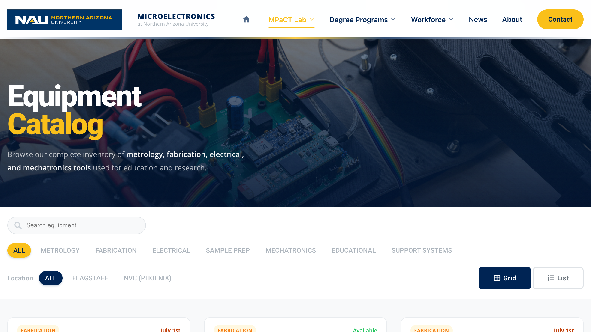

# Equipment Catalog (`Equipment.html`) — Documentation Index
**File:** `Equipment.html`  
**Last Updated:** May 2026  
**Internal Use Only**

---

## What This Page Is

*The hero section of Equipment.html — gives context on what the catalog page is before scrolling down to the instrument cards.*

`Equipment.html` is the full instrument catalog for the MPaCT Lab. It displays all 35+ instruments as filterable cards, lets users switch between grid and list view, and links each card to a reservation form and a dedicated About page.

This page has three interconnected systems that must stay in sync. Understanding how they relate is essential before editing anything:

| System | Where it lives | What it controls |
|--------|---------------|-----------------|
| **Card HTML** | `Equipment.html` — `#equipmentContainer` | The card's visual layout, badge color, image, location text |
| **`equipment.json`** | `equipment.json` (project root) | Status, availability date, warning messages — **overrides HTML at runtime** |
| **Sort order script** | `Equipment.html` — inline `<script>` at bottom | Which category appears first in the grid |

> **Note:** Status shown in the HTML (the `status-dot` class) is a fallback only. At page load, `JS/Equipment_Status.js` fetches `equipment.json` and overwrites the status dot and Reserve button for every card whose name matches. Always update `equipment.json` when changing availability — do not rely on HTML alone.

---

## Sections on This Page

| # | Section | Editable? | Doc |
|---|---------|-----------|-----|
| 1 | **Hero** — compact banner, headline, subtitle | Basic edits only — no doc needed | — |
| 2 | **Filter Bar** — category buttons, location buttons, search box, grid/list toggle | Yes — adding categories has 3 required steps | [equipment-filter-bar.md](equipment-filter-bar.md) |
| 3 | **Equipment Card Grid** — all instrument cards | Yes — badge/status/JSON must stay in sync | [equipment-cards.md](equipment-cards.md) |
| 4 | **Sort Order Script** — inline `const order = [...]` | Yes — part of adding a new category | [equipment-filter-bar.md](equipment-filter-bar.md) |
| 5 | **`equipment.json`** — status data file | Yes — primary way to update availability | [equipment-json-status.md](equipment-json-status.md) |

---

## Section 2 — Filter Bar
**Doc:** [equipment-filter-bar.md](equipment-filter-bar.md)

Adding a new category filter is a three-part change: the filter button, the card `data-category` attributes, and the sort order array. Missing any one of the three causes silent failures (filter does nothing, or new cards sort to the bottom).

Go here when: adding a new category, adding a new location, or the filter buttons stop working.

---

## Section 3 — Equipment Cards
**Doc:** [equipment-cards.md](equipment-cards.md)

Each card has HTML for layout and `equipment.json` for live status. The badge color, multi-location display, About-only card pattern, and commented-out card pattern all have non-obvious rules.

Go here when: adding a new instrument, changing a card's category, updating an image, or making a card About-only.

---

## Section 5 — `equipment.json` Status Data
**Doc:** [equipment-json-status.md](equipment-json-status.md)

This is the correct place to change an instrument's availability status, expected date, or warning message. Changes here take effect on page load without touching the HTML.

Go here when: an instrument becomes available or unavailable, a date changes, or you need to add a warning banner on an instrument's About page.

---

## Related Files

| File | Role |
|------|------|
| `equipment.json` | Live status data — fetched at runtime by Equipment_Status.js |
| `JS/Equipment_Status.js` | Reads `equipment.json`, rewrites status dots and Reserve buttons on all `.tech-card` elements |
| `JS/script.js` | Powers search box autocomplete, category filter clicks, location filter clicks, grid/list view toggle |
| `JS/layout.js` | Injects header and footer — do not modify |
| `CSS/style.css` | All card, badge, filter, and status styling |
| `About_Equipment/` | Individual instrument detail pages linked from each card's About button |
| `Reserve_Equipment.html` | Reservation form — linked from each card's Reserve button via `?equipment=EQ-XXX` |
