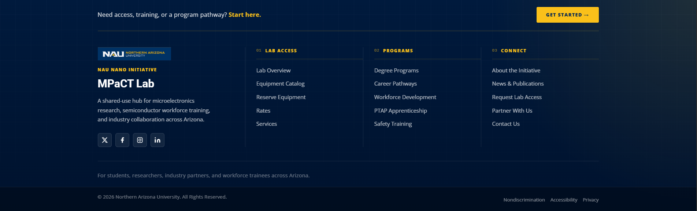

# Site Footer

**Summary:** Add, remove, or modify links, call-to-action text, and section columns inside the site-wide global footer.

**When to change:** When a new page is introduced to the main site structure, or links inside the footer columns need to be reorganized or updated.

**Difficulty:** <span class="difficulty-stars" style="color:#E6A800">★★</span>

**Estimated Time:** 10 minutes

---

## Visual Reference

<p align="center">
  <br/>
  <em>Figure 1: Global site footer — top CTA bar, brand block, Lab Access / Programs / Connect columns, meta line, and copyright bar</em>
</p>

---

## Target Files

| Path | Purpose in this task |
|---|---|
| `/includes/footer.html` | Footer markup loaded into every page (CTA bar, brand block, link columns, meta line, copyright bar). |
| `/JS/layout.js` | Fetches the footer and injects it into `#site-footer` on page load. |

> [!NOTE]
> **Client-side include architecture:** Each page includes `<div id="site-footer"></div>` and loads `JS/layout.js` (root pages use `JS/layout.js`; pages in subfolders such as `/About_Equipment/` use `../JS/layout.js`). On load, `layout.js` runs `loadPart('site-footer', '/includes/footer.html', …)`. Editing `/includes/footer.html` once updates the footer on every page that uses this layout.

> [!IMPORTANT]
> **Verify against your local codebase:** Class names, `href` targets, and query-string parameters can change. Before editing, confirm selectors and filenames in your active copy of `/includes/footer.html`.

---

## Step-by-Step Instructions

### Part 1: Locate the Footer Include

1. Open `/includes/footer.html` in your code editor.
2. The entire footer lives inside a single `<footer class="site-footer">` wrapper. The file is organized top-to-bottom as:
   * **Top CTA bar** — `.footer-cmd-bar`
   * **Main grid** — `.footer-grid` (brand column + three link columns)
   * **Meta line** — `.footer-meta`
   * **Copyright bar** — `.footer-bottom`

   **Real Code Snippet (footer root wrapper)**
   ```html
   <footer class="site-footer">
   ```

---

### Part 2: Update the Top Call-to-Action Bar

The yellow **Get Started** strip at the top of the footer is the `.footer-cmd-bar` block. Edit the prompt text or CTA destination here.

   **Real Code Snippet (CTA bar in footer.html)**
   ```html
   <div class="footer-cmd-bar">
       <p class="footer-cmd-bar__text">Need access, training, or a program pathway? <strong>Start here.</strong></p>
       <a href="/Contact_Us.html" class="footer-cmd-bar__cta">Get Started &rarr;</a>
   </div>
   ```

   **Example Snippet (CTA bar blueprint)**
   ```html
   <div class="footer-cmd-bar">
       <p class="footer-cmd-bar__text">[Prompt text] <strong>[Emphasis phrase]</strong></p>
       <a href="/[TargetPage].html" class="footer-cmd-bar__cta">[Button Label] &rarr;</a>
   </div>
   ```

---

### Part 3: Understand the Column Grid

Inside `.footer-grid`, the first column (`.footer-brand`) holds the NAU logo, initiative title, description, and social icons. The three `.footer-col` blocks to its right hold numbered link lists.

   **Real Code Snippet (footer grid skeleton)**
   ```html
   <div class="footer-grid">
       <div class="footer-brand">...</div>
       <div class="footer-col">...</div>
       <div class="footer-col">...</div>
       <div class="footer-col">...</div>
   </div>
   ```

Each link column follows the same pattern: a numbered label (`.footer-col__label` / `.footer-col__num`) and an unordered list (`.footer-links`).

---

### Part 4: Add or Edit Navigation Links

1. Locate the `<ul class="footer-links">` inside the column you want to change (`01 Lab Access`, `02 Programs`, or `03 Connect`).
2. Duplicate an existing `<li><a>…</a></li>` pair and update the `href` and link text.
3. **Root-relative path requirement:** Because the footer is injected on pages at different folder depths (root pages, `/About_Equipment/` subpages, etc.), every internal `href` **must** start with a leading slash (`/`). Use `/MPaCT.html`, not `MPaCT.html` or `../MPaCT.html`.

   **Real Code Snippet (Programs column in footer.html)**
   ```html
   <div class="footer-col">
       <div class="footer-col__label"><span class="footer-col__num">02</span> Programs</div>
       <ul class="footer-links">
           <li><a href="/degree-programs.html">Degree Programs</a></li>
           <li><a href="/CareerPathways.html">Career Pathways</a></li>
           <li><a href="/WorkForceDevelopment.html">Workforce Development</a></li>
           <li><a href="/PTAP.html">PTAP Apprenticeship</a></li>
           <li><a href="/Safety_Training.html">Safety Training</a></li>
       </ul>
   </div>
   ```

   **Example Snippet (new footer link blueprint)**
   ```html
   <li><a href="/[YourPage].html">[Link Label]</a></li>
   ```

   **Real Code Snippet (Connect column with query-string links)**
   ```html
   <li><a href="/Contact_Us.html?category=other">Request Lab Access</a></li>
   <li><a href="/Contact_Us.html?category=research">Partner With Us</a></li>
   <li><a href="/Contact_Us.html">Contact Us</a></li>
   ```

| # | What to Change | Description | Options / Example |
|---|---|---|---|
| ① | Column label & number | Header text and sequence prefix for a link column. | `<div class="footer-col__label"><span class="footer-col__num">04</span> Resources</div>` |
| ② | Root-relative link URL | Navigation path. Always use a leading slash for internal pages. | `<li><a href="/degree-programs.html">…</a></li>` |
| ③ | Link text | User-facing label shown in the footer. | `<a>Degree Programs</a>` |
| ④ | Contact form presets | Pre-select a category on `/Contact_Us.html` via query string. | `href="/Contact_Us.html?category=other"` |

---

### Part 5: Update Brand, Meta, and Bottom Bar (Optional)

* **Brand block (`.footer-brand`):** Logo (`/Images/NAU.png`), eyebrow text, title, description, and external social links in `.social-row`. Social URLs point off-site and use full `https://` paths with `target="_blank"`.
* **Meta line (`.footer-meta`):** Single centered tagline above the copyright bar — edit `.footer-meta__text`.
* **Copyright bar (`.footer-bottom`):** Copyright year/text on the left; NAU legal links (`Nondiscrimination`, `Accessibility`, `Privacy`) on the right. These are external URLs and do not use root-relative paths.

   **Real Code Snippet (meta and bottom bar)**
   ```html
   <div class="footer-meta">
       <p class="footer-meta__text">For students, researchers, industry partners, and workforce trainees across Arizona.</p>
   </div>
   ```

   ```html
   <div class="footer-bottom">
       <div class="container footer-bottom-flex">
           <p>&copy; 2026 Northern Arizona University. All Rights Reserved.</p>
           <div class="footer-links-flex">
               <a href="https://in.nau.edu/eoa/" target="_blank" class="footer-link-mute">Nondiscrimination</a>
               <a href="https://in.nau.edu/accessibility/" target="_blank" class="footer-link-mute">Accessibility</a>
               <a href="https://nau.edu/privacy/" target="_blank" class="footer-link-mute">Privacy</a>
           </div>
       </div>
   </div>
   ```

---

## Design Impact & Layout Solutions

* **The design discrepancy risk:** Adding too many links in footer columns wraps items awkwardly, creating uneven vertical gaps between columns.
* **Visual impact:** Jagged link columns look unbalanced and disrupt footer symmetry.
* **Recommended solutions:**
    * **Link limits:** Keep roughly 4–5 links per column (the live file uses five per column today).
    * **Column count:** The layout is designed for one brand column plus three link columns; adding a fourth link column may require CSS changes in `/CSS/style.css`.
    * **Mobile stacking:** On narrow viewports, columns stack vertically — very long lists make the footer excessively tall.

---

## Let's Verify Your Changes

1. Preview the site over HTTP (Live Server or your deploy host). `fetch()` in `layout.js` does not work on `file://`.
2. Open any page (such as `/index.html`) and scroll to the bottom of the page.
3. Confirm new or edited links render with the correct label and navigate to the intended page.
4. **Subpage navigation test:** Open a nested page (e.g. `/About_Equipment/SEM.html`) and click footer links to confirm root-relative paths resolve correctly from subdirectories.
5. If you changed the CTA bar or Connect-column query links, confirm they land on the expected section or pre-selected category on `/Contact_Us.html`.

---

🔔 **Documentation Update Reminder:** Please make sure to update any How-To procedures or relevant documentation every time you make a change to the website and deploy it. This keeps our operational manual healthy and helpful for the entire team!

*Last reviewed: May 27, 2026*
