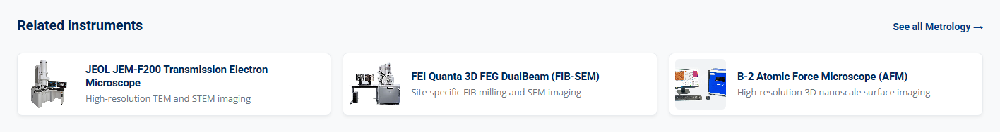

# Update Equipment Breadcrumbs and Related Instruments

**Summary:** Update the breadcrumb trail and the related-instrument cards on an equipment page, and copy the same category and instrument links into that page's JSON-LD.

**When to change:** When an instrument changes category, a new instrument page is added, or its related instruments change.

**Difficulty:** <span class="difficulty-stars" style="color:#E6A800">★★★</span>

**Estimated Time:** 15 minutes

---

## Visual Reference

<p align="center">
  <br/>
  <em>Breadcrumb trail above the instrument title on an equipment page</em>
</p>

<p align="center">
  <br/>
  <em>Related instruments at the bottom of an equipment page</em>
</p>

**Real Code Snippet (`/About_Equipment/SEM.html` — breadcrumb trail, lines 209–216)**

```html
                <nav class="eq-crumb" aria-label="Breadcrumb">
                    <ol>
                        <li><a href="../index.html"><i class="fas fa-house" aria-hidden="true"></i><span class="sr-only">Home</span></a></li>
                        <li><a href="../Equipment.html" rel="up">Equipment</a></li>
                        <li><a href="../Equipment.html?category=Metrology">Metrology</a></li>
                        <li><span aria-current="page">JEOL JSM-IT710HR Field Emission SEM</span></li>
                    </ol>
                </nav>
```

*Four crumbs, in this order. The › between them is not in the HTML. CSS draws it. The current page is text, not a link.*

---

## Target Files

| Path | Purpose in this task |
|---|---|
| `/About_Equipment/*.html` | Each instrument page holds `nav.eq-crumb`, `nav.eq-related`, and the JSON-LD `BreadcrumbList` and `isSimilarTo` nodes you keep in step with them. There are 42 pages. |
| `/Equipment.html` | Catalog filter buttons. The category crumb must match one of their `data-filter` values. |
| `/JS/script.js` | `applyCategoryFromUrl()` (around line 1357) reads `?category=` and selects the filter. You read it for a normal crumb change; you do not edit it. |
| `/CSS/style.css` | `.eq-crumb` (around line 23698) and `.eq-related` (around line 23787), including the narrow-screen rules. Edit this only when the layout should change on every instrument page. |

> [!WARNING]
> **Keep the visible trail, the JSON-LD, and the catalog filter name in step.**
> The visible crumbs must match the `BreadcrumbList`, and the related cards must match the `Product` node's `isSimilarTo`, in the same order. The category must be one of these `data-filter` values on `/Equipment.html`: `Educational`, `Electrical`, `Fabrication`, `Mechatronics`, `Metrology`, `Sample Prep`, `Support Systems`. `applyCategoryFromUrl()` compares the query to `data-filter` without regard to case. Any other name opens the full, unfiltered catalog and does not scroll to the grid. The page shows no error. A drift between the cards and `isSimilarTo`, or one stray comma in the JSON-LD, also fails silently: the page still renders, and crawlers drop the graph or keep the old list.

> [!IMPORTANT]
> **Verify against your local codebase:** the four items in `nav.eq-crumb`, the `data-filter` values on `/Equipment.html`, the `?category=` query on both the crumb and the `See all` link, `applyCategoryFromUrl()` in `/JS/script.js`, and the `BreadcrumbList` and `isSimilarTo` nodes in the same page's structured-data block.

> [!NOTE]
> **These blocks are copied by hand.**
> Nothing builds the crumb or the cards from `equipment.json`. Each of the 42 files under `/About_Equipment/` has its own copy. Changing one page does not update the others. If the instrument page does not exist yet, create it first with [Add a New Page](../General/add-a-new-page.md), then add the trail and the cards described here.

---

## Step-by-Step Instructions

Please edit the instrument page first, then mirror the same names in its JSON-LD. The catalog script and the stylesheet already know how to display a trail that follows the pattern below.

### Part 1: Update the Breadcrumb

1. To get started, please open the instrument page you are changing. `/About_Equipment/SEM.html` is the model. Search for `class="eq-crumb"`. The `nav` sits inside `.product-hero`, above the badges and the title.

2. Keep exactly four items, in the order shown in the Visual Reference. Home and Equipment stay as they are. Change the category item and the current-page name using the table below.

| # | What to Change | Description | Options / Example |
|---|---|---|---|
| ① | Home crumb | House icon plus a screen-reader name. The icon is hidden from assistive tech (`aria-hidden="true"`). The words `Home` are what a screen reader reads. | `href="../index.html"`, class `fa-house`, `<span class="sr-only">Home</span>` |
| ② | Equipment crumb | Parent link to the catalog. `rel="up"` belongs on this link only. | `href="../Equipment.html"`, text `Equipment` |
| ③ | Category crumb | Link text is one of the seven `data-filter` names. A space stays in the text and is written as `%20` in the query. | `../Equipment.html?category=Sample%20Prep` |
| ④ | Current page | The instrument name, not a link. An ampersand in HTML is written `&amp;`. | `<span aria-current="page">[Instrument Name]</span>` |

3. The house icon comes from the Font Awesome 6.4.0 stylesheet already linked in the page `<head>`. Please keep the `<i>` and the `<span class="sr-only">Home</span>` together. Drop the span and a screen reader loses "Home". Drop the stylesheet and a sighted visitor sees an empty first crumb, because the span is visually hidden. The page does not show an error either way.

4. Do not type the › character into the list. `.eq-crumb li+li::before` in `/CSS/style.css` (around line 23745) draws it. Adding a text separator puts a second mark beside the CSS one.

5. Please keep the trail at four items. The styles treat item 1 as Home and item 3 as the category. Add or remove an item and the wrong crumb is drawn brighter, and below 600px the wrong crumb is hidden. Nothing reports the mistake.

6. Please write a two-word category the way the live pages do. The link text keeps the space. The query encodes it as `%20`. Sample Prep and Support Systems are the only two filter names that need it today:

   **Real Code Snippet (`/About_Equipment/TEM_Prep_Disk_Grinder.html` — Sample Prep category crumb, around line 214)**

   ```html
                           <li><a href="../Equipment.html?category=Sample%20Prep">Sample Prep</a></li>
   ```

   **Real Code Snippet (`/About_Equipment/LN2_Storage_Dewars.html` — Support Systems category crumb, around line 225)**

   ```html
                           <li><a href="../Equipment.html?category=Support%20Systems">Support Systems</a></li>
   ```

   `URLSearchParams` turns `%20` back into a space before the comparison, so the button still matches. Please do not put a raw space in the `href`. These files use `%20`, not `+`. One-word categories (`Metrology`, `Fabrication`, `Electrical`, `Educational`, `Mechatronics`) are written as plain words in both the text and the query.

7. Please open `/Equipment.html` and match `data-filter`, not the wrapped button label. `Support Systems` is one attribute value even though the visible label breaks across two lines.

   **Real Code Snippet (`/Equipment.html` — catalog category buttons, lines 527–535)**

   ```html
                               <button class="filter-btn category-btn active" data-filter="all">All</button>
                               <button class="filter-btn category-btn" data-filter="Metrology">Metrology</button>
                               <button class="filter-btn category-btn" data-filter="Fabrication">Fabrication</button>
                               <button class="filter-btn category-btn" data-filter="Electrical">Electrical</button>
                               <button class="filter-btn category-btn" data-filter="Sample Prep">Sample Prep</button>
                               <button class="filter-btn category-btn" data-filter="Mechatronics">Mechatronics</button>
                               <button class="filter-btn category-btn" data-filter="Educational">Educational</button>
                               <button class="filter-btn category-btn" data-filter="Support Systems">Support
                                   Systems</button>
   ```

   `all` is the reset button, not an instrument category. Please do not put it on a crumb.

8. The colored badges under the trail (`.hero-badges`) are not the breadcrumb. Seven pages use a first badge that is not the catalog category. On `/About_Equipment/Keysight_ImpAnalyzer.html` the first badge says Metrology and the crumb says Electrical. Please do not copy a badge into the crumb, and do not change the badges as part of this task.

9. Please open `/JS/script.js` and find `applyCategoryFromUrl`. On an instrument page there are no `.category-btn` elements, so the function returns immediately and the crumb still works. It matters on `/Equipment.html`, which is where the category link lands.

   **Real Code Snippet (`/JS/script.js` — read the category query and select the filter button, lines 1357–1368)**

   ```javascript
   const applyCategoryFromUrl = () => {
       if (categoryBtns.length === 0) return false;
       const raw = new URLSearchParams(window.location.search).get('category');
       if (!raw) return false;
       const match = Array.from(categoryBtns).find(
           (btn) => (btn.getAttribute('data-filter') || '').toLowerCase() === raw.toLowerCase()
       );
       if (!match) return false;
       categoryBtns.forEach((b) => b.classList.remove('active'));
       match.classList.add('active');
       return true;
   };
   ```

   The comparison is case-insensitive, so `sample prep` and `Sample Prep` select the same button. The URL's case does not have to match. After the button is chosen, `applyFilters()` keeps a card only when its `data-category` equals that button's `data-filter` exactly, including capitals. You do not edit this script to rename a crumb.

   **Real Code Snippet (`/JS/script.js` — card filter is an exact match to the button, lines 1343–1344)**

   ```javascript
           const category = card.getAttribute('data-category') || '';
           const categoryMatch = activeCategory === 'all' || category === activeCategory;
   ```

10. If the query matches no button, the function returns false. The catalog stays on **All**, and `scrollToCatalog()` (around line 1370) does not run. The visitor sees every instrument, still at the top of the page, with no error. That is the silent failure. The handler around line 1240 is the Contact Us form preselect. Please leave it alone. `syncCategoryUrl()` (around line 1401) only rewrites the address bar after someone clicks a filter button on the catalog.

   **Real Code Snippet (`/JS/script.js` — scroll only when a category button matched, around line 1415)**

   ```javascript
   const landedOnCategory = applyCategoryFromUrl();
   ```

   **Real Code Snippet (`/JS/script.js` — scroll to the grid after a matched category, lines 1445–1456)**

   ```javascript
   if (landedOnCategory) {
       scrollToCatalog();
       const headerWait = setInterval(() => {
           if (document.getElementById('mainHeader')) {
               scrollToCatalog();
               clearInterval(headerWait);
               // Compact header (.scrolled) settles after 300ms; re-jump once.
               setTimeout(scrollToCatalog, 400);
           }
       }, 50);
       setTimeout(() => clearInterval(headerWait), 3000);
   }
   ```

> [!NOTE]
> **A matched filter can still show an empty grid.**
> `Mechatronics` is a real `data-filter`, and no catalog card uses it, so the grid is empty and the page does scroll. The three Sample Prep cards (the TEM prep instruments) are inside an HTML comment in `/Equipment.html`, so they are not on the page either. Choosing `Sample Prep` selects the button and scrolls to an empty grid. That is not a broken `%20`, and it is not the unfiltered-catalog failure above. `Support Systems` has one live card. Hiding an instrument from the catalog and the sitemap is a separate task: [Add or Unlist a Page in the Sitemap](02-update-sitemap.md).

11. If the instrument name contains `&`, write `&amp;` in the HTML. The JSON-LD name in Part 3 keeps a plain `&`. The JSON lives in a script block, so HTML entities are not decoded there: writing `&amp;` into the JSON stores those letters in the name. A raw `&` in the HTML text can be read as a character reference, so the name may not display as you typed it.

   **Real Code Snippet (`/About_Equipment/Seebeck_Resistivity_Instrument.html` — ampersand in the visible current-page crumb, around line 214)**

   ```html
                           <li><span aria-current="page">LINSEIS LSR-3 Seebeck &amp; Resistivity Instrument</span></li>
   ```

   **Example Snippet (breadcrumb for a new or moved instrument)**

   ```html
   <nav class="eq-crumb" aria-label="Breadcrumb">
       <ol>
           <li><a href="../index.html"><i class="fas fa-house" aria-hidden="true"></i><span class="sr-only">Home</span></a></li>
           <li><a href="../Equipment.html" rel="up">Equipment</a></li>
           <!-- Category text must be a data-filter name. In the href only, write a space as %20. -->
           <li><a href="../Equipment.html?category=[Category]">[Category]</a></li>
           <!-- Not a link. Write an ampersand as &amp;. -->
           <li><span aria-current="page">[Instrument Name]</span></li>
       </ol>
   </nav>
   ```

---

### Part 2: Update the Related Instruments

1. In the same file, please search for `class="eq-related"`. The block is the last thing inside `<main>`, under the two-column body. It is a gray band with a gold top border and the heading "Related instruments".

2. `/About_Equipment/SEM.html` shows the full pattern: a `See all` link, then one `<li>` per card.

   **Real Code Snippet (`/About_Equipment/SEM.html` — related-instruments block, lines 515–551)**

   ```html
           <nav class="eq-related" aria-label="Related instruments">
               <div class="container">
                   <div class="eq-related__head">
                       <h2 class="eq-related__title">Related instruments</h2>
                       <a class="eq-related__all" href="../Equipment.html?category=Metrology">See all Metrology →</a>
                   </div>
                   <ul class="eq-related__list">
                       <li>
                           <a class="eq-related__card" href="TEM.html">
                               
                               <span class="eq-related__body">
                                   <span class="eq-related__name">JEOL JEM-F200 Transmission Electron Microscope</span>
                                   <span class="eq-related__role">High-resolution TEM and STEM imaging</span>
                               </span>
                           </a>
                       </li>
                       <li>
                           <a class="eq-related__card" href="DualBeam_FIBSEM.html">
                               
                               <span class="eq-related__body">
                                   <span class="eq-related__name">FEI Quanta 3D FEG DualBeam (FIB-SEM)</span>
                                   <span class="eq-related__role">Site-specific FIB milling and SEM imaging</span>
                               </span>
                           </a>
                       </li>
                       <li>
                           <a class="eq-related__card" href="B2_AFM.html">
                               
                               <span class="eq-related__body">
                                   <span class="eq-related__name">B-2 Atomic Force Microscope (AFM)</span>
                                   <span class="eq-related__role">High-resolution 3D nanoscale surface imaging</span>
                               </span>
                           </a>
                       </li>
                   </ul>
               </div>
           </nav>
   ```

3. Please change the cards and the `See all` link with the table below. Leave the `aria-label`, the heading text, and every class name as they are. Rename a class and the rules in `/CSS/style.css` stop matching, so the row collapses. The page shows no error.

| # | What to Change | Description | Options / Example |
|---|---|---|---|
| ① | How many cards | Three cards fill one desktop row. 41 of the 42 pages have three. `/About_Equipment/DualBeam_FIBSEM.html` has two (the SEM and the TEM), so its row does not fill. A fourth card wraps onto a short second row. | 3 `<li>` elements |
| ② | Card link | A filename in this same folder. A wrong name opens a 404, which the visitor does see. | `href="[InstrumentPage].html"` |
| ③ | Thumbnail | 72 × 72, lazy, and cropped square by CSS (`object-fit: cover`, around line 23864). The `alt` text is the instrument name. On all 125 cards today, `alt` equals `.eq-related__name`. | `width="72"` `height="72"` `loading="lazy"` |
| ④ | Name and role | The name repeats the `alt` text. The role is one short line about what a visitor would compare or use this instrument for. | `[Instrument Name]` / `[Short role]` |
| ⑤ | See all link | The same `?category=` query as the category crumb, including `%20`. The arrow is the character `→`, not `->`. | `See all [Category] →` |

4. A card does not have to share the page's category. Of the 125 cards on the 42 pages, 73 point at an instrument in the same category and 52 point elsewhere on purpose (an educational trainer, for example, links to the SEM, the TEM, and the ProtoLaser). Please pick instruments a visitor would compare or use next, and stop at three.

5. A two-word `See all` link uses the same encoding as the crumb:

   **Real Code Snippet (`/About_Equipment/TEM_Prep_Disk_Grinder.html` — See all link with an encoded space, around line 520)**

   ```html
                       <a class="eq-related__all" href="../Equipment.html?category=Sample%20Prep">See all Sample Prep →</a>
   ```

6. Please copy this shape when you add a card. Repeat the `<li>` until you have three. You may delete the comments. They are notes, and HTML comments do not break the page.

   **Example Snippet (one related card and the See all link)**

   ```html
   <a class="eq-related__all" href="../Equipment.html?category=[Category]">See all [Category] →</a>
   <!-- ^^^ Same query as the category crumb. Write a space as %20 in the href only. -->
   <li>
       <!-- Same-folder filename. Keep three of these list items. -->
       <a class="eq-related__card" href="[InstrumentPage].html">
           <!-- alt is the instrument name. Leave width, height, and loading as written. -->
           
           <span class="eq-related__body">
               <span class="eq-related__name">[Instrument Name]</span>
               <span class="eq-related__role">[Short role, one line]</span>
           </span>
       </a>
   </li>
   ```

---

### Part 3: Mirror Both Changes in the JSON-LD

1. In the same file, please search for `BreadcrumbList` inside the `<!-- BEGIN structured-data -->` block. The visible trail and this list are hand-copied. The page will not tell you if they disagree.

   **Real Code Snippet (`/About_Equipment/SEM.html` — JSON-LD BreadcrumbList, lines 94–122)**

   ```json
           {
             "@type": "BreadcrumbList",
             "@id": "https://nano.nau.edu/About_Equipment/SEM.html#breadcrumb",
             "itemListElement": [
               {
                 "@type": "ListItem",
                 "position": 1,
                 "name": "Home",
                 "item": "https://nano.nau.edu/index.html"
               },
               {
                 "@type": "ListItem",
                 "position": 2,
                 "name": "Equipment",
                 "item": "https://nano.nau.edu/Equipment.html"
               },
               {
                 "@type": "ListItem",
                 "position": 3,
                 "name": "Metrology",
                 "item": "https://nano.nau.edu/Equipment.html?category=Metrology"
               },
               {
                 "@type": "ListItem",
                 "position": 4,
                 "name": "JEOL JSM-IT710HR Field Emission SEM"
               }
             ]
           },
   ```

2. Copy the four names from the visible trail. Home and Equipment stay. The category `name` uses a normal space, and its `item` is the absolute catalog URL with the same `%20` encoding as the crumb. Position 4 is the current-page name and has no `item`. Please do not add one. None of the 42 pages have an `item` on position 4.

3. Where the HTML crumb uses `&amp;`, the JSON name uses `&`. This is the same instrument as the crumb in Part 1:

   **Real Code Snippet (`/About_Equipment/Seebeck_Resistivity_Instrument.html` — JSON-LD current-page name with a plain ampersand, lines 116–120)**

   ```json
               {
                 "@type": "ListItem",
                 "position": 4,
                 "name": "LINSEIS LSR-3 Seebeck & Resistivity Instrument"
               }
   ```

4. Please search for `isSimilarTo` in the `Product` node. One `@id` per card, in the same order as the cards. The shape is `https://nano.nau.edu/About_Equipment/[InstrumentPage].html#product`. On all 42 pages today this list matches the card `href` values. Add a card and skip `isSimilarTo`, and visitors see the new card while crawlers keep the old list. No error is shown.

   **Real Code Snippet (`/About_Equipment/SEM.html` — Product isSimilarTo list, lines 177–187)**

   ```json
             "isSimilarTo": [
               {
                 "@id": "https://nano.nau.edu/About_Equipment/TEM.html#product"
               },
               {
                 "@id": "https://nano.nau.edu/About_Equipment/DualBeam_FIBSEM.html#product"
               },
               {
                 "@id": "https://nano.nau.edu/About_Equipment/B2_AFM.html#product"
               }
             ]
   ```

5. Please set the `Product` node's `category` to the same filter name, and its `name` to the current-page name (plain `&`, not `&amp;`). Leave the other nodes unless you are building the graph for a new page. That full copy is [Update Equipment Structured Data (JSON-LD)](03-update-equipment-structured-data.md), Part 2.

| # | What to Change | Description | Options / Example |
|---|---|---|---|
| ① | `BreadcrumbList` position 3 | `name` matches the category crumb text. `item` matches its query, as an absolute URL. | `https://nano.nau.edu/Equipment.html?category=Sample%20Prep` |
| ② | `BreadcrumbList` position 4 | Current-page name only. No `item` property. | `[Instrument Name]` |
| ③ | `isSimilarTo` | One `@id` per card, same order. A stale id fails silently. | `https://nano.nau.edu/About_Equipment/[InstrumentPage].html#product` |
| ④ | `Product` `category` and `name` | Repeat the category crumb and the current-page name. | `[Category]` / `[Instrument Name]` |

6. The block is JSON, parsed from a `<script type="application/ld+json">`. A `//` comment or a trailing comma makes the browser drop the whole script. The visible page does not change, so please delete every comment in the blueprint below before you save, and do not leave a comma after the last item.

   **Example Snippet (category crumb and current page in the BreadcrumbList)**

   ```json
   {
     "@type": "ListItem",
     "position": 3,
     "name": "[Category]", // same words as the category crumb; keep the space
     "item": "https://nano.nau.edu/Equipment.html?category=[Category]" // write a space as %20 in this URL
   },
   {
     "@type": "ListItem",
     "position": 4,
     "name": "[Instrument Name]" // no item property; type & not &amp;
   }
   ```

   **Example Snippet (isSimilarTo entries, one per card)**

   ```json
   "isSimilarTo": [
     {
       "@id": "https://nano.nau.edu/About_Equipment/[InstrumentPage].html#product" // same order as the cards
     }
   ]
   ```

7. If you rename the file, please update the `@id` values in this page and every other page that names it in a card `href` or in `isSimilarTo`. A stale card `href` opens a 404. A stale `@id` does not. The visitor still sees a working card, and the graph points at a page that is no longer there.

---

## Design Impact & Layout Solutions

* **The Design Discrepancy Risk:** The list row is fixed at 20px and does not wrap. A long instrument name truncates with an ellipsis. The stylesheet says wrapping would change the row height. The related list is a three-column grid. Two cards leave a gap, and a fourth card starts a short second row. The styles also assume exactly four crumbs: item 1 is Home, item 3 is the category.
* **Visual Impact:** On a wide screen the current-page name ends in an ellipsis instead of pushing the title down. At 600px and narrower the Home icon disappears and the trail starts at Equipment, still on one line. At 900px and narrower the three cards stack in a single column. A card lifts 3px on hover unless the visitor prefers reduced motion.
* **Recommended Solutions:**
    * **Leave the current page as text:** Keep `aria-current="page"` on a `<span>`, not on a link. The ellipsis rules target that attribute. Remove the attribute and a long name can wrap inside the 20px row and get clipped. A link that keeps the attribute still truncates, but the current page should not be a link: the visitor is already on it, and JSON-LD position 4 has no URL.
    * **Keep three cards:** That is what fills `.eq-related__list` on desktop. DualBeam is the only page with two, and its row does not fill.
    * **Do not edit the CSS for a name change:** The narrow-screen rules already handle the row. A change in `/CSS/style.css` restyles all 42 instrument pages at once. Please change it only when that is what you want.

The one-row rule is `flex-wrap: nowrap` and a fixed height. The current-page crumb is the piece that shrinks:

**Real Code Snippet (`/CSS/style.css` — single-row breadcrumb, lines 23702–23717)**

```css
/* nowrap keeps this a single row at every width; the current-page crumb
   truncates instead of wrapping, which is what keeps the height exact. */
.eq-crumb ol {
    display: flex;
    flex-wrap: nowrap;
    align-items: center;
    gap: 6px;
    height: 20px;
    list-style: none;
    margin: 0;
    padding: 0;
    font-family: var(--font-display);
    font-size: 0.78rem;
    line-height: 20px;
    letter-spacing: 0.3px;
}
```

The separator, the brighter category crumb, the ellipsis, the hero padding, and the narrow-screen rule sit together. At 600px and narrower the first crumb (Home) and the separator in front of Equipment are hidden, so the row does not start with a dangling ›. `.product-hero:has(.eq-crumb)` keeps the band the same height. Move the `nav` outside `.product-hero` and the hero grows. The page does not warn you.

**Real Code Snippet (`/CSS/style.css` — separator, truncation, and the 600px rule, lines 23745–23778)**

```css
.eq-crumb li+li::before {
    content: '\203A';
    color: rgba(255, 255, 255, 0.25);
}

/* The category crumb is the only one leading somewhere the visitor
   has not just been, so it is weighted brighter than its neighbours. */
.eq-crumb li:nth-child(3) a {
    color: rgba(255, 255, 255, 0.7);
}

/* The current page is not a link. Long instrument names truncate
   rather than wrapping, which would change the row height. */
.eq-crumb [aria-current="page"] {
    color: rgba(255, 255, 255, 0.85);
    overflow: hidden;
    text-overflow: ellipsis;
    white-space: nowrap;
}

/* The crumb lives in space .product-hero was already padding out, so adding
   it does not make the band taller. */
.product-hero:has(.eq-crumb) {
    padding-top: 32px;
}

/* Drop Home, and the separator that would be left dangling. */
@media (max-width: 600px) {

    .eq-crumb li:first-child,
    .eq-crumb li:nth-child(2)::before {
        display: none;
    }
}
```

Above 900px the related row is three equal columns. At 900px and narrower it is one column. Reduced motion removes the hover lift:

**Real Code Snippet (`/CSS/style.css` — three-column related grid, lines 23832–23839)**

```css
.eq-related__list {
    display: grid;
    grid-template-columns: repeat(3, minmax(0, 1fr));
    gap: var(--space-md);
    list-style: none;
    margin: 0;
    padding: 0;
}
```

**Real Code Snippet (`/CSS/style.css` — stacked cards and reduced motion, lines 23895–23914)**

```css
@media (max-width: 900px) {
    .eq-related {
        padding: var(--space-xl) 0;
    }

    .eq-related__list {
        grid-template-columns: 1fr;
    }
}

@media (prefers-reduced-motion: reduce) {
    .eq-related__card {
        transition: none;
    }

    .eq-related__card:hover,
    .eq-related__card:focus-visible {
        transform: none;
    }
}
```

The thumbnail box is forced to 72 × 72 regardless of the file's real size. A wide photo is cropped, not stretched. Please fix a bad crop in the image file, not by changing the HTML width and height. Those attributes should stay 72 so they match the CSS.

**Real Code Snippet (`/CSS/style.css` — thumbnail size, lines 23864–23872)**

```css
.eq-related__thumb {
    width: 72px;
    height: 72px;
    max-width: 72px;
    flex-shrink: 0;
    object-fit: cover;
    border-radius: 6px;
    background: var(--gray-100);
}
```

---

## Let's Verify Your Changes

1. From the website root, please start PHP's built-in server (any free port is fine):

   ```powershell
   php -S localhost:8080
   ```

   Open `http://localhost:8080/About_Equipment/SEM.html`. Please do not open the file with `file://`. The header is loaded by script, and the category check needs the catalog page served the same way. This test does not use Apache rewrite rules. `php -S` does not read `.htaccess`, and nothing on this page depends on it.

2. Click the Home icon. It opens the homepage. Go back, then click **Equipment**. The catalog opens at the top and shows every instrument. It should not jump down to the grid, because that link has no `category` query.

3. Click the category crumb (**Metrology** on the SEM page). The catalog scrolls to the instrument grid, the Metrology button is selected, and only Metrology cards are shown. The page scrolls again when the header appears, and once more after that, so the grid should still be in view.

4. Go back to the instrument page. Click each related card and confirm it opens the instrument named on the card. Click **See all Metrology**. It should behave like the category crumb.

5. Open `/About_Equipment/LN2_Storage_Dewars.html` and click **Support Systems**. The query contains `Support%20Systems`. The Support Systems button is selected, the page scrolls to the grid, and the LN2 card is shown. That is the check that a space was encoded correctly.

6. In the address bar, please try three queries on `/Equipment.html` without editing any file:
   * `?category=NotAFilter` shows every instrument and does not scroll. There is no error message. Restore nothing, because you did not save a change.
   * `?category=support%20systems` (lowercase) selects Support Systems, the same as the properly capitalized link. Case is not the failure.
   * `?category=Sample%20Prep` selects Sample Prep and scrolls to an empty grid. That empty grid is expected today, because those cards are commented out. It is not a sign that `%20` failed.

7. On the instrument page, open your browser's device toolbar. At 600px wide or narrower, the Home icon is gone, the trail starts at Equipment, and a long name ends in an ellipsis on one line. At 900px wide or narrower, the related cards stack in one column. Widen the window and confirm three cards sit in one row (two, on the DualBeam page).

8. View the page source. The four `BreadcrumbList` names match the visible trail, the category `item` uses the same query, and each `isSimilarTo` `@id` matches a card, in the same order. If you changed the JSON, confirm there is no `//` comment and no comma after the last item in that script. A broken script leaves the visible page looking finished.

---

🔔 **Documentation Update Reminder:** Please make sure to update any How-To procedures or relevant documentation every time you make a change to the website and deploy it. This keeps our operational manual healthy and helpful for the entire team!

*Last reviewed: September 21, 2026*
