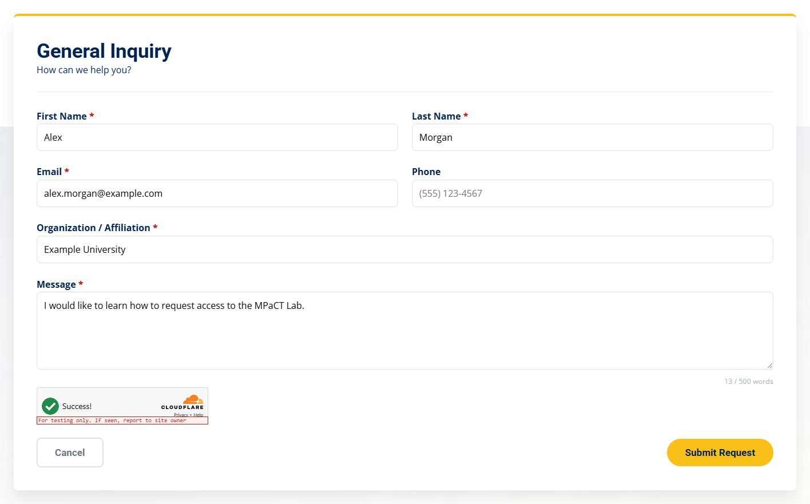

# Add Security Checks to a New Form

**Summary:** Add the honeypot, Turnstile container, and security script tags in the HTML, wire the token checks in JavaScript, register the four PHP guards on the handler, and hide that handler in robots.txt.

**When to change:** When a new page with a form is added, or an existing form moves to a new PHP handler.

**Difficulty:** <span class="difficulty-stars" style="color:#E6A800">★★★★★</span>

**Estimated Time:** 45 minutes

---

## Visual Reference

<p align="center">
  <br/>
  <em>General Inquiry form with the Turnstile widget above the buttons</em>
</p>

**Real Code Snippet (`/FormSubmission.php` — guard chain after the POST check, lines 330–337)**

```php
if ($_SERVER['REQUEST_METHOD'] !== 'POST') {
    respond(false, 'Invalid request method.');
}

rejectIfHoneypotFilled();
verifyCsrfToken();
verifyTurnstile();
checkRateLimits(getClientIp(), trim($_POST['email'] ?? ''));
```

*The POST check, then the honeypot, the CSRF token, Turnstile, and the rate limit. Each reject stops the handler. Copy this order; do not rearrange it.*

---

## Target Files

| Path | Purpose in this task |
|---|---|
| `/[NewPage].html` | The new form page. Copy the honeypot, the Turnstile container, and the five security script tags from `/Contact_Us.html`. |
| `/JS/[your-script].js` (or an inline `<script>` on the page) | Submit code. Model it on `/JS/script.js`: render when the form is shown (lines 822–828) and submit (lines 1181–1226). |
| `/[NewHandler].php` | The new POST handler in the site root. Model the six `require_once` lines and the guard chain on `/FormSubmission.php` (lines 56–65 and 330–337). |
| `/robots.txt` | Add `Disallow: /[NewHandler].php` next to the other form handlers. |
| `/Contact_Us.html` | Markup to copy: honeypot, `#turnstile-contact`, and the five script tags before `JS/layout.js`. |
| `/JS/script.js` | Submit pattern to copy. The widget is rendered around line 822. `handleFormSubmit` sends the form around line 1181. |
| `/FormSubmission.php` | Handler pattern to copy: `require_once` lines 56-65 and the guard chain at lines 330-337. |
| `/includes/validation.php` | `respond()`. Load it before the guard files. Do not edit it for a new form. |
| `/includes/honeypot.php` | `rejectIfHoneypotFilled()`. Do not edit it for a new form. |
| `/includes/csrf.php` | `verifyCsrfToken()`. Do not edit it for a new form. |
| `/includes/turnstile.php` | `verifyTurnstile()`. Do not edit it for a new form. |
| `/includes/rate_limit.php` | `checkRateLimits()` and `getClientIp()`. Do not edit it for a new form. |
| `/JS/turnstile.js` | `MPCT.Turnstile`. The new page loads it. Do not rewrite it for one form. |
| `/JS/csrf.js` | `MPCT.Csrf`. The new page loads it. Do not rewrite it for one form. |
| `/turnstile-config.php` | Prints `window.MPCT_TURNSTILE_SITE_KEY`. The new page only loads it. |
| `/csrf-token.php` | Sets the `csrf_token` cookie and prints `window.MPCT_CSRF_TOKEN`. The new page only loads it. |
| `/CSS/style.css` | No edit. `.hp-field` (around line 23279) already parks the honeypot off-screen. `.mpct-turnstile` (around line 18745, inside `@media (max-width: 768px)`) already centers the widget on a narrow screen. |

> [!WARNING]
> **Keep all four checks in the same order in every handler!**
> The order is the honeypot, then the CSRF token, then Turnstile, then the rate limit, immediately after the POST check. `respond()` exits, so a check that runs too early hides every later failure, and a check you skip never runs.
> Without the browser half (the honeypot block, the widget, the five script tags, and the `csrf_token` field) PHP rejects every submit that is missing a Turnstile token or a CSRF token. The visitor sees `Please complete the security check.` or `Unable to process your submission. Please refresh the page and try again.` Refreshing does not fix a page that never loaded those scripts. The honeypot reject and the CSRF reject write nothing to `error_log`, so the log stays quiet. Leaving the honeypot block out does not reject anyone: bots pass that check and nothing looks wrong.
> Without the PHP half, the form accepts bots and forged posts. The visitor still gets a normal response, and nothing looks wrong.

> [!IMPORTANT]
> **Verify against your local codebase:** Before you edit, confirm the honeypot `id` values and Turnstile container `id` values listed in Part 1 still match your HTML, that `/JS/script.js` still calls `ensureRendered`, `requireToken`, `getBlockReason`, `appendToFormData`, `applyToForm`, and `reset` at the lines cited below, and that `/FormSubmission.php` still has the six `require_once` lines (56–65) and the four calls (330–337). `mpact_config.php` is listed in `/.gitignore` and is not in the repo. There is no sample. Check the server copy, or your local copy, rather than searching the tree for one.

> [!NOTE]
> **Guard chain (same order in every handler):** Other security pages send readers here for this table. Do not edit the shared files unless that page tells you to. A new form repeats these calls; it does not get its own copy of the checks.
>
> | Order | Call | Defined in | Reject message the visitor sees |
> |---|---|---|---|
> | 0 | `if ($_SERVER['REQUEST_METHOD'] !== 'POST')` | each handler | `Invalid request method.` |
> | 1 | `rejectIfHoneypotFilled()` | `/includes/honeypot.php` (lines 17–22) | `Unable to process your submission. Please try again.` |
> | 2 | `verifyCsrfToken()` | `/includes/csrf.php` (lines 78–90) | `Unable to process your submission. Please refresh the page and try again.` |
> | 3 | `verifyTurnstile()` | `/includes/turnstile.php` (lines 28–74) | `Security verification is not configured on the server. Please contact the site administrator.`<br>`Please complete the security check.`<br>`Security verification is temporarily unavailable. Please try again in a moment.`<br>`Security verification failed. Please try again.` |
> | 4 | `checkRateLimits(getClientIp(), trim($_POST['email'] ?? ''))` | `/includes/rate_limit.php` (lines 31–75) | `Too many submissions from your network. Please try again later.`<br>`Too many submissions for this email address. Please try again later.` |
>
> The same calls are in `/FormSubmission.php` (lines 330–337), `/ServiceRequestSubmission.php` (lines 501–511), `/EquipmentReservation.php` (lines 178–188), and `/IntelScholarshipSubmission.php` (lines 39–47). Every reject calls `respond(false, …)` in `/includes/validation.php` (lines 48–59): HTTP 200, JSON `{"success": false, "message": "…"}`, then `exit`. The honeypot and CSRF rejects log nothing. An empty Turnstile token and a missing secret also log nothing. A siteverify failure logs `MPCT Turnstile siteverify failed:` or `MPCT Turnstile siteverify curl error:`. The rate limiter logs `MPCT rate limit store ready:`, `MPCT rate limit store init failed:`, `MPCT rate limit storage driver rejected`, and `MPCT rate limit skipped`. The browser can also stop the submit before any request, using `getBlockReason()` in `/JS/turnstile.js` (lines 150–161). Those messages are listed on [Troubleshoot Blocked Form Submissions](05-troubleshoot-blocked-submissions.md).
>
> Every honeypot `name` is `website`. These six forms already use this chain.
>
> | Form | Page | Form id | Honeypot id | Turnstile container | Handler |
> |---|---|---|---|---|---|
> | Contact | `/Contact_Us.html` | `contactForm` | `website` | `turnstile-contact` | `/FormSubmission.php` |
> | 3D printing | `/ServiceRequest.html` | `printingForm` | `website_printing` | `turnstile-printing` | `/ServiceRequestSubmission.php` |
> | Laser structuring | `/ServiceRequest.html` | `laserForm` | `website_laser` | `turnstile-laser` | `/ServiceRequestSubmission.php` |
> | 3D scanning | `/ServiceRequest.html` | `scanningForm` | `website_scanning` | `turnstile-scanning` | `/ServiceRequestSubmission.php` |
> | Equipment booking | `/Reserve_Equipment.html` | `bookingForm` | `website_booking` | `turnstile-booking` | `/EquipmentReservation.php` |
> | CHIPS scholarship | `/CHIPS_Scholars_Program.html` | `scholarshipForm` | `website_scholarship` | `turnstile-scholarship` | `/IntelScholarshipSubmission.php` |


> [!TIP]
> **A test submit was rejected?** Use [Let's Verify Your Changes](#lets-verify-your-changes) below, then [Troubleshoot Blocked Form Submissions](05-troubleshoot-blocked-submissions.md).

---

## Step-by-Step Instructions

Model the new form on `/Contact_Us.html`, `/JS/script.js`, and `/FormSubmission.php`. Do the four parts in order. The shared PHP files, `/JS/turnstile.js`, `/JS/csrf.js`, `/turnstile-config.php`, and `/csrf-token.php` already exist. This task does not change them. Key rotation is [Update Cloudflare Turnstile (CAPTCHA) Settings](02-update-turnstile-settings.md). Cookie details are [Update CSRF Token Protection](03-update-csrf-protection.md). Thresholds are [Update Rate Limits](04-update-rate-limits.md).

---

### Part 1: Add the page markup (HTML)

1. To get started, please open `/Contact_Us.html` beside the new page. If `/[NewPage].html` does not exist yet, create the shell with [Add a New Page](../General/add-a-new-page.md), then come back. Keep the new page in the site root, next to `Contact_Us.html`. The script addresses below are relative. From a subfolder they point at the wrong files, the security scripts 404, and `fetch` does not receive JSON. The contact script then shows `Unable to connect to the server. Please try again later or email us directly.` The PHP log has no `MPCT` line, because the request never arrived.

2. Copy the honeypot into the `<form>`, before the real fields. Use one honeypot per form. If two fields in the same form are both named `website`, PHP keeps only the last value. It becomes an array only when the name ends in `[]`. A filled first field plus an empty second field would pass the check, and nothing would look wrong.

   **Real Code Snippet (`/Contact_Us.html` — honeypot block, lines 144–148)**
   ```html
                           <!-- Honeypot: leave empty. Hidden from users; bots often fill it. -->
                           <div class="hp-field" aria-hidden="true">
                               <label for="website">Website</label>
                               <input type="text" id="website" name="website" value="" tabindex="-1" autocomplete="off">
                           </div>
   ```

   Keep `name="website"`. `rejectIfHoneypotFilled()` reads only that name. A different name is never checked: bots pass, visitors see no error, and `error_log` stays empty. The `id` must be unique on the page. These ids are already used: `website` (`/Contact_Us.html`, line 147), `website_printing`, `website_laser`, and `website_scanning` (`/ServiceRequest.html`, lines 1021, 1358, and 1659), `website_booking` (`/Reserve_Equipment.html`, line 68), and `website_scholarship` (`/CHIPS_Scholars_Program.html`, line 489). Reusing one on a page that already has it makes `getElementById` hit the wrong field. Pick `website_[form]`. Keep `class="hp-field"`, `aria-hidden="true"`, `tabindex="-1"`, and `autocomplete="off"`. Browser autofill can still fill the field. The visitor then sees the honeypot message, and the log stays empty. [Troubleshoot Blocked Form Submissions](05-troubleshoot-blocked-submissions.md) covers that case.

3. Put the Turnstile container inside the same `<form>`, directly above the buttons.

   **Real Code Snippet (`/Contact_Us.html` — Turnstile container above the buttons, lines 184–194)**
   ```html
                           <div id="turnstile-contact" class="mpct-turnstile" style="margin-bottom: 16px;"></div>

                           <!-- Actions -->
                           <div class="d-flex justify-between align-center">
                               <button type="button" onclick="resetSelection()" class="btn btn-outline btn-outline-gray">
                                   Cancel
                               </button>
                               <button type="submit" id="submitBtn" class="btn btn-primary">
                                   Submit Request
                               </button>
                           </div>
   ```

   Keep `class="mpct-turnstile"` and `style="margin-bottom: 16px;"`. Change the `id` to `turnstile-[form]`. Container ids already used: `turnstile-contact` (line 184), `turnstile-printing` (line 1333), `turnstile-laser` (line 1634), `turnstile-scanning` (line 1918), `turnstile-booking` (line 615), and `turnstile-scholarship` (line 594). If this div sits outside the `<form>`, Turnstile can still show Success, but `FormData` does not include `cf-turnstile-response`. PHP returns `Please complete the security check.` An empty token writes nothing to `error_log`.

4. At the end of `<body>`, add the five security script tags in this order, immediately before `JS/layout.js`. Leave your submit script after `JS/layout.js`, where `/Contact_Us.html` loads `/JS/script.js` (line 212).

   **Real Code Snippet (`/Contact_Us.html` — security scripts, then layout.js, lines 205–210)**
   ```html
       <script src="https://challenges.cloudflare.com/turnstile/v0/api.js?render=explicit" defer></script>
       <script src="turnstile-config.php"></script>
       <script src="JS/turnstile.js"></script>
       <script src="csrf-token.php"></script>
       <script src="JS/csrf.js"></script>
       <script src="JS/layout.js"></script>
   ```

   `api.js` uses `defer`. `turnstile-config.php` must run before `JS/turnstile.js`, because it sets `window.MPCT_TURNSTILE_SITE_KEY`. `csrf-token.php` must run before `JS/csrf.js`, because it sets `window.MPCT_CSRF_TOKEN` and the `csrf_token` cookie. Swap either pair and the widget never gets a key, or the token is empty. PHP then rejects every submit with one of the generic messages in the warning above, and a CSRF miss still writes nothing to `error_log`. How the deferred script is polled is Part 1 of [Update Cloudflare Turnstile (CAPTCHA) Settings](02-update-turnstile-settings.md).

5. Set the five values in the table. Rows ①, ②, ③, and ⑤ are markup. Row ④ is added by JavaScript in Part 2. Do not type a `csrf_token` input by hand.

| # | What to Change | Description | Options / Example |
|---|---|---|---|
| ① | Honeypot `name` | The only name `rejectIfHoneypotFilled()` reads. Any other name is ignored. Bots pass, and the visitor sees no error. | `name="website"` only. Never rename it. |
| ② | Honeypot `id` | Unique on the page. PHP does not read the id. The label's `for` must match this id. | `id="website_[form]"` |
| ③ | Turnstile container `id` | Must match the id you pass to `ensureRendered`, `getBlockReason`, and `reset`. A typo leaves an empty div. The browser blocks the submit, or PHP rejects an empty token. | `id="turnstile-[form]"` |
| ④ | `csrf_token` field | Not handwritten. `JS/csrf.js` adds a hidden input, and `appendToFormData()` sets it on the `FormData`. The cookie is HttpOnly, so the browser will not copy it into the form for you. | Added by script. Name stays `csrf_token`. |
| ⑤ | `email` field | `checkRateLimits()` reads `$_POST['email']`. Another name skips the per-email limit and shows no error. The IP limit still applies. | `name="email"` |

   **Example Snippet (new form markup)**
   ```html
   <form id="[form]Form" novalidate>
       <!-- Honeypot: leave empty. Hidden from users; bots often fill it. -->
       <div class="hp-field" aria-hidden="true">
           <label for="website_[form]">Website</label>
           <!-- id is unique per form; name stays website -->
           <input type="text" id="website_[form]" name="website" value="" tabindex="-1" autocomplete="off">
       </div>

       <!-- name must stay email so the per-email limit has a key -->
       <label for="[form]-email">Email</label>
       <input type="email" id="[form]-email" name="email" required>

       <!-- inside the form, directly above the buttons -->
       <div id="turnstile-[form]" class="mpct-turnstile" style="margin-bottom: 16px;"></div>

       <button type="submit">Submit</button>
   </form>

   <!-- these five tags, in this order, immediately before JS/layout.js -->
   <script src="https://challenges.cloudflare.com/turnstile/v0/api.js?render=explicit" defer></script>
   <script src="turnstile-config.php"></script>
   <script src="JS/turnstile.js"></script>
   <script src="csrf-token.php"></script>
   <script src="JS/csrf.js"></script>
   <script src="JS/layout.js"></script>
   ```

---

### Part 2: Wire the submit code (JavaScript)

1. To get started, please open `/JS/script.js`. Put the same calls in `/JS/[your-script].js`, or in an inline `<script>` after `JS/csrf.js`. Service Request and `/CHIPS_Scholars_Program.html` use an inline script. The booking page uses `/JS/booking.js`. Loading your script before `JS/csrf.js` leaves `MPCT.Csrf` undefined. The token is never added, PHP returns the refresh message, and `error_log` stays empty.

2. Call `ensureRendered` once the form is visible, not while a parent is still `display: none`. A hidden widget can stay at zero size. The visitor sees no checkbox, `requireToken()` fails, and `getBlockReason()` shows a browser message before any POST. PHP is never asked, so `error_log` stays empty.

   **Real Code Snippet (`/JS/script.js` — render Turnstile when the contact form is shown, lines 822–828)**
   ```javascript
           if (window.MPCT && MPCT.Turnstile) {
               requestAnimationFrame(function () {
                   requestAnimationFrame(function () {
                       MPCT.Turnstile.ensureRendered('turnstile-contact');
                   });
               });
           }
   ```

#### Case A: The form is hidden until the visitor opens it

Contact Us keeps `#formContainer` hidden until a category is chosen. The call above sits in that show path, inside two `requestAnimationFrame` callbacks, so the widget is measured after the form is on screen. Put `MPCT.Turnstile.ensureRendered('turnstile-[form]')` in the function that removes your hiding class. Calling it only on `DOMContentLoaded`, while the form is still hidden, produces the zero-size widget described above.

#### Case B: The form is visible when the page loads

Call `ensureRendered` from `DOMContentLoaded`, as `/JS/booking.js` does around line 252 for `turnstile-booking`. An inline script at the end of `<body>` can call it immediately, as `/CHIPS_Scholars_Program.html` does around line 659 for `turnstile-scholarship`. The form element has to exist already. If `getElementById` cannot find `turnstile-[form]`, nothing renders and the failure looks the same as a hidden widget.

3. Before `fetch`, stop when there is no token. Send the CSRF token with the body. After `form.reset()`, put the token back. Reset the widget after success, after a JSON error, and after a network failure. The snippet below is lines 1181-1226 of the contact submit, from the token check through the network-failure reset, including the button label and the `resetSelection` timeout. Those two belong to the contact gateway. Please do not copy `resetSelection` onto a form that should stay on the page.

   **Real Code Snippet (`/JS/script.js` — contact submit security calls, lines 1181–1226)**
   ```javascript
       if (window.MPCT && MPCT.Turnstile && !MPCT.Turnstile.requireToken(form)) {
           setContactFeedback(
               MPCT.Turnstile.getBlockReason(form, 'turnstile-contact') || 'Please complete the security check.',
               'error'
           );
           return;
       }

       setContactFeedback('', '');
       submitBtn.disabled = true;
       submitBtn.textContent = 'Submitting...';

       try {
           const formData = new FormData(form);
           if (window.MPCT && MPCT.Csrf) {
               MPCT.Csrf.appendToFormData(formData);
           }
           const response = await fetch('FormSubmission.php', {
               method: 'POST',
               body: formData,
           });
           const result = await response.json();

           if (result.success) {
               setContactFeedback(result.message || 'Your message was sent.', 'success');
               form.reset();
               if (window.MPCT && MPCT.Csrf) {
                   MPCT.Csrf.applyToForm(form);
               }
               if (window.MPCT && MPCT.Turnstile) {
                   MPCT.Turnstile.reset('turnstile-contact');
               }
               // Return the page to the gateway view after the success toast
               // has had enough time to be read.
               setTimeout(resetSelection, 5000);
           } else {
               setContactFeedback(result.message || 'An error occurred. Please try again.', 'error');
               if (window.MPCT && MPCT.Turnstile) {
                   MPCT.Turnstile.reset('turnstile-contact');
               }
           }
       } catch (err) {
           setContactFeedback('Unable to connect to the server. Please try again later or email us directly.', 'error');
           if (window.MPCT && MPCT.Turnstile) {
               MPCT.Turnstile.reset('turnstile-contact');
           }
   ```

   `requireToken()` is false when `cf-turnstile-response` is empty. Do not `fetch` in that case. `getBlockReason()` returns one of these, or an empty string: `Security check is not configured. Add your Turnstile site key to the server config.`, `Security check failed to load. Confirm your domain is allowed on your Turnstile widget, refresh, and try again.`, or `Please wait for the security check to finish (spinner above Submit).` When it returns an empty string, the contact script uses `Please complete the security check.` Skipping this gate posts an empty token. PHP answers with that same sentence and writes nothing to `error_log`.

   `appendToFormData()` sets `csrf_token` from `window.MPCT_CSRF_TOKEN`. Call it for every `fetch`, even though `JS/csrf.js` also inserts a hidden input on load. A body built some other way will not include that input. PHP then returns the refresh message and logs nothing.

   `form.reset()` restores each input's `defaultValue`. `applyToForm()` sets both `value` and `defaultValue` so the reset does not wipe the token. Call it again after every `form.reset()`. If you reset without that call, and `defaultValue` was never set, the next POST sends an empty `csrf_token`. PHP returns the refresh message and logs nothing. Reloading runs `JS/csrf.js` again, which repairs the field. A handler that never appends the token is not repaired by a reload.

   Turnstile tokens are single-use. `MPCT.Turnstile.reset('turnstile-[form]')` must run after success, after `result.success` is false, and in the `catch`. If you skip it, the next click resends the old token. PHP returns `Security verification failed. Please try again.`, and `error_log` shows `MPCT Turnstile siteverify failed:` plus the error codes. That one does get logged.

   **Example Snippet (new form submit script)**
   ```javascript
   document.addEventListener('DOMContentLoaded', function () {
       if (window.MPCT && MPCT.Turnstile) {
           // Case B. Case A: move this into the function that shows the form.
           MPCT.Turnstile.ensureRendered('turnstile-[form]');
       }
   });

   // Rename this function, and call it from the form's submit handler.
   async function handleNewFormSubmit(e) {
       e.preventDefault();
       var form = document.getElementById('[form]Form');

       if (window.MPCT && MPCT.Turnstile && !MPCT.Turnstile.requireToken(form)) {
           // Do not fetch. Show the browser reason, or the shared fallback.
           showFeedback(
               MPCT.Turnstile.getBlockReason(form, 'turnstile-[form]') || 'Please complete the security check.',
               'error'
           );
           return;
       }

       try {
           var formData = new FormData(form);
           if (window.MPCT && MPCT.Csrf) {
               MPCT.Csrf.appendToFormData(formData); // fetch must send csrf_token itself
           }
           var response = await fetch('[NewHandler].php', { // root-relative to this page
               method: 'POST',
               body: formData,
           });
           var result = await response.json();

           if (result.success) {
               // show result.message, then:
               form.reset();
               if (window.MPCT && MPCT.Csrf) {
                   MPCT.Csrf.applyToForm(form); // put the token back after reset
               }
           } else {
               // show result.message here too; it is the guard-chain text
           }
           if (window.MPCT && MPCT.Turnstile) {
               MPCT.Turnstile.reset('turnstile-[form]'); // success and a JSON error
           }
       } catch (err) {
           if (window.MPCT && MPCT.Turnstile) {
               MPCT.Turnstile.reset('turnstile-[form]');
           }
       }
   }
   ```

---

### Part 3: Register the guard chain (PHP)

1. To get started, please open `/FormSubmission.php`. These steps are for a new file, `/[NewHandler].php`, in the site root. If the new form posts to a handler that already has this chain, do not add the calls again. Skip Part 3 and Part 4. A second `verifyTurnstile()` in the same request spends the token. The second call returns `Security verification failed. Please try again.`, and `error_log` shows `MPCT Turnstile siteverify failed:`. The visitor did nothing wrong. The `require_once` guards would not redeclare the functions; the extra calls are what break the submit.

2. Copy the six `require_once` lines. `mpact_config.php` comes first. `validation.php` comes before the four guard files.

   **Real Code Snippet (`/FormSubmission.php` — config and guard includes, lines 56–65)**
   ```php
   require_once __DIR__ . '/mpact_config.php';

   // Shared validators / sanitizers / required-field gate live in
   // includes/validation.php so all three form endpoints share one
   // source of truth instead of each carrying a prefixed copy.
   require_once __DIR__ . '/includes/validation.php';
   require_once __DIR__ . '/includes/turnstile.php';
   require_once __DIR__ . '/includes/rate_limit.php';
   require_once __DIR__ . '/includes/honeypot.php';
   require_once __DIR__ . '/includes/csrf.php';
   ```

   The comment still says three endpoints. Four handlers load these files today: `FormSubmission.php`, `ServiceRequestSubmission.php`, `EquipmentReservation.php`, and `IntelScholarshipSubmission.php`. Leave the comment unless you are already editing that file. Your handler is one more caller, not a new copy of the checks.

   The guard files call `respond()` from `validation.php`. If that file is missing, the first reject fatals on an undefined `respond()` instead of returning JSON. With `display_errors` off, the visitor gets a blank or non-JSON body, and the submit script's `catch` shows the connection message. That fatal does reach the PHP log, unlike a normal honeypot or CSRF reject. Paths use `__DIR__`. A handler that is not in the site root cannot see `includes/` or `mpact_config.php`, and this require fails the same way.

   `mpact_config.php` holds `TURNSTILE_SITE_KEY` and `TURNSTILE_SECRET_KEY`. Do not commit it. Putting the keys in place is Part 2 of [Update Cloudflare Turnstile (CAPTCHA) Settings](02-update-turnstile-settings.md). The nano.nau.edu server administrator edits the server copy. Without it, `verifyTurnstile()` returns `Security verification is not configured on the server. Please contact the site administrator.` and does not log.

3. Immediately after the POST check, and before field validation or mail, call the four functions in this order.

   **Real Code Snippet (`/FormSubmission.php` — POST check and the four calls, lines 330–337)**
   ```php
   if ($_SERVER['REQUEST_METHOD'] !== 'POST') {
       respond(false, 'Invalid request method.');
   }

   rejectIfHoneypotFilled();
   verifyCsrfToken();
   verifyTurnstile();
   checkRateLimits(getClientIp(), trim($_POST['email'] ?? ''));
   ```

   `getClientIp()` is defined in `/includes/rate_limit.php` (lines 16–19), not in `validation.php`. It returns `$_SERVER['REMOTE_ADDR']`, or `0.0.0.0` when that value is missing. Do not read a forwarded-IP header in this call. [Update Rate Limits](04-update-rate-limits.md) explains what one shared address does to the limit.

   `trim($_POST['email'] ?? '')` is the per-email key. If the input is not named `email`, the string is empty, the email limit is skipped, and the visitor is not told. Only the IP limit remains. That miss is silent.

   Do not send mail or write a stored row above these four calls. `respond()` exits, so a reject never reaches code below them. If the calls sit below the mail, a forged post is already sent and the page still looks normal.

4. After the four calls, add your own field checks and whatever the form is supposed to do. On the contact handler, a mail failure is not a security failure. `createMailer()` lives in `mpact_config.php`. When it throws, the handler logs `MPCT Form Error:` and returns `We were unable to send your inquiry at this time. Please try again or email us directly at ` plus `LAB_EMAIL`. Follow that pattern in a new handler: keep the real mail error out of the guard-chain messages.

   **Example Snippet (new handler guards)**
   ```php
   require_once __DIR__ . '/mpact_config.php';
   // validation.php must load before the guard files: they call respond().
   require_once __DIR__ . '/includes/validation.php';
   require_once __DIR__ . '/includes/turnstile.php';
   require_once __DIR__ . '/includes/rate_limit.php';
   require_once __DIR__ . '/includes/honeypot.php';
   require_once __DIR__ . '/includes/csrf.php';

   if ($_SERVER['REQUEST_METHOD'] !== 'POST') {
       respond(false, 'Invalid request method.');
   }

   rejectIfHoneypotFilled(); // 1. honeypot. Do not move.
   verifyCsrfToken();        // 2. CSRF token. Do not move.
   verifyTurnstile();        // 3. Turnstile. Do not move.
   // 4. Rate limit. The email field must be named email.
   checkRateLimits(getClientIp(), trim($_POST['email'] ?? ''));

   // Field checks, mail, and storage go below this line only.
   ```

---

### Part 4: Hide the handler from crawlers

1. To get started, please open `/robots.txt`. The form handlers are Disallowed in the one shared rule group.

   **Real Code Snippet (`/robots.txt` — form-handler Disallow lines, lines 39–42)**
   ```text
   # Block PHP form processors — no indexable content
   Disallow: /FormSubmission.php
   Disallow: /EquipmentReservation.php
   Disallow: /ServiceRequestSubmission.php
   ```

2. Add one line for the new handler in that same list, still inside the shared group. Do not insert a new `User-agent` line above it. A crawler with its own group would stop using these rules. The fuller crawler list is [Update robots.txt and AI Crawler Access](../SEO-GEO/01-update-robots-and-ai-crawlers.md).

   `robots.txt` is public and only a request. Listing the handler advertises the path. That matches the three handlers already listed. It does not stop a person from POSTing. Do not deny `[NewHandler].php` in `/.htaccess`. `Require all denied` returns 403 to real visitors, and every submit fails. Use [Update Security Headers and Blocked Paths](06-update-security-headers.md) only for a file that must not be requested at all.

   `IntelScholarshipSubmission.php` is not in this list today. Do not add it as part of this task. The robots page names that gap.

   **Example Snippet (new handler Disallow line)**
   ```text
   # Keep this with the other Disallow lines. Do not start a new User-agent group.
   Disallow: /[NewHandler].php
   ```

---

## Design Impact & Layout Solutions

The honeypot stays off-screen only while it keeps `.hp-field`. Site CSS does not set the widget's width. The 16 px gap above the buttons is the inline `margin-bottom` on the container.

**Real Code Snippet (`/CSS/style.css` — honeypot kept off-screen, around line 23278)**
```css
/* Honeypot field — off-screen so bots may fill it; real users never see it */
.hp-field {
    position: absolute;
    left: -10000px;
    top: auto;
    width: 1px;
    height: 1px;
    overflow: hidden;
}
```

The contact rule below is inside `@media (max-width: 1024px)`, opened around line 5209. It matches only the contact form.

**Real Code Snippet (`/CSS/style.css` — contact widget centering at 1024px, around line 5220)**
```css
    #turnstile-contact,
    #contactForm .mpct-turnstile {
        display: flex;
        justify-content: center;
        max-width: 100%;
        overflow-x: auto;
    }
```

The shared rule below is inside `@media (max-width: 768px)`, opened around line 18647. A new `class="mpct-turnstile"` container is covered here. Please do not add another width rule.

**Real Code Snippet (`/CSS/style.css` — shared widget centering at 768px, around line 18744)**
```css
    #turnstile-booking,
    .mpct-turnstile {
        display: flex;
        justify-content: center;
        max-width: 100%;
        overflow-x: auto;
    }
```

* **The Design Discrepancy Risk:** Turnstile draws the widget at a fixed width. Site CSS does not set that width. The 16 px gap is the inline `margin-bottom` on the container, not a rule you add to `/CSS/style.css`. The honeypot stays invisible only while it keeps `.hp-field`.
* **Visual Impact:** Visitors see the widget above the buttons, as in the screenshot above. They do not see the honeypot. On a narrow screen the widget can overflow sideways instead of shrinking. Dropping the inline margin puts the buttons against the widget. The form still submits. Dropping `.hp-field` shows a Website field. If it is filled, including by autofill, every submit ends with `Unable to process your submission. Please try again.` and `error_log` stays empty.
* **Recommended Solutions:**
    * **Keep the 16 px gap:** copy `style="margin-bottom: 16px;"` onto `#turnstile-[form]`. Removing it does not fail the security checks. It only closes the gap above the buttons.
    * **Do not add CSS for this task:** `.hp-field` (around line 23279) already positions the honeypot off-screen (`left: -10000px`, 1 px by 1 px, `overflow: hidden`). `.mpct-turnstile` (around line 18745, inside `@media (max-width: 768px)`) centers the widget and sets `overflow-x: auto`. Contact Us also centers `#turnstile-contact` up to 1024 px (lines 5220–5226). A new page does not need a copy of that tablet rule. Widget theme and color belong to [Update Cloudflare Turnstile (CAPTCHA) Settings](02-update-turnstile-settings.md), not to a new stylesheet block.
    * **Leave the honeypot off-screen:** keep the class, `aria-hidden="true"`, and `tabindex="-1"`. To test a filled honeypot, set the value in DevTools. Do not remove the class to "see" the field.

---

## Let's Verify Your Changes

Use a local copy and Cloudflare's dummy test keys in a local `mpact_config.php`. The key pair and the always-pass secret are Part 4 of [Update Cloudflare Turnstile (CAPTCHA) Settings](02-update-turnstile-settings.md). Do not use the nano.nau.edu keys for this test, and do not commit the file. PHP's built-in server does not read `.htaccess`. This page does not need Apache. Rewrite rules, blocked paths, and Apache headers are the checks that do.

After every response, wait until the widget shows Success again. If `reset` is missing, the next click reuses the token. You will see `Security verification failed. Please try again.` instead of the check you meant to run, and the server log will show `MPCT Turnstile siteverify failed:`.

1. From the website root (the folder that contains `Contact_Us.html`), start `php -S 127.0.0.1:8080`. Open `http://127.0.0.1:8080/[NewPage].html`. Do not double-click the file. `file://` does not run `turnstile-config.php` or `csrf-token.php`, so the widget has no key and the CSRF cookie is never set. Any free port is fine. Use that same port in the steps below.

2. Fill the required fields. Use a valid address such as `name@example.com`. An address that fails `filter_var` never increments the per-email counter, so the later limit test would not count. Wait until the widget shows Success, then submit once. In DevTools, open Network and select the POST to `[NewHandler].php`. The payload must include `website` (empty), `csrf_token`, and `cf-turnstile-response`. The status is 200. `respond()` does not change the status code. The four checks passed when `message` is not one of the reject messages in the guard-chain table.

   On a local copy, mail usually cannot leave the machine. After the guards, the contact handler calls `createMailer()` from `mpact_config.php`. When that throws a mail exception, the JSON message is `We were unable to send your inquiry at this time. Please try again or email us directly at ` plus `LAB_EMAIL`, and the `php -S` terminal logs `MPCT Form Error:`. That mail message means the four checks succeeded. The contact handler's success message, `Your inquiry has been submitted successfully! You will receive a confirmation email shortly.`, appears only when the lab notification email is actually sent. If `createMailer()` is not defined, that is an `Error`, not an `Exception`, so the mail `catch` does not see it. `validation.php` logs `MPCT uncaught error:` and the visitor sees the sentence from `publicFormErrorMessage()` in `/includes/validation.php` (around line 101), which appends `LAB_EMAIL` when that constant is defined. Please do not copy the address into this guide or into the page. That sentence is also not a guard-chain reject. A blank body, or the script's connection message, means `mpact_config.php` did not load at all. Fix the test keys before you read the result as a security failure.

3. Honeypot. With the widget on Success, open the console and run `document.getElementById('website_[form]').value = 'bot'`, using your id. The field is off-screen, so the Elements panel is the other way to set it. Submit. The message is `Unable to process your submission. Please try again.` The terminal does not add an `MPCT` line for that reject. The browser does not block a filled honeypot; only PHP does, and only if the request is actually sent. Clear the value, or reload, before the next test. A value you leave in place keeps failing the honeypot, and a reload is what clears it.

4. CSRF token. In DevTools, open Application (or Storage), then Cookies, and delete `csrf_token` for `127.0.0.1`. Do not reload. Wait for the widget if the last response reset it. Submit. The message is `Unable to process your submission. Please refresh the page and try again.` Nothing is written for that reject. Reload the page so `csrf-token.php` sets the cookie again, wait for the widget, and submit once more. That refresh message should be gone.

5. Rate limit. Use a valid email you have not submitted in the last 5 minutes on any form. The window is shared by every handler that calls `checkRateLimits()`. Submit three times within 5 minutes, waiting for Success after each reset. The third message is `Too many submissions for this email address. Please try again later.` The first two count even when their message is the mail failure, because the limit runs before mail. A honeypot or CSRF reject does not count. It returns before `checkRateLimits()`. If the third submit is not rejected, storage failed open and the visitor is let through. Look in the `php -S` terminal for `MPCT rate limit`. [Update Rate Limits](04-update-rate-limits.md) is the storage setup.

6. Open `http://127.0.0.1:8080/robots.txt` and confirm `Disallow: /[NewHandler].php` sits with the other form handlers. Then open `http://127.0.0.1:8080/[NewHandler].php` in the address bar (a GET). The JSON message is `Invalid request method.` On Windows PowerShell, `curl` is an alias, so use `curl.exe -s http://127.0.0.1:8080/[NewHandler].php` if you want the same body in the terminal. A 403 means the handler was denied in `.htaccess`. Remove that deny, or real posts cannot get through. `robots.txt` itself does not block the GET. `php -S` will not show an `.htaccess` deny either. Check a 403 on Apache (production, staging, or a local Apache such as XAMPP).

7. Any other message is [Troubleshoot Blocked Form Submissions](05-troubleshoot-blocked-submissions.md). Match the sentence the visitor sees before changing keys or limits.

---

🔔 **Documentation Update Reminder:** Please make sure to update any How-To procedures or relevant documentation every time you make a change to the website and deploy it. This keeps our operational manual healthy and helpful for the entire team!

*Last reviewed: September 21, 2026*
