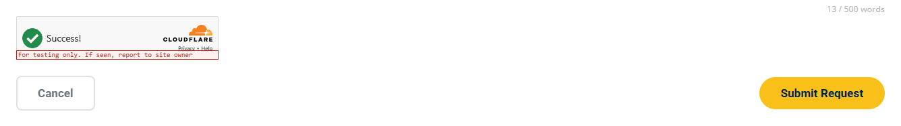

# Update Cloudflare Turnstile (CAPTCHA) Settings

**Summary:** Replace or test the Cloudflare Turnstile site key and secret key, allow a hostname on the widget, and change how the widget looks, in the server config, the shared browser script, and the Cloudflare dashboard.

**When to change:** When keys are rotated, the site is served from a new domain or staging host, or someone needs to test forms on a local server.

**Difficulty:** <span class="difficulty-stars" style="color:#E6A800">★★★★</span>

**Estimated Time:** 20 minutes

---

## Visual Reference

<p align="center">
  <br/>
  <em>Turnstile widget after it passes, above the form buttons</em>
</p>

**Real Code Snippet (`/Contact_Us.html` — security script tags, lines 205–209)**

```html
    <script src="https://challenges.cloudflare.com/turnstile/v0/api.js?render=explicit" defer></script>
    <script src="turnstile-config.php"></script>
    <script src="JS/turnstile.js"></script>
    <script src="csrf-token.php"></script>
    <script src="JS/csrf.js"></script>
```

*The same five tags, in this order, sit on every form page just before `JS/layout.js`. `api.js` is deferred, so it runs after the two Turnstile scripts below it.*

---

## Target Files

| Path | Purpose in this task |
|---|---|
| `/includes/turnstile.php` | Checks the secret key and posts `cf-turnstile-response` to Cloudflare. This is where the server reject messages and `error_log` lines come from. |
| `/turnstile-config.php` | Prints the public site key as `window.MPCT_TURNSTILE_SITE_KEY`. Sends `Cache-Control: no-store`. The secret key never leaves the server. |
| `/JS/turnstile.js` | Renders the widget, waits for the deferred API, and chooses the message the visitor sees before a request is sent. |
| `/mpact_config.php` | Server-only file, not in the repo. Holds `TURNSTILE_SITE_KEY` and `TURNSTILE_SECRET_KEY`. The nano.nau.edu server administrator edits the production copy. |
| `/CSS/style.css` | Narrow-screen `.mpct-turnstile` rules that center the widget and allow sideways scroll. |
| Cloudflare dashboard (not a file) | The widget whose site key and secret key you copy, and Hostname Management for every host that serves the forms. |

> [!NOTE]
> **Turnstile is the site's CAPTCHA.**
> There is no reCAPTCHA, hCaptcha, or image puzzle on this site. Cloudflare Turnstile is the check the visitor can see. The hidden honeypot is the second bot check, and the server runs it before Turnstile. The full order is on [Add Security Checks to a New Form](01-add-security-checks-to-a-form.md).

> [!WARNING]
> **The site key and the secret key must come from the same widget, and every hostname that serves the forms must be on that widget.**
> A hostname missing from the widget makes the widget error in the browser. The visitor sees "Security check failed to load. Confirm your domain is allowed on your Turnstile widget, refresh, and try again." No request is sent, so the server log stays empty.
> A wrong or mismatched secret key lets the widget pass, then siteverify fails. The visitor sees "Security verification failed. Please try again." and the server logs `MPCT Turnstile siteverify failed:` plus Cloudflare's error codes. Either mistake blocks every form. The visitor only sees that generic sentence, and nothing is saved.

> [!IMPORTANT]
> **Verify against your local codebase:** `REPLACE_WITH_YOUR_SITE_KEY` in `/JS/turnstile.js`, `REPLACE_WITH_YOUR_SECRET_KEY` in `/includes/turnstile.php`, the constant names `TURNSTILE_SITE_KEY` and `TURNSTILE_SECRET_KEY`, the five security script tags on each form page, and the `.mpct-turnstile` rules in `/CSS/style.css`.

---

## Step-by-Step Instructions

One site key and one secret key cover all six forms. Please keep the browser half and the server half on the same widget.

---

### Part 1: Understand how the widget loads

1. To get started, please open `/Contact_Us.html` and find the five security script tags in the Visual Reference (lines 205–209). The same five lines, still before `JS/layout.js`, are on `/ServiceRequest.html` (lines 1936–1940), `/Reserve_Equipment.html` (lines 639–643), and `/CHIPS_Scholars_Program.html` (lines 638–642).
2. Please leave that order as it is. `api.js` uses `defer`, and the next scripts do not, so `turnstile-config.php` and `JS/turnstile.js` run while Cloudflare's API is not available yet. That is why Part 1 step 5 polls instead of calling `turnstile.ready()`. The helper reads `window.MPCT_TURNSTILE_SITE_KEY` only when a form renders the widget, not when the script file itself loads. Keep `turnstile-config.php` ahead of `JS/turnstile.js` anyway. If the global is still empty at render time, every visitor sees "Security check is not configured. Add your Turnstile site key to the server config." and no request is sent. The two CSRF tags are a separate check. Please leave them in this block. Removing either one makes every submit fail the CSRF check. [Update CSRF Token Protection](03-update-csrf-protection.md) covers that pair.
3. Please open `/turnstile-config.php`. The whole file is the bridge from the server config to the browser.

   **Real Code Snippet (`/turnstile-config.php` — public site key script, lines 1–16)**

   ```php
   <?php
   /**
    * turnstile-config.php
    *
    * Exposes the public Turnstile site key to the browser as a JS global.
    * The secret key never leaves the server — it lives in mpact_config.php only.
    */

   require_once __DIR__ . '/mpact_config.php';

   header('Content-Type: application/javascript; charset=UTF-8');
   header('Cache-Control: no-store');

   $siteKey = defined('TURNSTILE_SITE_KEY') ? (string) TURNSTILE_SITE_KEY : '';

   echo 'window.MPCT_TURNSTILE_SITE_KEY=' . json_encode($siteKey, JSON_UNESCAPED_SLASHES) . ';';
   ```

   The response is JavaScript, not HTML. If `TURNSTILE_SITE_KEY` is missing, the script still returns `window.MPCT_TURNSTILE_SITE_KEY="";`. The secret is not in this file and is not in the response. Please leave `Cache-Control: no-store` in place. If that response is cached, a rotated site key can stay in the browser after you change the secret. Every submit then fails siteverify with the generic failure message until the cache expires.
4. Please open `/JS/turnstile.js`. An empty site key and the placeholder string are both treated as "not configured".

   **Real Code Snippet (`/JS/turnstile.js` — site key check, lines 13–19)**

   ```javascript
       function getSiteKey() {
           var key = (global.MPCT_TURNSTILE_SITE_KEY || '').trim();
           if (!key || key === 'REPLACE_WITH_YOUR_SITE_KEY') {
               return '';
           }
           return key;
       }
   ```

5. The helper does not call `turnstile.ready()`. That call throws when `api.js` is loaded with `defer`, which is how every form page loads it. `whenReady()` polls instead: every 100 ms, and it gives up after 100 tries (about 10 seconds).

   **Real Code Snippet (`/JS/turnstile.js` — poll until the deferred API exists, lines 27–48)**

   ```javascript
       // Do not call turnstile.ready() — it throws when api.js is loaded with
       // async/defer (which all our form pages use). Poll for turnstile.render.
       function whenReady(callback, onTimeout) {
           if (global.turnstile && typeof global.turnstile.render === 'function') {
               callback();
               return;
           }

           var attempts = 0;
           var timer = setInterval(function () {
               attempts += 1;
               if (global.turnstile && typeof global.turnstile.render === 'function') {
                   clearInterval(timer);
                   callback();
               } else if (attempts >= 100) {
                   clearInterval(timer);
                   if (typeof onTimeout === 'function') {
                       onTimeout();
                   }
               }
           }, 100);
       }
   ```

   When the 10 seconds run out, the timeout handler marks the widget as failed. The visitor then sees the "failed to load" sentence from the next step, and no request is sent. A blocked `challenges.cloudflare.com` script fails the same way. The server log stays empty.

   **Real Code Snippet (`/JS/turnstile.js` — timeout marks the widget failed, lines 101–103)**

   ```javascript
           }, function () {
               widgetErrors[containerId] = 'widget-error';
           });
   ```

6. Before a request is sent, `getBlockReason()` picks the sentence in the feedback box. An empty return means the token is ready.

   **Real Code Snippet (`/JS/turnstile.js` — browser message before submit, lines 150–161)**

   ```javascript
       function getBlockReason(form, containerId) {
           if (!getSiteKey()) {
               return 'Security check is not configured. Add your Turnstile site key to the server config.';
           }
           if (containerId && widgetErrors[containerId]) {
               return 'Security check failed to load. Confirm your domain is allowed on your Turnstile widget, refresh, and try again.';
           }
           if (!getToken(form)) {
               return 'Please wait for the security check to finish (spinner above Submit).';
           }
           return '';
       }
   ```

   Any truthy `widgetErrors` value uses that same "failed to load" sentence. That includes a hostname the widget does not allow (`widget-error` from the error callback), the 10-second timeout, and an expired token (`expired`). The contact form shows the sentence, and falls back to "Please complete the security check." when `getBlockReason()` returns an empty string but the token is still missing. The other three submit scripts use that same fallback.

   **Real Code Snippet (`/JS/script.js` — contact form blocks the submit, lines 1181–1187)**

   ```javascript
       if (window.MPCT && MPCT.Turnstile && !MPCT.Turnstile.requireToken(form)) {
           setContactFeedback(
               MPCT.Turnstile.getBlockReason(form, 'turnstile-contact') || 'Please complete the security check.',
               'error'
           );
           return;
       }
   ```

7. The contact widget is not drawn on first paint. `#formContainer` starts hidden (`/Contact_Us.html`, line 132). `/JS/script.js` calls `MPCT.Turnstile.ensureRendered('turnstile-contact')` after a category is chosen (around line 825), including when the URL is `?category=other` (around line 1240). An empty contact page is not a missing key. Booking renders on load (`/JS/booking.js`, around line 253). The scholarship inline script renders when it runs (around line 660). Service Request renders the printing widget on load, and renders laser or scanning when that panel is opened (`/ServiceRequest.html`, around lines 1957 and 1992).

---

### Part 2: Replace or rotate the keys

1. The keys are not in git. Please open `/.gitignore` and confirm the config file is ignored. There is no sample copy in the repo.

   **Real Code Snippet (`/.gitignore` — server config stays off git, lines 10–11)**

   ```text
   #congig
   mpact_config.php
   ```

2. On nano.nau.edu, the nano.nau.edu server administrator edits `/mpact_config.php` in the site root (the same folder as `FormSubmission.php`). For a local test, create that file yourself and keep it on your machine. Never commit it. If the file is missing, `/turnstile-config.php` cannot run, the browser never receives a site key, and the form shows "Security check is not configured. Add your Turnstile site key to the server config." A POST to a handler fails earlier than that: `mpact_config.php` is loaded before `/includes/validation.php`, so the friendly JSON error handler is not installed yet. The contact form then shows "Unable to connect to the server. Please try again later or email us directly." The PHP log reports that the file could not be loaded. That message does not name Turnstile.
3. Add or edit the two constants below. Do not replace the rest of the file. The handlers also read mail settings from it. Replacing the whole file makes the submit fail after Turnstile has already passed, and the Turnstile sentences will not tell you why. Both values have to be PHP constants with these exact names. A misspelled name is treated as "not configured".

   | # | What to Change | Description | Options / Example |
   |---|---|---|---|
   | ① | `TURNSTILE_SITE_KEY` | Public site key from the Cloudflare widget. `/turnstile-config.php` sends it to the browser. | `define('TURNSTILE_SITE_KEY', '[TURNSTILE_SITE_KEY]');` |
   | ② | `TURNSTILE_SECRET_KEY` | Secret from that same widget. Stays on the server. Never put it in HTML, JavaScript, or git. | `define('TURNSTILE_SECRET_KEY', '[TURNSTILE_SECRET_KEY]');` |

   **Example Snippet (two constants in mpact_config.php)**

   ```php
   // Add or edit these two lines in /mpact_config.php. Do not replace the rest of the file.
   define('TURNSTILE_SITE_KEY', '[TURNSTILE_SITE_KEY]'); // public site key; must match the secret's widget
   define('TURNSTILE_SECRET_KEY', '[TURNSTILE_SECRET_KEY]'); // secret; server only — never commit this file
   ```

   Please do not add spaces or a newline inside the quotes. The browser trims the site key before it renders. The server trims the secret only to decide whether it is configured, then sends the raw constant to Cloudflare (line 40 of the snippet below). A trailing space still counts as configured, siteverify rejects it, and the visitor sees the generic failure.
4. `REPLACE_WITH_YOUR_SITE_KEY` and `REPLACE_WITH_YOUR_SECRET_KEY` count as not configured. So does an empty string, and so does a constant that was never defined.

   **Real Code Snippet (`/includes/turnstile.php` — secret counts as missing, lines 16–26)**

   ```php
   function turnstileIsConfigured(): bool
   {
       if (!defined('TURNSTILE_SECRET_KEY')) {
           return false;
       }

       $secret = trim((string) TURNSTILE_SECRET_KEY);

       return $secret !== ''
           && $secret !== 'REPLACE_WITH_YOUR_SECRET_KEY';
   }
   ```

5. Please read `verifyTurnstile()` before you change keys, so you know which sentence belongs to which mistake. The comment on line 6 of this file says to call it immediately after the POST check. That comment is out of date. The live call sits after the honeypot and the CSRF check, and before the rate limit: `/FormSubmission.php` (lines 330–337), `/ServiceRequestSubmission.php` (lines 501–511), `/EquipmentReservation.php` (lines 178–188), and `/IntelScholarshipSubmission.php` (lines 39–47). Please leave those calls where they are. Moving Turnstile earlier changes which sentence a blocked visitor sees. The guard-chain table is on [Add Security Checks to a New Form](01-add-security-checks-to-a-form.md).

   **Real Code Snippet (`/includes/turnstile.php` — siteverify and the visitor messages, lines 28–74)**

   ```php
   function verifyTurnstile(): void
   {
       if (!turnstileIsConfigured()) {
           respond(false, 'Security verification is not configured on the server. Please contact the site administrator.');
       }

       $token = trim($_POST['cf-turnstile-response'] ?? '');
       if ($token === '') {
           respond(false, 'Please complete the security check.');
       }

       $payload = http_build_query([
           'secret'   => TURNSTILE_SECRET_KEY,
           'response' => $token,
           'remoteip' => $_SERVER['REMOTE_ADDR'] ?? '',
       ]);

       if (!function_exists('curl_init')) {
           error_log('MPCT Turnstile siteverify failed: curl extension is not available');
           respond(false, 'Security verification is temporarily unavailable. Please try again in a moment.');
       }

       $ch = curl_init('https://challenges.cloudflare.com/turnstile/v0/siteverify');
       curl_setopt_array($ch, [
           CURLOPT_POST           => true,
           CURLOPT_POSTFIELDS     => $payload,
           CURLOPT_RETURNTRANSFER => true,
           CURLOPT_TIMEOUT        => 10,
           CURLOPT_SSL_VERIFYPEER => true,
       ]);

       $raw = curl_exec($ch);
       $curlError = curl_error($ch);
       curl_close($ch);

       if ($raw === false) {
           error_log('MPCT Turnstile siteverify curl error: ' . $curlError);
           respond(false, 'Security verification is temporarily unavailable. Please try again in a moment.');
       }

       $result = json_decode($raw, true);
       if (!is_array($result) || empty($result['success'])) {
           $codes = isset($result['error-codes']) ? implode(', ', (array) $result['error-codes']) : 'unknown';
           error_log('MPCT Turnstile siteverify failed: ' . $codes);
           respond(false, 'Security verification failed. Please try again.');
       }
   }
   ```

   `respond()` in `/includes/validation.php` sends HTTP 200 and JSON `{"success": false, "message": "…"}`, then exits. A failed check is not an HTTP error. Use the table below when the wording is ambiguous, and [Troubleshoot Blocked Form Submissions](05-troubleshoot-blocked-submissions.md) when a later layer (CSRF, honeypot, rate limit, or mail) is the one that stopped the submit.

   | # | What to Change | Description | Options / Example |
   |---|---|---|---|
   | ① | Site key missing, empty, or `REPLACE_WITH_YOUR_SITE_KEY` | The browser stops the submit. No POST is sent, and the server log stays empty. | `Security check is not configured. Add your Turnstile site key to the server config.` |
   | ② | Secret missing, empty, or `REPLACE_WITH_YOUR_SECRET_KEY` | The widget can still pass. The server rejects the POST and writes nothing to `error_log`. | `Security verification is not configured on the server. Please contact the site administrator.` |
   | ③ | Hostname not on the widget | The widget errors in the browser. No POST, so the server log stays empty. | `Security check failed to load. Confirm your domain is allowed on your Turnstile widget, refresh, and try again.` |
   | ④ | Secret from another widget, a dummy site key with a production secret, or a secret with a trailing space | siteverify fails. The log line includes Cloudflare's error codes. | `Security verification failed. Please try again.` and `MPCT Turnstile siteverify failed: <codes>` |
   | ⑤ | PHP has no curl, or Cloudflare does not answer within 10 seconds | The visitor is asked to retry. The log names curl, not a key. | `Security verification is temporarily unavailable. Please try again in a moment.` |

---

### Part 3: Allow a new hostname

Do this when a staging host or a new domain will serve the forms with the real widget. Dummy keys in Part 4 do not need a hostname entry. They work on any host, including `localhost`.

1. In the Cloudflare dashboard, open the [Turnstile page](https://dash.cloudflare.com/?to=/:account/turnstile).
2. Select the existing widget. It must be the widget whose site key and secret key are in `mpact_config.php`. Adding the hostname on a different widget does nothing for these forms, and the failure looks like a bad hostname (row ③ in Part 2).
3. Go to **Settings**.
4. Under **Hostname Management**, select **Add Hostnames**.
5. Add the hostname, or choose one already on the account, then select **Add**. These names are Cloudflare's current dashboard labels ([Hostname management](https://developers.cloudflare.com/turnstile/additional-configuration/hostname-management/)).

   | # | What to Change | Description | Options / Example |
   |---|---|---|---|
   | ① | Hostname | A fully qualified domain name only. Adding a name also allows its subdomains. Adding only a subdomain does not allow the parent. | `nano.nau.edu` also allows `www.nano.nau.edu`. `www.nano.nau.edu` alone does not allow `nano.nau.edu`. |
   | ② | Rejected text | Schemes, ports, paths, and `*` are not accepted. The widget will not save them. | Not `https://nano.nau.edu`, not `nano.nau.edu:443`, not `*.nau.edu`. |
   | ③ | How many | Cloudflare's limit is 10 hostnames per widget on a free account, and 200 on an Enterprise account. **Add** fails at the limit instead of saving quietly. | Remove a host you no longer serve before you add another. |

6. Please do not add `localhost` or `127.0.0.1` to the production widget. Cloudflare recommends that a production site key not allow local domains. Use the dummy pair in Part 4 on your own machine instead. Removing `nano.nau.edu` from the production widget blocks every public form in the browser, and the server log stays empty.
7. Please leave the widget visible. These pages render a visible widget into `.mpct-turnstile`, and the wait message tells the visitor to watch the spinner above Submit. Switching the dashboard widget to Invisible removes that box. The forms will not explain the new behavior.

---

### Part 4: Test locally with Cloudflare's dummy keys

Cloudflare publishes dummy site keys and secret keys for local tests. They are not secret. A dummy site key only works with a dummy secret key. A production secret rejects the dummy token (`XXXX.DUMMY.TOKEN.XXXX`), and a dummy secret rejects a real token. Copy the values from [Test your Turnstile implementation](https://developers.cloudflare.com/turnstile/troubleshooting/testing/). Do not put a dummy site key in the production `mpact_config.php`. The widget then shows the red "For testing only" line from the screenshot above, and the always-pass pair accepts every visitor.

| # | What to Change | Description | Options / Example |
|---|---|---|---|
| ① | Always-pass site key, visible | Use this with the always-pass secret for a normal local submit. | `1x00000000000000000000AA` |
| ② | Always-fail site key, visible | The widget itself is labeled always-fail. Do not use it for the server-log test in Let's Verify. | `2x00000000000000000000AB` |
| ③ | Always-pass site key, invisible | This site expects a visible widget. Skip this row unless you mean to hide the box. | `1x00000000000000000000BB` |
| ④ | Always-fail site key, invisible | Same caution as row ③. | `2x00000000000000000000BB` |
| ⑤ | Forced challenge, visible | Use when you need to click through an interactive challenge. | `3x00000000000000000000FF` |
| ⑥ | Always-pass secret | Pair with row ①. | `1x0000000000000000000000000000000AA` |
| ⑦ | Always-fail secret | Cloudflare describes this as always failing validation. | `2x0000000000000000000000000000000AA` |
| ⑧ | Token-already-spent secret | Pair with row ①. Cloudflare documents a siteverify failure of `timeout-or-duplicate`. | `3x0000000000000000000000000000000AA` |

Cloudflare's published pairs are: row ① with row ⑥ (always succeeds), row ② with row ⑦ (always fails), and row ① with row ⑧ (fails validation with `timeout-or-duplicate`).

1. Please put the always-pass visible pair in your local `mpact_config.php`. A local server is enough. You do not need the nano.nau.edu server administrator for this step.

   **Example Snippet (local always-pass pair)**

   ```php
   // Local testing only. Never deploy these values to nano.nau.edu.
   // A dummy site key works only with a dummy secret key.
   define('TURNSTILE_SITE_KEY', '1x00000000000000000000AA'); // always-pass, visible widget
   define('TURNSTILE_SECRET_KEY', '1x0000000000000000000000000000000AA'); // always-pass validation
   ```

2. For the failed siteverify test, keep the always-pass site key so the widget still writes a token, and change only the secret. Row ② can fail inside the widget before a POST exists. You would then see the browser "failed to load" sentence, and the server log would stay empty, which does not exercise `verifyTurnstile()`.

   **Example Snippet (local always-fail secret)**

   ```php
   // Failed-check test only. Switch the secret back to the always-pass value when you are done.
   define('TURNSTILE_SITE_KEY', '1x00000000000000000000AA'); // keep the always-pass site key so a token is posted
   define('TURNSTILE_SECRET_KEY', '2x0000000000000000000000000000000AA'); // always-fail validation
   ```

---

### Part 5: Change the widget's look

The shared helper passes a fixed set of options into `turnstile.render()`. A page can pass more through `MPCT.Turnstile.render(id, {…})` or `MPCT.Turnstile.ensureRendered(id, {…})`. `Object.assign` merges them, and the page's keys replace the defaults. Please keep the three callbacks. `getBlockReason()` depends on them. Replacing `error-callback`, `expired-callback`, or `callback` does not wrap the old function. The helper then cannot see a widget error or an expired token. The visitor may stay on the spinner sentence after the widget has already failed, or the form may send a token that the server rejects with the generic failure message.

1. Please open `/JS/turnstile.js` and find the object passed to `render()`.

   **Real Code Snippet (`/JS/turnstile.js` — options passed to render, lines 78–91)**

   ```javascript
                   var widgetId = global.turnstile.render(el, Object.assign({
                       sitekey: siteKey,
                       theme: 'light',
                       action: 'turnstile-spin-v2',
                       'error-callback': function () {
                           widgetErrors[containerId] = 'widget-error';
                       },
                       'expired-callback': function () {
                           widgetErrors[containerId] = 'expired';
                       },
                       callback: function () {
                           widgetErrors[containerId] = false;
                       }
                   }, options || {}));
   ```

   `render()` returns `null` immediately. The widget id is stored later on the container as `data-turnstile-widget-id`. Please do not treat that return value as success or failure. A missing site key also returns `null`, and it sets `widgetErrors` to `missing-site-key` before the poll starts. `getBlockReason()` still shows the "not configured" sentence in that case, because it checks the site key first.

   **Real Code Snippet (`/JS/turnstile.js` — a second call ignores new options, lines 108–119)**

   ```javascript
       function ensureRendered(containerId, options) {
           var el = getContainer(containerId);
           if (!el) {
               return;
           }

           if (el.getAttribute('data-turnstile-widget-id')) {
               return;
           }

           render(containerId, options);
       }
   ```

   If the container already has `data-turnstile-widget-id`, `ensureRendered()` returns without looking at `options`. The old look stays, and nothing tells you the call was ignored. Reload the page after you change options.

2. Change the shared look in the object above when every form should match. Pass options from one page only when that form should differ. Cloudflare's theme values are `light`, `dark`, and `auto` ([widget configurations](https://developers.cloudflare.com/turnstile/get-started/client-side-rendering/widget-configurations/)). This site sets `light`. PHP does not read `action`, so changing `turnstile-spin-v2` does not change accept or reject. It only changes the label Cloudflare records for the widget. Please do not pass `sitekey` in the options. That replaces the server key, siteverify fails, and the visitor sees the generic failure.

   | # | What to Change | Description | Options / Example |
   |---|---|---|---|
   | ① | `sitekey` | Taken from `TURNSTILE_SITE_KEY`. Overriding it uses a different key than the secret. | Leave this key out of the options object. |
   | ② | `theme` | Light, dark, or auto. The shared default is `light`. | `theme: 'dark'` |
   | ③ | `action` | Sent with the challenge. Our PHP does not check it. | `'turnstile-spin-v2'` |
   | ④ | `error-callback` | Sets `widget-error`, which `getBlockReason()` turns into the "failed to load" sentence. | Keep the function in `/JS/turnstile.js`. |
   | ⑤ | `expired-callback` | Sets `expired`. That value is also truthy, so the visitor sees the same "failed to load" sentence. | Keep the function in `/JS/turnstile.js`. |
   | ⑥ | `callback` | Clears the error after a pass (`false`). | Keep the function in `/JS/turnstile.js`. |

   **Example Snippet (one page overrides the theme only)**

   ```javascript
   // Pass only the options you intend to change.
   // Do not pass sitekey, error-callback, expired-callback, or callback.
   MPCT.Turnstile.ensureRendered('[turnstile-container-id]', {
       theme: 'dark' // light, dark, or auto — callbacks stay the ones in JS/turnstile.js
   });
   ```

   Call that once, the first time the form is shown, in place of the existing `ensureRendered` call for that container. The container ids are `turnstile-contact`, `turnstile-printing`, `turnstile-laser`, `turnstile-scanning`, `turnstile-booking`, and `turnstile-scholarship`.

---

## Design Impact & Layout Solutions

* **The Design Discrepancy Risk:** The site does not pass `size` to `render()`, so the widget keeps Cloudflare's default fixed width. On a narrow screen that box is wider than the form column. The two rules below were written for that fixed box. Passing `size: 'flexible'` or `size: 'compact'` (Cloudflare's other sizes) changes the width those rules center.
* **Visual Impact:** Above 1024 px the contact widget stays left-aligned, as in the screenshot above. At 1024 px and below, the contact rule centers it. At 768 px and below, a second rule centers every `.mpct-turnstile` on the site, not only booking. Without those rules the widget clips or pushes the page sideways. Removing the inline 16 px margin pulls the buttons up against the widget, and no stylesheet rule puts that gap back.
* **Recommended Solutions:**
    * **Keep the contact rule inside its media query:** Lines 5220–5226 sit in `@media (max-width: 1024px)` (opened at line 5209, closed at line 5227). The comment just above that query says desktop widths of 1025 px and up are left unchanged. The selectors are `#turnstile-contact` and `#contactForm .mpct-turnstile`.

      **Real Code Snippet (`/CSS/style.css` — contact widget at 1024 px and below, lines 5220–5226)**

      ```css
          #turnstile-contact,
          #contactForm .mpct-turnstile {
              display: flex;
              justify-content: center;
              max-width: 100%;
              overflow-x: auto;
          }
      ```

    * **Keep the shared narrow-screen rule:** Lines 18744–18750 sit in `@media (max-width: 768px)` (opened at line 18647, closed at line 18751). The selectors are `#turnstile-booking` and `.mpct-turnstile`. The second selector matches every form, including Service Request and the scholarship form. Editing it is site-wide. Service Request also sets `max-width: 100%` on `.mpct-turnstile` and its iframe in that page's own `@media (max-width: 768px)` (`/ServiceRequest.html`, around lines 821–824). Changing `/CSS/style.css` alone does not remove that cap.

      **Real Code Snippet (`/CSS/style.css` — every widget at 768 px and below, lines 18744–18750)**

      ```css
          #turnstile-booking,
          .mpct-turnstile {
              display: flex;
              justify-content: center;
              max-width: 100%;
              overflow-x: auto;
          }
      ```

    * **Keep the 16 px gap above the buttons:** The contact container carries it inline. The same `style="margin-bottom: 16px;"` is on `/Reserve_Equipment.html` (line 615) and on the three Service Request widgets (`/ServiceRequest.html`, lines 1333, 1634, and 1918). Please leave it there when you restyle the widget.

      **Real Code Snippet (`/Contact_Us.html` — 16 px gap above the buttons, line 184)**

      ```html
                              <div id="turnstile-contact" class="mpct-turnstile" style="margin-bottom: 16px;"></div>
      ```

    * **Leave the scholarship row alone:** `/CHIPS_Scholars_Program.html` does not use that inline margin. `.intel-register__turnstile-row` (around line 22891) is right-aligned with `margin-top: 20px`, and `.intel-register__actions` (around line 22913) adds `margin-top: 28px`. At 640 px and below, the row centers. Pasting the contact inline style onto that widget fights the right alignment. The comment on that rule also notes that Cloudflare's inner wrapper is `width: 100%`, which is why the row, not the widget alone, does the alignment.

---

## Let's Verify Your Changes

1. In the site root, create a local `/mpact_config.php` that git already ignores. Use the always-pass visible pair from Part 4. Do not use this file on nano.nau.edu.
2. From the site root, start PHP's built-in server:

   ```powershell
   php -S localhost:8000
   ```

   `php -S` does not read `.htaccess`. Turnstile does not need `.htaccess`. Lines written with `error_log()` appear in this terminal. On Apache (production, staging, or a local Apache such as XAMPP) those same lines go to the server error log instead. The nano.nau.edu server administrator can read the production log.
3. Open `http://localhost:8000/Contact_Us.html?category=other` over HTTP. Do not open the file with `file://`. Turnstile only runs on `http://` or `https://`. In DevTools → Network, confirm `api.js` and the widget iframe load from `challenges.cloudflare.com`, and that `turnstile-config.php` returns JavaScript setting `window.MPCT_TURNSTILE_SITE_KEY` to `1x00000000000000000000AA` with `Cache-Control: no-store`.
4. The spinner becomes a tick and the widget reads Success. With this dummy site key you also see the red "For testing only" line in the screenshot above. If that red line ever shows on `https://nano.nau.edu`, the production config is using a test site key. Ask the nano.nau.edu server administrator to put the real pair back.
5. Submit General Inquiry with test details such as `name@example.com`. In Network, the POST to `FormSubmission.php` is HTTP 200. HTTP 200 does not mean the check passed. Read JSON `success` and `message`. A Turnstile pass means `message` is not one of the sentences in the Part 2 table. Mail can still fail on a local server after Turnstile has passed. That is a later step. If the sentence asks you to refresh the page, that is CSRF, not Turnstile ([Update CSRF Token Protection](03-update-csrf-protection.md)). Two submits with the same email inside five minutes are allowed. A third is the rate limit, not a bad key ([Update Rate Limits](04-update-rate-limits.md)). [Troubleshoot Blocked Form Submissions](05-troubleshoot-blocked-submissions.md) matches the other sentences.
6. Leave the server running. Change only `TURNSTILE_SECRET_KEY` to `2x0000000000000000000000000000000AA`, save, and reload. The site-key script is `no-store`, but reload so the widget writes a fresh token. Submit again. The feedback box shows `Security verification failed. Please try again.` The terminal shows `MPCT Turnstile siteverify failed:` followed by Cloudflare's error codes. The widget resets after that error. If you instead see `Security check failed to load…` and the terminal has no new Turnstile line, the widget never issued a token. Set the secret to `3x0000000000000000000000000000000AA` (Cloudflare's documented token-already-spent failure with the always-pass site key) and submit once more. Then put the always-pass secret back before you test anything else.
7. Dummy keys work on every hostname, so they cannot prove Hostname Management. After you add a real hostname in Part 3, load a form on that host with the real keys. The widget should reach Success. A host that is not listed shows `Security check failed to load. Confirm your domain is allowed on your Turnstile widget, refresh, and try again.` and Network shows no POST.
8. Narrow the window below 768 px. The widget stays centered, and the form can scroll sideways instead of clipping it. The buttons stay 16 px below the widget.

---

🔔 **Documentation Update Reminder:** Please make sure to update any How-To procedures or relevant documentation every time you make a change to the website and deploy it. This keeps our operational manual healthy and helpful for the entire team!

*Last reviewed: September 21, 2026*
