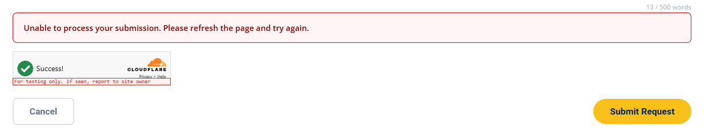

# Troubleshoot Blocked Form Submissions

**Summary:** Match the exact red-box sentence on a blocked form to the browser check, PHP guard, or later mail step that produced it, across all four form pages.

**When to change:** When a visitor or a local test reports that a form will not submit.

**Difficulty:** <span class="difficulty-stars" style="color:#E6A800">★★★</span>

**Estimated Time:** 15 minutes

---

## Visual Reference

<p align="center">
  <br/>
  <em>CSRF rejection on the Contact Us form</em>
</p>

---

## Target Files

| Path | Purpose in this task |
|---|---|
| `/includes/honeypot.php` | Rejects a filled `website` field. That reject logs nothing. |
| `/includes/csrf.php` | `verifyCsrfToken()`. That reject logs nothing. |
| `/includes/turnstile.php` | The server Turnstile sentences, and the only Turnstile lines that reach `error_log`. |
| `/includes/rate_limit.php` | The two "Too many submissions…" sentences, `getClientIp()`, and the fail-open skip log. A normal block logs nothing. |
| `/includes/rate_limit/RateLimitStoreFactory.php` | `MPCT rate limit store ready`, `init failed`, and `storage driver rejected`. |
| `/includes/rate_limit/JsonFileRateLimitStore.php` | `describe()` shapes the `store ready` line (`json:` plus the folder). |
| `/JS/turnstile.js` | `getBlockReason()`, shown before any request is sent. |
| `/includes/validation.php` | `respond()` (always HTTP 200 JSON) and `publicFormErrorMessage()`, plus `MPCT uncaught error` and `MPCT fatal`. |
| `/Contact_Us.html` | `#formFeedback`, directly above `#turnstile-contact`. |
| `/JS/script.js` | Contact Us submit: browser sentence, JSON `message`, and the network sentence. |
| `/ServiceRequest.html` | Three `.sr-form-feedback` strips and the inline submit script for printing, laser, and scanning. |
| `/Reserve_Equipment.html` | `#formFeedback`, directly above `#turnstile-booking`. |
| `/JS/booking.js` | Booking submit, including the network sentence and the success text the visitor actually sees. |
| `/CHIPS_Scholars_Program.html` | `#formFeedback` and the inline scholarship submit script. |
| `/FormSubmission.php` | Contact handler: the guard order, the mail-failure sentence, and the success sentence. |
| `/ServiceRequestSubmission.php` | Service-request handler. Same guard order. |
| `/EquipmentReservation.php` | Booking handler. Same guard order. The page does not show this file's success sentence. |
| `/IntelScholarshipSubmission.php` | Scholarship handler. Same guard order. |
| Server `error_log` (not in the repo) | With `php -S`, these lines print in the terminal running the server. On nano.nau.edu, ask the nano.nau.edu server administrator. Do not guess a path. |

> [!WARNING]
> **A rejected submit is HTTP 200, and several rejects log nothing.**
> `respond()` does not send 403 or 500. If you only watch the status code, or you only read `error_log`, you will miss the block, and the miss is silent. The honeypot, the CSRF token check, a normal rate-limit block, a missing Turnstile token, and a missing Turnstile key write no log line. The red box, or the JSON `message`, is the evidence.

> [!IMPORTANT]
> **Verify against your local codebase:** The reject sentences in `/includes/honeypot.php`, `/includes/csrf.php`, `/includes/turnstile.php`, and `/includes/rate_limit.php`; `getBlockReason()` in `/JS/turnstile.js`; and the submit scripts in `/JS/script.js`, `/JS/booking.js`, `/ServiceRequest.html`, and `/CHIPS_Scholars_Program.html`. A one-word edit moves a row to the wrong cause, and the form still fails with no extra error.

> [!NOTE]
> **The same four guards run, in the same order, in every handler.**
> The order, the file, and the reject sentence for each step are listed on [Add Security Checks to a New Form](01-add-security-checks-to-a-form.md). This page is the lookup: match the sentence the visitor sees, then follow the Fix link. A sentence that names a field is field validation after the guards. It is not in the table below.

> [!TIP]
> **The honeypot and CSRF sentences differ only by the words "refresh the page".**
> `Please try again.` is the honeypot. `Please refresh the page and try again.` is the CSRF token. Browser autofill or a password manager can fill the hidden `website` field even with `autocomplete="off"` and `tabindex="-1"`, which causes a false honeypot block and logs nothing. Jump to [Part 2: Match the Message in the Lookup Table](#part-2-match-the-message-in-the-lookup-table).

---

## Step-by-Step Instructions

---

### Part 1: Read the Exact Message

The red box in the screenshot above is not a browser alert. It is a `bk-feedback bk-feedback--error` strip with `role="alert"`, placed above the Cloudflare Turnstile widget. On all four forms an error stays about 8 seconds and a success stays about 10 seconds, then the strip clears itself. Please copy the full sentence, including the period, or read it from the Network panel. If you wait, the page looks as if nothing happened, and that silence is easy to misread as a second bug.

The four boxes are:

| Page | Where the sentence appears | Submit code |
|---|---|---|
| `/Contact_Us.html` | `#formFeedback` (line 182), above `#turnstile-contact` | `/JS/script.js`, `setContactFeedback()` around line 1136, submit in `handleFormSubmit()` |
| `/ServiceRequest.html` | `.sr-form-feedback` inside each form (lines 1332, 1633, and 1917), above `#turnstile-printing`, `#turnstile-laser`, and `#turnstile-scanning` | Inline script, `showFeedbackMsg()` around line 2025 |
| `/Reserve_Equipment.html` | `#formFeedback` (line 613), above `#turnstile-booking` | `/JS/booking.js`, `showFeedback()` around line 1175. A small icon is placed in front of every sentence. |
| `/CHIPS_Scholars_Program.html` | `#formFeedback` (line 591), above `#turnstile-scholarship` (line 594) | Inline `setFeedback()` around line 784 |

##### 1. Client-Side: Read the Message Before Any Request

1. To get started, please open the form page the visitor used, on a local HTTP server (not `file://`). Submit once and watch whether a POST leaves the browser.
2. On Contact Us the strip sits directly above the widget:

   **Real Code Snippet (`/Contact_Us.html` — feedback strip above the Turnstile container, lines 181–184)**
   ```html
                           <!-- Feedback Message -->
                           <div id="formFeedback" class="bk-feedback" role="alert"></div>
   
                           <div id="turnstile-contact" class="mpct-turnstile" style="margin-bottom: 16px;"></div>
   ```

3. If Cloudflare Turnstile has no token yet, the submit script does not call `fetch`. `getBlockReason()` supplies the sentence:

   **Real Code Snippet (`/JS/turnstile.js` — `getBlockReason()`, lines 150–161)**
   ```javascript
       function getBlockReason(form, containerId) {
           if (!getSiteKey()) {
               return 'Security check is not configured. Add your Turnstile site key to the server config.';
           }
           if (containerId && widgetErrors[containerId]) {
               return 'Security check failed to load. Confirm your domain is allowed on your Turnstile widget, refresh, and try again.';
           }
           if (!getToken(form)) {
               return 'Please wait for the security check to finish (spinner above Submit).';
           }
           return '';
       }
   ```

4. Contact Us shows that sentence, or a fallback when `getBlockReason()` returns an empty string:

   **Real Code Snippet (`/JS/script.js` — browser block before `fetch`, lines 1181–1187)**
   ```javascript
       if (window.MPCT && MPCT.Turnstile && !MPCT.Turnstile.requireToken(form)) {
           setContactFeedback(
               MPCT.Turnstile.getBlockReason(form, 'turnstile-contact') || 'Please complete the security check.',
               'error'
           );
           return;
       }
   ```

   With the function above, a missing token returns "Please wait…", not an empty string, so the fallback does not run on that path. The other three forms use the same fallback and the same `requireToken()` test. Service Request picks the container from the form id (`turnstile-printing`, `turnstile-laser`, or `turnstile-scanning`) around lines 2665–2671. The scholarship form uses `turnstile-scholarship` around lines 955–960. Booking prefixes an icon:

   **Real Code Snippet (`/JS/booking.js` — browser block before `fetch`, lines 979–984)**
   ```javascript
           if (window.MPCT && MPCT.Turnstile && !MPCT.Turnstile.requireToken(form)) {
               const feedback = document.getElementById('formFeedback');
               showFeedback(feedback, false,
                   '<i class="fas fa-times-circle"></i> ' + (MPCT.Turnstile.getBlockReason(form, 'turnstile-booking') || 'Please complete the security check.'));
               return;
           }
   ```

5. No POST in the Network panel means the browser stopped here. Please match that sentence in Part 2. Do not look for an `error_log` line yet. Nothing was sent, so nothing was logged.

##### 2. Server-Side: Read the JSON Message

1. When a POST does leave the browser, every reject uses `respond()`. The status stays 200. The front end reads JSON `success` and `message`, not the status code.

   **Real Code Snippet (`/includes/validation.php` — `respond()`, lines 48–59)**
   ```php
   function respond(bool $ok, string $msg): void
   {
       if (!defined('MPCT_JSON_SENT')) {
           define('MPCT_JSON_SENT', true);
       }
       if (ob_get_length()) {
           ob_clean();
       }
       header('Content-Type: application/json');
       echo json_encode(['success' => $ok, 'message' => $msg]);
       exit;
   }
   ```

   **Example Snippet (what to read in the Network panel)**
   ```javascript
   const body = { success: false, message: '[Paste the exact red-box sentence]' }; // Status stays 200. Match this sentence to the lookup table.
   ```

2. The handler stops at the first check that fails. Later checks never run, and no email is sent.

   **Real Code Snippet (`/FormSubmission.php` — guard chain, lines 330–337)**
   ```php
   if ($_SERVER['REQUEST_METHOD'] !== 'POST') {
       respond(false, 'Invalid request method.');
   }
   
   rejectIfHoneypotFilled();
   verifyCsrfToken();
   verifyTurnstile();
   checkRateLimits(getClientIp(), trim($_POST['email'] ?? ''));
   ```

   The same calls, in the same order, are in `/ServiceRequestSubmission.php` (lines 501–511), `/EquipmentReservation.php` (lines 178–188), and `/IntelScholarshipSubmission.php` (lines 39–47). On the scholarship handler, `verifyTurnstile()` is on the line immediately after `verifyCsrfToken()`. The order does not change.
3. Contact Us prints `result.message` when the JSON says `success` is false. A thrown error (no response, or a body that is not JSON) uses a fixed sentence instead:

   **Real Code Snippet (`/JS/script.js` — JSON message and network failure, lines 1216–1227)**
   ```javascript
           } else {
               setContactFeedback(result.message || 'An error occurred. Please try again.', 'error');
               if (window.MPCT && MPCT.Turnstile) {
                   MPCT.Turnstile.reset('turnstile-contact');
               }
           }
       } catch (err) {
           setContactFeedback('Unable to connect to the server. Please try again later or email us directly.', 'error');
           if (window.MPCT && MPCT.Turnstile) {
               MPCT.Turnstile.reset('turnstile-contact');
           }
           console.error('Form submission error:', err);
   ```

4. The other three pages do not share that network sentence. Please match the words on screen, not the page the visitor thinks they used.

   Service Request throws the JSON message when `success` is false, so a guard reject still shows the server sentence. The `catch` prefers `err.message`, which is why a dropped connection often shows the browser's own text (Chrome uses `Failed to fetch`) rather than the fallback:

   **Real Code Snippet (`/ServiceRequest.html` — failed JSON becomes an `Error`, lines 2694–2696)**
   ```javascript
                           if (!response.ok || !result.success) {
                               throw new Error(result.message || 'Unable to submit your request at this time.');
                           }
   ```

   **Real Code Snippet (`/ServiceRequest.html` — network `catch`, lines 2711–2717)**
   ```javascript
                       } catch (err) {
                           console.error('Service request submission error:', err);
                           showFeedbackMsg(
                               feedbackEl,
                               err.message || 'Unable to connect to the server. Please try again later.',
                               'bk-feedback--error', 3, true
                           );
   ```

   Booking always replaces a thrown error with its own sentence:

   **Real Code Snippet (`/JS/booking.js` — network `catch`, lines 1020–1022)**
   ```javascript
           } catch (err) {
               showFeedback(feedback, false,
                   '<i class="fas fa-times-circle"></i> Network error. Please check your connection and try again.');
   ```

   The scholarship form does the same with a different sentence:

   **Real Code Snippet (`/CHIPS_Scholars_Program.html` — network `catch`, lines 1011–1015)**
   ```javascript
                   } catch (err) {
                       setFeedback(
                           'Unable to reach the server. Please try again later, or email mpct.nano@nau.edu.',
                           'error', FEEDBACK_PRIORITY.server
                       );
   ```

5. If the sentence names a field ("Missing required field…", emoji, a word limit) or says `Invalid email address.`, the guards already passed. That is field validation inside the handler. Search that handler for the exact string, and fix the value. Please see [Update Contact Form Fields](../Contact/02-update-contact-form-fields.md) and [How ServiceRequest.html Works](../Service-Request/service-request-how-it-works.md). Do not remove a guard to get past a field error. The form would accept bad posts and would not show a new error.

---

### Part 2: Match the Message in the Lookup Table

1. Please search the first column for the full sentence, including the period. Do not stop on a shared opening such as "Unable to process your submission."
2. The two easy-to-swap rows come from these two functions. Spaces alone do not trip the honeypot, because the value is trimmed.

   **Real Code Snippet (`/includes/honeypot.php` — `rejectIfHoneypotFilled()`, lines 17–22)**
   ```php
   function rejectIfHoneypotFilled(): void
   {
       if (trim($_POST['website'] ?? '') !== '') {
           respond(false, 'Unable to process your submission. Please try again.');
       }
   }
   ```

   **Real Code Snippet (`/includes/csrf.php` — `verifyCsrfToken()`, lines 78–90)**
   ```php
   function verifyCsrfToken(): void
   {
       $cookie = (string) ($_COOKIE[MPCT_CSRF_COOKIE] ?? '');
       $posted = (string) ($_POST[MPCT_CSRF_FIELD] ?? '');
   
       if ($cookie === '' || $posted === '' || !csrfTokenLooksValid($cookie) || !csrfTokenLooksValid($posted)) {
           respond(false, 'Unable to process your submission. Please refresh the page and try again.');
       }
   
       if (!hash_equals($cookie, $posted)) {
           respond(false, 'Unable to process your submission. Please refresh the page and try again.');
       }
   }
   ```

3. Use this table. The Fix cell names the page to open. Come back to [Part 4: Apply the Fix from the Linked Page](#part-4-apply-the-fix-from-the-linked-page) before you edit anything.

| Message the visitor sees | Layer | Likely cause | Fix |
|---|---|---|---|
| Please wait for the security check to finish (spinner above Submit). | Cloudflare Turnstile, browser | The widget has no token yet. The same sentence appears when the container never rendered and no widget error was stored, so a wrong container `id` looks like "clicked too soon." No POST is sent. | Wait until the spinner becomes a tick, and confirm `api.js` in the Network tab. If the widget never appears, follow [Update Cloudflare Turnstile (CAPTCHA) Settings](02-update-turnstile-settings.md), Part 1, and [Add Security Checks to a New Form](01-add-security-checks-to-a-form.md), Part 2. |
| Security check is not configured. Add your Turnstile site key to the server config. | Cloudflare Turnstile, browser | `MPCT_TURNSTILE_SITE_KEY` is missing or still `REPLACE_WITH_YOUR_SITE_KEY`. No POST is sent. Logs nothing. | [Update Cloudflare Turnstile (CAPTCHA) Settings](02-update-turnstile-settings.md), Part 2. |
| Security check failed to load. Confirm your domain is allowed on your Turnstile widget, refresh, and try again. | Cloudflare Turnstile, browser | Any truthy `widgetErrors` value uses this one sentence: hostname not on the widget, `api.js` blocked, the 10 second `whenReady()` timeout, a render error, or an expired token (`expired`). No POST is sent. | [Update Cloudflare Turnstile (CAPTCHA) Settings](02-update-turnstile-settings.md), Part 3. If the widget had already passed and then expired, refresh and solve it again. |
| Please complete the security check. | Cloudflare Turnstile, server | The POST reached `verifyTurnstile()` with an empty `cf-turnstile-response`. The four scripts also contain this sentence as the fallback when `getBlockReason()` returns an empty string. With the current function, a missing token returns the "Please wait…" sentence instead, so that fallback does not run. You see this sentence when the POST still goes out with an empty token, which happens if `JS/turnstile.js` did not load and the browser test was skipped. Logs nothing. | [Add Security Checks to a New Form](01-add-security-checks-to-a-form.md), Part 2. Confirm the five security script tags are present and in order. |
| Security verification failed. Please try again. | Cloudflare Turnstile, server | Cloudflare `siteverify` rejected the token (expired, already used, or the site key and the secret are not from the same widget). | Read `MPCT Turnstile siteverify failed:` in [Part 3: Check the Server error_log](#part-3-check-the-server-error_log), then [Update Cloudflare Turnstile (CAPTCHA) Settings](02-update-turnstile-settings.md), Part 2. Local dummy keys are Part 4 of that page. A dummy site key only works with its matching dummy secret. |
| Security verification is not configured on the server. Please contact the site administrator. | Cloudflare Turnstile, server | `TURNSTILE_SECRET_KEY` in `mpact_config.php` is missing, empty, or still `REPLACE_WITH_YOUR_SECRET_KEY`. Logs nothing. | [Update Cloudflare Turnstile (CAPTCHA) Settings](02-update-turnstile-settings.md), Part 2. The nano.nau.edu server administrator edits that file. It is not in the repo. |
| Security verification is temporarily unavailable. Please try again in a moment. | Cloudflare Turnstile, server | PHP has no curl extension, or `https://challenges.cloudflare.com/turnstile/v0/siteverify` did not answer within 10 seconds. | Ask the nano.nau.edu server administrator. The log line in Part 3 says which of the two it is. |
| Unable to process your submission. Please refresh the page and try again. | CSRF token | The `csrf_token` cookie is missing, the posted field is missing, either value is not 64 hex characters, or the two values differ. The screenshot above is this sentence. Logs nothing. A passed widget only means the browser finished Turnstile. The server stopped at CSRF and never called Cloudflare. | [Update CSRF Token Protection](03-update-csrf-protection.md), Part 1 and Part 2. |
| Unable to process your submission. Please try again. | Honeypot | `website` was not empty after `trim`. Autofill can do this. Logs nothing. If the CSRF token is also wrong, you still see only this sentence, because the honeypot runs first. | Clear the field in Part 4 of this page. The markup rules are [Add Security Checks to a New Form](01-add-security-checks-to-a-form.md), Part 1. |
| Too many submissions from your network. Please try again later. | Rate limit | More than the IP limit (default 5) from this `REMOTE_ADDR` in the window (default 300 seconds), across all four forms. The slot is taken before field validation, so a rejected retry still counts. Campus Wi-Fi can share one address. A normal block logs nothing. | [Update Rate Limits](04-update-rate-limits.md), Part 3. If real visitors share one address, Part 1 of that page. |
| Too many submissions for this email address. Please try again later. | Rate limit | More than the email limit (default 2) for this address in the same window. The address is lowercased. An invalid email does not use this counter. A normal block logs nothing. | [Update Rate Limits](04-update-rate-limits.md), Part 3. |
| Invalid request method. | POST check | The handler URL was opened in the browser or called with GET. The four form scripts always POST, so this is usually raw JSON in the address bar, not the red box. | Submit from the form page. A new client must POST, as in [Add Security Checks to a New Form](01-add-security-checks-to-a-form.md), Part 2. |
| We were unable to process your submission at this time. Please try again later or email us directly at mpct.nano@nau.edu. | After the guards | An uncaught exception or a fatal error. The address is `LAB_EMAIL` when that constant is defined, and `mpct.nano@nau.edu` otherwise. A caught mail failure uses a different sentence. A SharePoint failure does not use this sentence. | [Part 3: Check the Server error_log](#part-3-check-the-server-error_log), for `MPCT uncaught error` or `MPCT fatal`. Ask the nano.nau.edu server administrator. Do not remove a guard. |
| We were unable to send your inquiry at this time. Please try again or email us directly at mpct.nano@nau.edu. | After the guards (mail) | Contact Us (`MPCT Form Error`) or booking (`MPCT Booking Error`) caught a mail exception. The guards already passed. The address is `LAB_EMAIL` from `mpact_config.php`. | [Part 3: Check the Server error_log](#part-3-check-the-server-error_log). Ask the server administrator to check mail. Do not remove a guard. |
| We were unable to send your request at this time. Please try again or email us directly at mpct.nano@nau.edu. | After the guards (mail) | Service Request. The log line is `MPCT Service Request Error`. The address is `LAB_EMAIL`. | [Part 3: Check the Server error_log](#part-3-check-the-server-error_log). Ask the server administrator to check mail. |
| We were unable to submit your registration at this time. Please try again or email us directly at mpct.nano@nau.edu. | After the guards (mail) | CHIPS Scholars. The log line is `MPCT Intel Scholarship Form Error`. The address is `LAB_EMAIL`. | [Part 3: Check the Server error_log](#part-3-check-the-server-error_log). Ask the server administrator to check mail. |
| Unable to connect to the server. Please try again later or email us directly. | Browser, network | Contact Us only. `fetch` threw, or the body was not JSON. This script ignores `err.message` and always shows this sentence. | Open the page over HTTP from a running PHP server, not `file://`. `php -S` is enough for the form handlers. It does not read `.htaccess`, which this check does not need. Watch that terminal for a PHP fatal. |
| Unable to connect to the server. Please try again later. | Browser, network | Service Request, and only when the caught error has an empty `message`. A dropped connection usually shows the browser text instead, such as `Failed to fetch`. | Same HTTP-server check. Read the response body in the Network tab. |
| Unable to submit your request at this time. | Browser, fallback | Service Request, when a response arrived, the HTTP status was not OK or `success` was false, and the JSON had no `message`. Guard rejects always include a message, so this row is rare. | Read the raw response. If it has a `message`, use that row instead. |
| Network error. Please check your connection and try again. | Browser, network | Reserve Equipment. Any thrown error uses this sentence. An icon sits in front of the words. | Same HTTP-server check. |
| Unable to reach the server. Please try again later, or email mpct.nano@nau.edu. | Browser, network | CHIPS Scholars. Any thrown error uses this sentence, not `err.message`. | Same HTTP-server check. |
| An error occurred. Please try again. | Browser, fallback | Contact Us, when `success` is false and the JSON has no `message`. `respond()` always sets a message, so this row means the body was not one of our rejects. | Read the raw JSON in the Network tab. |
| We could not submit your registration. Please try again. | Browser, fallback | CHIPS Scholars, in that same empty-message case. | Read the raw JSON in the Network tab. |
| Submission failed. Please try again or email mpct.nano@gmail.com. | Browser, fallback | Reserve Equipment, when `success` is false and the JSON has no `message`. This one sentence names `mpct.nano@gmail.com`, not `mpct.nano@nau.edu`. An icon sits in front of the words. | Read the raw JSON. Do not change a guard to avoid the fallback. |

4. For either "Too many submissions…" row, both counters live here. Defaults are 5 per IP address and 2 per email address in 300 seconds, unless `mpact_config.php` defined `RATE_LIMIT_IP_MAX`, `RATE_LIMIT_EMAIL_MAX`, or `RATE_LIMIT_WINDOW_SEC` first.

   **Real Code Snippet (`/includes/rate_limit.php` — IP limit, then email limit, lines 44–63)**
   ```php
           processRateLimitKey(
               $store,
               'ip:' . $ip,
               (int) RATE_LIMIT_IP_MAX,
               $windowSec,
               $retentionDays,
               'Too many submissions from your network. Please try again later.'
           );
   
           $email = normalizeEmail($emailRaw);
           if ($email !== null) {
               processRateLimitKey(
                   $store,
                   'email:' . $email,
                   (int) RATE_LIMIT_EMAIL_MAX,
                   $windowSec,
                   $retentionDays,
                   'Too many submissions for this email address. Please try again later.'
               );
           }
   ```

   The IP is only `REMOTE_ADDR`. Behind a proxy or CDN that the server does not unwrap, every visitor shares one address, and the default limit (5 submissions in 300 seconds) then applies to the whole site. Nothing in the red box names the proxy. Visitors only see "Too many submissions from your network. Please try again later."

   **Real Code Snippet (`/includes/rate_limit.php` — `getClientIp()`, lines 16–19)**
   ```php
   function getClientIp(): string
   {
       return $_SERVER['REMOTE_ADDR'] ?? '0.0.0.0';
   }
   ```

5. For the honeypot row, the field is on the page but off-screen. You will not see it without DevTools. Please inspect `input[name="website"]`. The `id` differs per form (`website`, `website_printing`, `website_laser`, `website_scanning`, `website_booking`, `website_scholarship`). The `name` is always `website`.

   **Real Code Snippet (`/Contact_Us.html` — honeypot markup, lines 145–148)**
   ```html
                           <div class="hp-field" aria-hidden="true">
                               <label for="website">Website</label>
                               <input type="text" id="website" name="website" value="" tabindex="-1" autocomplete="off">
                           </div>
   ```

   **Real Code Snippet (`/CSS/style.css` — `.hp-field` off-screen rule, lines 23279–23286)**
   ```text
   .hp-field {
       position: absolute;
       left: -10000px;
       top: auto;
       width: 1px;
       height: 1px;
       overflow: hidden;
   }
   ```

---

### Part 3: Check the Server error_log

1. Please do not guess a log path on nano.nau.edu. Ask the nano.nau.edu server administrator to search for `MPCT` at the time of the click. On your own machine, start the site with PHP's built-in server and leave that terminal visible. `error_log()` prints there. `php -S` does not read `.htaccess`, so this check says nothing about security headers or blocked paths. Those need Apache, and they are documented in [Update Security Headers and Blocked Paths](06-update-security-headers.md).
2. Match the new line. A line that is not new for this click, such as `MPCT rate limit store ready` from earlier in the same PHP process, is not the block by itself.

| Log line | What it means | Does the visitor get a red box? |
|---|---|---|
| `MPCT Turnstile siteverify failed: curl extension is not available` | PHP curl is missing. | Yes. "Security verification is temporarily unavailable. Please try again in a moment." |
| `MPCT Turnstile siteverify curl error: …` | The request to Cloudflare failed. The text after the colon is curl's error. Do not copy a token into a ticket. | Yes. The same "temporarily unavailable" sentence. |
| `MPCT Turnstile siteverify failed: <codes>` | `siteverify` returned `success` false. `<codes>` is Cloudflare's `error-codes` list, or `unknown`. | Yes. "Security verification failed. Please try again." |
| `MPCT rate limit store ready: json:<folder>` | The JSON store opened. This is normal the first time this PHP process uses it. | No. |
| `MPCT rate limit store init failed: …` | One storage folder failed. The factory tries the next candidate. | Not by itself. |
| `MPCT rate limit storage driver rejected` | `RATE_LIMIT_STORAGE` is not `json` or `sqlite`. | The limiter then fails open (next row). The visitor is not blocked by the rate limit. |
| `MPCT rate limit skipped: … in <file>:<line>` | Storage threw, and the submission was allowed through. `validation.php` loads first, so this is the line you should see. The bare line `MPCT rate limit skipped` is only the fallback if that helper is missing. | No. If the visitor was blocked, look at the red-box sentence instead. |
| `MPCT uncaught error: …` | An exception escaped the handler. | Yes, when headers were not already sent: the `publicFormErrorMessage()` sentence. |
| `MPCT fatal: …` | A fatal error. | Yes, the same generic sentence, when a response was not already sent. |
| `MPCT Form Error: …` | Contact Us mail failed after the guards. | Yes. "We were unable to send your inquiry…" |
| `MPCT Booking Error: …` | Booking mail failed after the guards. | Yes. The same inquiry sentence. The booking page shows `json.message`, so the visitor does see it. |
| `MPCT Service Request Error: …` | Service-request mail failed. | Yes. "We were unable to send your request…" |
| `MPCT Intel Scholarship Form Error: …` | Scholarship mail failed. | Yes. "We were unable to submit your registration…" |
| `MPCT SharePoint Inquiry Sync Error: …` (`/FormSubmission.php`, around line 839) | SharePoint failed after success was already sent. | No. |
| `MPCT SharePoint Booking Sync Error: …` (`/EquipmentReservation.php`, around line 886, and `/IntelScholarshipSubmission.php`, around line 538) | Same, for booking or scholarship. | No. |
| `MPCT SharePoint Service Sync Error: …` (`/ServiceRequestSubmission.php`, around line 1157) | Same, for a service request. | No. |
| `MPCT SharePoint alert email failed: …` (`/includes/sharepoint_alert.php`, around line 64) | The lab alert about SharePoint could not be sent. | No. |
| `MPCT Upload Warning: finfo_open unavailable — magic-byte MIME check skipped.` (`/ServiceRequestSubmission.php`, around line 426) | A file-type helper was missing. | Not this line alone. |

3. If no new `MPCT` line was written at that moment, the block was silent on purpose: honeypot, CSRF token, empty Turnstile token, Turnstile key not configured, or a normal rate-limit reject. Please trust the sentence in Part 2. An empty log does not mean the submit succeeded.
4. The Turnstile lines in that table are the only `error_log` calls inside the guard. "Not configured" and "Please complete the security check." are not among them.

   **Real Code Snippet (`/includes/turnstile.php` — `verifyTurnstile()`, lines 28–74)**
   ```php
   function verifyTurnstile(): void
   {
       if (!turnstileIsConfigured()) {
           respond(false, 'Security verification is not configured on the server. Please contact the site administrator.');
       }
   
       $token = trim($_POST['cf-turnstile-response'] ?? '');
       if ($token === '') {
           respond(false, 'Please complete the security check.');
       }
   
       $payload = http_build_query([
           'secret'   => TURNSTILE_SECRET_KEY,
           'response' => $token,
           'remoteip' => $_SERVER['REMOTE_ADDR'] ?? '',
       ]);
   
       if (!function_exists('curl_init')) {
           error_log('MPCT Turnstile siteverify failed: curl extension is not available');
           respond(false, 'Security verification is temporarily unavailable. Please try again in a moment.');
       }
   
       $ch = curl_init('https://challenges.cloudflare.com/turnstile/v0/siteverify');
       curl_setopt_array($ch, [
           CURLOPT_POST           => true,
           CURLOPT_POSTFIELDS     => $payload,
           CURLOPT_RETURNTRANSFER => true,
           CURLOPT_TIMEOUT        => 10,
           CURLOPT_SSL_VERIFYPEER => true,
       ]);
   
       $raw = curl_exec($ch);
       $curlError = curl_error($ch);
       curl_close($ch);
   
       if ($raw === false) {
           error_log('MPCT Turnstile siteverify curl error: ' . $curlError);
           respond(false, 'Security verification is temporarily unavailable. Please try again in a moment.');
       }
   
       $result = json_decode($raw, true);
       if (!is_array($result) || empty($result['success'])) {
           $codes = isset($result['error-codes']) ? implode(', ', (array) $result['error-codes']) : 'unknown';
           error_log('MPCT Turnstile siteverify failed: ' . $codes);
           respond(false, 'Security verification failed. Please try again.');
       }
   }
   ```

5. Rate-limit storage logs look like this. `store ready` on a healthy submit is not a failure. `skipped` means the visitor was not rate-limited.

   **Real Code Snippet (`/includes/rate_limit/RateLimitStoreFactory.php` — store open and init failure, lines 27–36)**
   ```php
           foreach (self::candidates($driver, $baseDir, $tempDir) as $make) {
               try {
                   self::$instance = $make();
                   error_log('MPCT rate limit store ready: ' . self::$instance->describe());
                   return self::$instance;
               } catch (Throwable $e) {
                   $lastError = $e;
                   error_log('MPCT rate limit store init failed: ' . $e->getMessage());
               }
           }
   ```

   **Real Code Snippet (`/includes/rate_limit/JsonFileRateLimitStore.php` — `describe()`, lines 131–134)**
   ```php
       public function describe(): string
       {
           return 'json:' . $this->directory;
       }
   ```

   **Real Code Snippet (`/includes/rate_limit/RateLimitStoreFactory.php` — rejected storage driver, lines 63–68)**
   ```php
           if ($driver === 'sqlite' || $driver === '') {
               return $sqliteThenJson;
           }
   
           error_log('MPCT rate limit storage driver rejected');
           throw new RuntimeException('Unable to initialize rate limit storage.');
   ```

   **Real Code Snippet (`/includes/rate_limit.php` — fail open, lines 68–74)**
   ```php
       } catch (Throwable $e) {
           if (function_exists('mpactLogInternalError')) {
               mpactLogInternalError('MPCT rate limit skipped', $e);
           } else {
               error_log('MPCT rate limit skipped');
           }
       }
   ```

6. The generic sentence and the mail sentences are what you see when the guards passed and a later step failed. SharePoint errors are not in this group: the visitor already has a success box.

   **Real Code Snippet (`/includes/validation.php` — `publicFormErrorMessage()`, lines 101–106)**
   ```php
   function publicFormErrorMessage(): string
   {
       $email = defined('LAB_EMAIL') ? LAB_EMAIL : 'mpct.nano@nau.edu';
   
       return 'We were unable to process your submission at this time. Please try again later or email us directly at ' . $email . '.';
   }
   ```

   **Real Code Snippet (`/includes/validation.php` — uncaught error and fatal log, lines 123–139)**
   ```php
   set_exception_handler(static function (Throwable $e): void {
       mpactLogInternalError('MPCT uncaught error', $e);
       mpactRespondWithoutInternals();
   });
   
   register_shutdown_function(static function (): void {
       $err = error_get_last();
       if ($err === null) {
           return;
       }
       $fatals = [E_ERROR, E_PARSE, E_CORE_ERROR, E_COMPILE_ERROR, E_USER_ERROR];
       if (!in_array($err['type'], $fatals, true)) {
           return;
       }
       error_log('MPCT fatal: ' . $err['message']);
       mpactRespondWithoutInternals();
   });
   ```

   **Real Code Snippet (`/FormSubmission.php` — caught mail failure, lines 754–755)**
   ```php
       error_log("MPCT Form Error: " . $e->getMessage());
       respond(false, 'We were unable to send your inquiry at this time. Please try again or email us directly at ' . LAB_EMAIL . '.');
   ```

   **Real Code Snippet (`/EquipmentReservation.php` — caught mail failure, lines 789–790)**
   ```php
       error_log("MPCT Booking Error: " . $e->getMessage());
       respond(false, 'We were unable to send your inquiry at this time. Please try again or email us directly at ' . LAB_EMAIL . '.');
   ```

   **Real Code Snippet (`/ServiceRequestSubmission.php` — caught mail failure, lines 987–988)**
   ```php
       error_log('MPCT Service Request Error: ' . $e->getMessage());
       respond(false, 'We were unable to send your request at this time. Please try again or email us directly at ' . LAB_EMAIL . '.');
   ```

   **Real Code Snippet (`/IntelScholarshipSubmission.php` — caught mail failure, lines 440–441)**
   ```php
       error_log('MPCT Intel Scholarship Form Error: ' . $e->getMessage());
       respond(false, 'We were unable to submit your registration at this time. Please try again or email us directly at ' . LAB_EMAIL . '.');
   ```

---

### Part 4: Apply the Fix from the Linked Page

1. Please open the page named in the Fix cell and follow that Part. Do not comment out `rejectIfHoneypotFilled()`, `verifyCsrfToken()`, `verifyTurnstile()`, or `checkRateLimits()` to push one submission through. The form would still return HTTP 200, so the hole would not show up as an error. Every later visitor, and every bot, would skip that check. It fails silently for the lab.
2. For a false honeypot block, open DevTools and find `input[name="website"]` inside `.hp-field`. If the value is not empty after trimming spaces, clear it and submit again. Please leave the field in the page. A private window is a fair retest when a password manager keeps filling it. If the next submit then says "refresh the page", that second sentence is the CSRF token. Fix that next. You could not see it while the honeypot was stopping the chain.
3. For the CSRF sentence, reload the form so `csrf-token.php` runs, then submit from the form. To reproduce the screenshot on purpose, delete the `csrf_token` cookie in DevTools and submit again. You should see the same red box, still with HTTP 200, and still with no new honeypot or CSRF line in the log. The repair steps are [Update CSRF Token Protection](03-update-csrf-protection.md), Part 1 and Part 2.
4. For a rate-limit sentence, wait out the 300 second window, or follow [Update Rate Limits](04-update-rate-limits.md), Part 3. Please raise a limit only when real visitors are blocked (Part 1 of that page), not to finish a single test.
5. For a server-admin row, send the red-box sentence and the `MPCT` log line. Do not send the visitor's email address, IP address, CSRF token, or Turnstile token. Use `name@example.com` when a note needs an example. The public lab address, `mpct.nano@nau.edu`, is fine to name.
6. When the fix is in place, please continue to [Let's Verify Your Changes](#lets-verify-your-changes).

---

## Technical best practices and validation

* **Never weaken a guard to clear one submission:** Turning a check off, or catching its reject and continuing, lets the next bot through on every form that shares the handler. The page still returns HTTP 200, so the mistake does not announce itself. Fix the cause in the linked page instead.
* **Reproduce the block on a local server with Cloudflare's test keys:** [Update Cloudflare Turnstile (CAPTCHA) Settings](02-update-turnstile-settings.md), Part 4, lists Cloudflare's published dummy keys. A dummy site key only works with its matching dummy secret ([Cloudflare Turnstile testing](https://developers.cloudflare.com/turnstile/troubleshooting/testing/)). The red "For testing only" line in the screenshot above means those keys are loaded. If that line ever shows on nano.nau.edu, the test keys are in the production config. Tell the nano.nau.edu server administrator. Do not paste the key values into the ticket or into this repo. `php -S` runs the PHP guards and prints `error_log` in that terminal. It does not read `.htaccess`.
* **Keep visitor emails and IP addresses out of tickets:** The rate-limit keys are `ip:` plus `REMOTE_ADDR`, and `email:` plus the lowercased address. Paste the red-box sentence and the `MPCT` log line. Leave out the address, the IP, the CSRF token, and the Turnstile token.
* **Trust the sentence, not the status code:** Confirm in DevTools that the POST body is JSON `success: false` and that `message` matches the strip. The strip clears itself after about 8 seconds, so the Network panel is the copy that stays. A JSON parse error in the strip means the handler returned something that was not JSON. Read that raw body, and the `php -S` terminal, before you change a guard.

---

## Let's Verify Your Changes

1. After the fix, reload the form page on a local HTTP server so `csrf-token.php` sets a new cookie and Turnstile renders again. `php -S` is enough. It does not read `.htaccess`, and this check does not need Apache.
2. Use Cloudflare's dummy test keys when you are not on production ([Update Cloudflare Turnstile (CAPTCHA) Settings](02-update-turnstile-settings.md), Part 4). Leave every `website` field empty. Submit once with valid test data, such as `name@example.com`.
3. In the Network panel, the POST to the handler returns HTTP 200 and `"success": true`. A 200 with `"success": false` means the block is still there. Please return to Part 2 with that `message`.
4. The green strip (`bk-feedback--success`) shows the success sentence for about 10 seconds. Contact Us also returns to the category gateway about 5 seconds after success, so read it promptly.

   | Page | Sentence you should see |
   |---|---|
   | `/Contact_Us.html` | Your inquiry has been submitted successfully! You will receive a confirmation email shortly. |
   | `/ServiceRequest.html` | Your service request has been submitted successfully. A confirmation email has been sent. |
   | `/CHIPS_Scholars_Program.html` | Thanks! Your scholarship interest has been submitted. Watch your inbox for a confirmation email. |
   | `/Reserve_Equipment.html` | Course request submitted! The lab team will contact you to discuss scheduling for your class. — or, outside educational mode — Booking request submitted! The lab team will contact you to confirm your session. |

   The Contact Us, service-request, and scholarship sentences come from PHP:

   **Real Code Snippet (`/FormSubmission.php` — Contact Us success, lines 748–748)**
   ```php
       respondAndContinue(true, 'Your inquiry has been submitted successfully! You will receive a confirmation email shortly.');
   ```

   **Real Code Snippet (`/ServiceRequestSubmission.php` — service-request success, lines 985–985)**
   ```php
       respondAndContinue(true, 'Your service request has been submitted successfully. A confirmation email has been sent.');
   ```

   **Real Code Snippet (`/IntelScholarshipSubmission.php` — scholarship success, lines 437–437)**
   ```php
       respond(true, 'Thanks! Your scholarship interest has been submitted. Watch your inbox for a confirmation email.');
   ```

   Booking's handler returns the same sentence as Contact Us, but `/JS/booking.js` does not show `json.message` on success. Please look for the two sentences in the table, not the PHP sentence. An icon sits in front of the words.

   **Real Code Snippet (`/EquipmentReservation.php` — booking success JSON the page does not show, lines 783–783)**
   ```php
       respondAndContinue(true, 'Your inquiry has been submitted successfully! You will receive a confirmation email shortly.');
   ```

   **Real Code Snippet (`/JS/booking.js` — success text the visitor sees, lines 1000–1004)**
   ```javascript
               if (json.success) {
                   const msg = isEducationalMode
                       ? '<i class="fas fa-check-circle"></i> Course request submitted! The lab team will contact you to discuss scheduling for your class.'
                       : '<i class="fas fa-check-circle"></i> Booking request submitted! The lab team will contact you to confirm your session.';
                   showFeedback(feedback, true, msg);
   ```

5. Confirm the lab message arrived at `mpct.nano@nau.edu` (the `LAB_EMAIL` inbox). On a local server without mail configured, the guards can pass and the strip then shows "We were unable to send your inquiry…", "We were unable to send your request…", or "We were unable to submit your registration…". That is a mail failure, not a security block. The matching `MPCT Form Error`, `MPCT Booking Error`, `MPCT Service Request Error`, or `MPCT Intel Scholarship Form Error` line is in the `php -S` terminal. Ask the nano.nau.edu server administrator to confirm the lab inbox on the server. Do not guess a mailbox path.

---

🔔 **Documentation Update Reminder:** Please make sure to update any How-To procedures or relevant documentation every time you make a change to the website and deploy it. This keeps our operational manual healthy and helpful for the entire team!

*Last reviewed: September 21, 2026*
