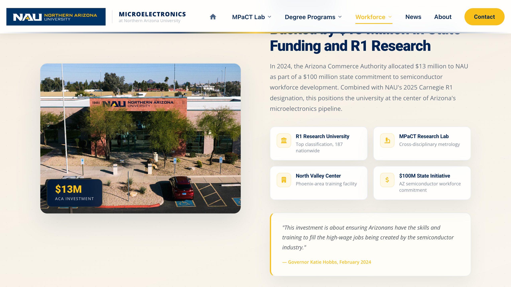

# Workforce Development · NAU's Investment (§5)
**File:** `WorkForceDevelopment.html`  
**Last Updated:** May 2026  
**Internal Use Only**

---

## Section Overview



*The NAU Investment section — the photo with the $13M badge pinned over it on the left, and the four highlight cards on the right. The badge number and highlight cards are the most commonly updated elements here.*

The Investment section is a two-column layout: a photo with a pinned overlay badge on the left, and a text block with four highlight cards and a pull quote on the right.

The **image overlay badge** (showing `$13M`) is the most structurally non-obvious part of this section. It uses absolute CSS positioning and two specific class names — editing the number incorrectly or removing either div breaks the badge position.

| Area | Search For (Ctrl+F) | What You Can Change |
|------|---------------------|---------------------|
| Section container | `class="wfd-investment__grid"` | Overall section structure |
| Image + badge | `class="wfd-investment__img-wrap"` | Photo and overlay badge |
| Badge number | `class="wfd-investment__img-badge-num"` | Dollar figure on the badge |
| Badge label | `class="wfd-investment__img-badge-text"` | Label beneath the number |
| Investment highlights | `class="wfd-investment__highlights"` | Four icon + heading + sub-text items |
| Pull quote | `<blockquote>` | Quote text and attribution |

---

## SECTION 1 — Updating the Image

**Search for:** `class="wfd-investment__img-wrap"`

```html
<div class="wfd-investment__img-wrap wfd-reveal">
    
    <div class="wfd-investment__img-badge">
        <div class="wfd-investment__img-badge-num">$13M</div>
        <div class="wfd-investment__img-badge-text">ACA Investment</div>
    </div>
</div>
```

To swap the photo: change only the `src` filename and `alt` text on the `` tag. Recommended size: 800 × 600 px minimum, `.jpg`. Do not remove the `wfd-investment__img-badge` div — it will disappear.

---

## SECTION 2 — Updating the Image Overlay Badge

The `$13M` badge pinned over the bottom-left of the photo is two separate divs inside `wfd-investment__img-badge`. Its position is set by absolute CSS — the structure must stay intact.

```html
<div class="wfd-investment__img-badge">
    <div class="wfd-investment__img-badge-num">$13M</div>
    <div class="wfd-investment__img-badge-text">ACA Investment</div>
</div>
```

- To change the dollar figure: edit the text inside `wfd-investment__img-badge-num` only.
- To change the label beneath it: edit `wfd-investment__img-badge-text` only.
- Do not add inline styles or extra wrapper divs — the badge position is controlled by `style.css` targeting these exact class names.

> **Please double-check:** After updating the badge, resize the browser to a narrow width (below 900px). The image goes full-width on mobile and the badge should remain pinned to the photo corner. If it floats outside the image, the `wfd-investment__img-wrap` element has lost its `position: relative` — check that no surrounding div changes were accidentally made.

> **Note:** The `$13M` figure also appears in the section heading (`<h2 class="wfd-investment__title">`), in a body paragraph, and in the hero stats panel (`wfd-pstat__num`). Search the file for `13` before saving to find and update all occurrences.

---

## SECTION 3 — Updating Investment Highlights

**Search for:** `class="wfd-investment__highlights"`

Four `.wfd-inv-highlight` items, each with a Font Awesome icon, an `<h4>` title, and a `<p>` sub-text:

```html
<div class="wfd-investment__highlights">
    <div class="wfd-inv-highlight">
        <div class="wfd-inv-highlight__icon"><i class="fas fa-university"></i></div>
        <div class="wfd-inv-highlight__text">
            <h4>R1 Research University</h4>
            <p>Top classification, 187 nationwide</p>
        </div>
    </div>
    <!-- repeat for each highlight -->
</div>
```

### Editing an existing highlight
Change the `fas fa-*` icon class, the `<h4>` text, or the `<p>` sub-text directly.

### Adding a new highlight
Copy the entire `.wfd-inv-highlight` block and paste it before the closing `</div>` of `wfd-investment__highlights`. Choose a Font Awesome solid icon from [fontawesome.com/icons](https://fontawesome.com/icons).

> **Note:** The highlights are in a two-column grid. Four items fill the grid evenly. Adding a fifth will leave an orphaned item on a new row. If you need a fifth, add a sixth at the same time to keep the grid balanced — or test carefully at all screen widths.

### Removing a highlight
Delete the entire `.wfd-inv-highlight` block. Three items will display in a single row or wrap depending on screen width — test visually before deploying.

---

## SECTION 4 — Updating the Pull Quote

**Search for:** `class="wfd-investment__quote"`

```html
<div class="wfd-investment__quote">
    <blockquote>
        "This investment is about ensuring Arizonans have the skills and training to
        fill the high-wage jobs being created by the semiconductor industry."
    </blockquote>
    <cite>— Governor Katie Hobbs, February 2024</cite>
</div>
```

Edit the quote text inside `<blockquote>` and the attribution inside `<cite>`. Keep the attribution format consistent: `— Full Name, Month Year`.

> **Tip:** Keep blockquote text under three lines. Longer quotes push the section height and create an awkward amount of white space between the quote and the section below on desktop.

---

## Quick Reference

| Task | Search For (Ctrl+F) |
|------|---------------------|
| Update badge dollar figure | `class="wfd-investment__img-badge-num"` |
| Update badge label | `class="wfd-investment__img-badge-text"` |
| Update photo | `class="wfd-investment__img-wrap"` |
| Update highlights | `class="wfd-investment__highlights"` |
| Update pull quote | `class="wfd-investment__quote"` |

### Changes That Must Always Be Made Together

| If you change… | You must also check… |
|---|---|
| Badge dollar figure (`$13M`) | Section `<h2>` title, body paragraph text, and hero stats panel — all may repeat the same number |
| Add a 5th highlight | Add a 6th at the same time to keep the two-column grid balanced |
| Section image filename | Update `src` path — no auto-resolution fallback on this image |
