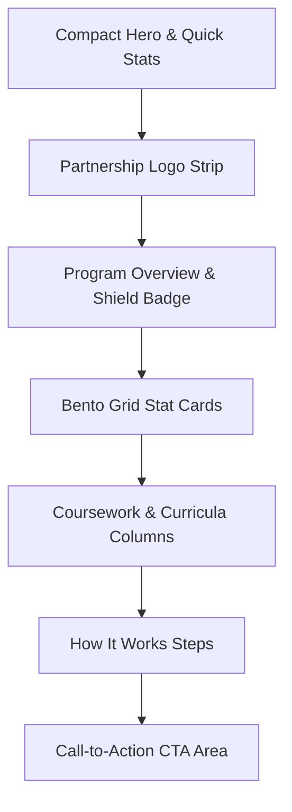

# Update PTAP and Intel CHIPS Program Pages

**Summary:** Update highlights, bento grid metrics, partners, and curriculum lists for the Process Technician Apprenticeship Program (PTAP) and matching high-level training program pages like the Intel CHIPS page.

**Trigger:** When a program curriculum changes, partnership lists are updated, or regional workforce stats require updating on the program page.

**Difficulty:** Careful

**Estimated Time:** 25 minutes

---

## Target Files

| File | Purpose in this task |
|---|---|
| `PTAP.html` | The HTML document containing the structure and styles for the Process Technician Apprenticeship Program. |
| `IntelCHIPS.html` (If cloned) | The sibling HTML document containing the structure and styles for the Intel CHIPS scholarship program. |

---

## Key Structural Components

Both the PTAP and Intel CHIPS pages share an identical high-end visual design. When you look at these files, you will find several distinct visual sections that create a professional, responsive layout.

> [!NOTE]
> **SharePoint / OneNote Rendering Compatibility:**
> Mermaid diagrams are supported natively by many modern editors (like VS Code), but when this documentation is hosted within standard SharePoint/OneNote web views, the raw Mermaid syntax might display as a plain code block instead of a graphic. 
> 
> To ensure maximum accessibility for everyone on the team, we have provided both the Mermaid diagram and a clean text-based flowchart below:



**Layout Sequence Flowchart:**
```text
  ┌──────────────────────────────┐
  │ Compact Hero & Quick Stats   │
  └──────────────┬───────────────┘
                 │
                 ▼
  ┌──────────────────────────────┐
  │   Partnership Logo Strip     │
  └──────────────┬───────────────┘
                 │
                 ▼
  ┌──────────────────────────────┐
  │  Program Overview & Shield   │
  └──────────────┬───────────────┘
                 │
                 ▼
  ┌──────────────────────────────┐
  │    Bento Grid Stat Cards     │
  └──────────────┬───────────────┘
                 │
                 ▼
  ┌──────────────────────────────┐
  │ Coursework & Curricula Lists │
  └──────────────┬───────────────┘
                 │
                 ▼
  ┌──────────────────────────────┐
  │     How It Works Steps       │
  └──────────────┬───────────────┘
                 │
                 ▼
  ┌──────────────────────────────┐
  │  Call-to-Action (CTA) Area   │
  └──────────────────────────────┘
```

Let's walk through how to update each section safely.

---

## Step-by-Step Instructions

### Part 1: Update the Compact Hero & Quick Stats

At the top of the file, you will find the hero section container. Inside this area is a gold-trimmed details card that lists key stats like program duration, credit hours, and credentials.

1. Open `PTAP.html` (or `IntelCHIPS.html`).
2. Scroll to the main content container and look for the section container tag (represented by a `<section>`) with the class names `"ml-hero"` and `"ml-hero--compact"`:
   `<section class="ml-hero ml-hero--compact">`
3. Inside this container, look for the quick-info division tag (represented by a `<div>`) with the class name `"ml-hero__panel"`:
   `<div class="ml-hero__panel">`
4. Locate the individual list items inside the unordered list (`<ul>`). You can update the text and figures inside these tags:
   ```html
   <li>
       <i class="fas fa-calendar-alt"></i>
       <div>
           <span>Duration</span>
           <strong>18 Months</strong> <!-- Update duration here -->
       </div>
   </li>
   ```

---

### Part 2: Update the Scrolling Partnership Strip

Beneath the hero section is a smooth, scrolling strip showing logos of companies sponsoring or partnering with the program (such as TSMC, Intel, and Rio Salado).

1. Look for the division tag with the class name `"ptap-partners"`:
   `<div class="ptap-partners">`
2. Inside, you will see a container division tag with the class name `"partners-track"`:
   `<div class="partners-track">`
3. To add or update a logo, insert an image tag (``) pointing to the brand's logo file inside `Images/`. Ensure you specify the height attribute directly so it scales cleanly with the other logos:
   ```html
   
   ```

---

### Part 3: Edit Stats and Accent Colors inside the Bento Grid

The hallmark of the page is a modern, responsive Bento Grid (`.ptap-bento__grid`) that displays program statistics, highlights, and benefits. The grid uses two distinct card structures and flexible grid spanning rules to create its premium visual hierarchy.

#### 1. Locate the Bento Grid Section
1. To get started, please open `PTAP.html` (or `IntelCHIPS.html`) in your code editor.
2. Please scroll down to the main section tag with the class name `"ptap-bento"`:
   `<section class="ptap-bento">`
3. Inside, you will locate the grid wrapper division tag:
   `<div class="ptap-bento__grid">`

#### 2. Understanding Card Layouts & HTML Structures
Inside the `.ptap-bento__grid` container, you will see a collection of card division tags (`<div class="ptap-bento__card">`). There are **two structural formats** you can use depending on the type of content you want to display:

*   **Option A: Detail Narrative Card** (Used for text highlights with decorative accents and icons):
    ```html
    <div class="ptap-bento__card ptap-bento__card--wide ptap-reveal">
        <!-- Top accent color strip (gold, blue, green, or cyan) -->
        <div class="ptap-bento__accent ptap-bento__accent--gold"></div>
        
        <!-- Graphic font-awesome icon container -->
        <div class="ptap-bento__icon ptap-bento__icon--gold">
            <i class="fas fa-industry"></i>
        </div>
        
        <!-- Content text -->
        <h3>On-the-Job Training at TSMC Arizona</h3>
        <p>Apprentices gain direct experience with semiconductor equipment...</p>
    </div>
    ```
*   **Option B: Feature Stat Card** (Used for high-impact metric highlights with giant background numbers):
    ```html
    <div class="ptap-bento__card ptap-bento__card--narrow ptap-bento__card--featured ptap-reveal">
        <!-- Absolute-positioned giant watermark background text -->
        <div class="ptap-bento__watermark">600</div>
        
        <!-- High-impact large metric -->
        <div class="ptap-bento__stat">600<em>hrs</em></div>
        
        <!-- Description label -->
        <div class="ptap-bento__stat-label">Coursework at NAU</div>
    </div>
    ```

#### 3. Responsive Column Spanning Rules
To build a creative "bento box" shape, each card has a modifier class that defines how many columns it spans in the 12-column desktop grid. You can adjust these classes to re-align tiles:
*   `ptap-bento__card--wide`: Spans **8 columns** (ideal for detailed narrative blocks).
*   `ptap-bento__card--narrow`: Spans **4 columns** (ideal for high-impact metric cards).
*   `ptap-bento__card--third`: Spans **4 columns** (ideal for creating a balanced 3-column row, e.g. three cards in a row).

#### 4. Customizing Color Accents & Themes
The bento cards use CSS custom properties to manage hover glows and accent borders cleanly. If you wish to customize these variables or backgrounds (for example, to make a new card pop):
1. Scroll to the `<style>` tag located inside the `<head>` section at the top of the file.
2. Locate the CSS rules mapping to the accent class you are using:
   ```css
   .ptap-bento__card:hover {
       background: rgba(255, 255, 255, 0.065);
       border-color: rgba(255, 255, 255, 0.12);
       transform: translateY(-3px);
   }
   ```
3. To customize a specific card's glow color, look for the background gradient styles or variables and modify the HSL or hex values to align perfectly with your program's specific brand theme (such as NAU Gold, NAU Blue, or a corporate partner's brand color).

---

### Part 4: Modify the Coursework and Curricula Lists

The curriculum section uses a elegant, two-column split layout. The left column lists the specific courses, while the right column shows a visually striking key outcomes card with a gold shield border.

1. Locate the division tag with the class name `"ptap-curriculum"`:
   `<div class="ptap-curriculum">`
2. **Left Column (Course List):** Inside the list container, look for the individual list items (`<li>`). You can update the course title, description, and icons:
   ```html
   <li class="curr-item">
       <div class="curr-icon"><i class="fas fa-shield-alt"></i></div>
       <div class="curr-content">
           <h4>OSHA 30 Certification</h4>
           <p>Rigorous safety protocols and workplace compliance standards essential for high-tech environments.</p>
       </div>
   </li>
   ```
3. **Right Column (Sidebar Note Card):** Look for the division card tag with the class name `"curr-note"`:
   `<div class="curr-note">`
   You can modify the background image, highlight descriptions, or change the bullet outcomes inside the unordered list (`<ul>`).

---

### Part 5: Update the "How It Works" Milestones

The step-by-step program pathway uses a sequential line design.

1. Locate the division tag with the class name `"pt-steps"`:
   `<div class="pt-steps">`
2. Each milestone is a division tag with the class name `"pt-step"`:
   `<div class="pt-step">`
3. Modify the step number, title, and instructional text inside the step block:
   ```html
   <div class="pt-step__badge">1</div>
   <h4 class="pt-step__title">Online Application</h4>
   <p class="pt-step__desc">Submit your application along with academic transcripts and brief personal statements.</p>
   ```

---

### Part 6: Maintain the Scroll-Reveal Animation Script

To keep the page feeling premium and alive, a scroll-reveal script is located at the very bottom of the document. This script uses an `IntersectionObserver` in JavaScript to animate cards into view as the user scrolls.

* **Crucial Rule:** The script is hardcoded at the bottom of the HTML file. It automatically scans the page for any element that has the class name `"reveal-on-scroll"`.
* **Action Required:** When adding new sections, cards, or bento elements that you want to animate, simply add the `"reveal-on-scroll"` class to their container tags. The bottom script will automatically detect them and trigger their fade-in animations as soon as they cross the browser threshold.

---

## Design Impact & Layout Solutions

*   **The Design Discrepancy Risk:** Bento grid blocks wrap unpredictably or distort on medium viewports (like tablets). Missing brand logo margins in the loop strip create jagged scrolling.
*   **Visual Impact:** Bento tiles stretching to ugly proportions and logo blocks colliding.
*   **Recommended Solutions:**
    *   **Bento Grid Sizing:** Use explicit grid fractional fits (`grid-template-columns: repeat(auto-fit, minmax(280px, 1fr))`) to let tiles scale cleanly.
    *   **Scrolling Marquee Protection:** Keep partnership loop images cropped inside uniform squares with generous margins.
    *   **IntersectionObserver Fallback:** Ensure scroll-reveal animations fall back to immediate display if JavaScript is disabled on the client browser.

---

## Let's Verify Your Changes

1. Load `PTAP.html` in your local web browser.
2. Verify that the scrolling partnership logo strip flows smoothly across the page.
3. Review the Bento Grid to ensure cards are aligned correctly, and check that the watermark numbers are positioned behind the text without obstructing readability.
4. Scroll down the page and verify that all elements with the class `"reveal-on-scroll"` slide elegantly into view.

---

🔔 **Documentation Update Reminder:** Please make sure to update any How-To procedures or relevant documentation every time you make a change to the website and deploy it. This keeps our operational manual healthy and helpful for the entire team!
*Last reviewed: May 19, 2026*
