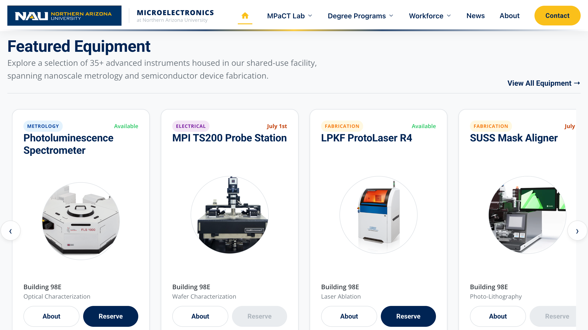

# Home Page · Featured Equipment Carousel
**File:** `index.html`  
**Last Updated:** May 2026  
**Internal Use Only**

---

## Page Overview



*The Featured Equipment carousel — each card shows an instrument photo, name, category, and brief description. These cards are hardcoded in index.html, not pulled from a database.*

The Featured Equipment section is a **manually maintained, hardcoded** horizontal carousel of instrument cards on the homepage. It is a curated preview — not a live feed from any database. Every card you see was placed there by hand in `index.html`.

| Area | Search For (Ctrl+F) | What You Can Change |
|------|---------------------|---------------------|
| Card grid container | `id="cardContainer"` | Add, remove, or reorder cards |
| Individual card | `class="equipment-card"` | Edit any single card's content |
| Category badge | `class="badge badge-` | Change badge color and category label |
| Status indicator | `class="status-dot` | Switch between Available / Busy / Coming Soon |
| Reserve button | `class="action-btn book-btn"` | Enable or disable reservation link |

> **Note:** This carousel is separate from `Equipment.html` (the full catalog). Changes here do not automatically appear there, and vice versa. If you add an instrument here, you likely need to add it on `Equipment.html` too.

---

## SECTION 1 — Adding a New Equipment Card

### Step 1 — Find the container
In `index.html`, press **Ctrl+F** (Windows) or **Cmd+F** (Mac) and search for:
```
id="cardContainer"
```
You will land on this opening tag:
```html
<div class="card-wrapper" id="cardContainer">
```

### Step 2 — Paste the template
Copy the block below and paste it anywhere **inside** `#cardContainer`, before the closing `</div>`. The visual order matches the HTML order, so place it where you want it to appear (leftmost card = first in the HTML).

```html
<!-- Equipment card template — paste inside id="cardContainer" -->
<div class="equipment-card">
    <div>
        <div class="d-flex justify-between align-center">
            <span class="badge badge-blue">Metrology</span>   <!-- ① badge -->
            <span class="status-dot available"></span>         <!-- ② status -->
        </div>
        <h3 class="card-title">Your Equipment Name</h3>       <!-- ③ name -->
    </div>
    <div class="image-container">
        
             class="equipment-img"
             alt="Your Equipment Name"
             onerror="this.src='https://placehold.co/400x300?text=Equipment'">
    </div>
    <div class="specs">Building 98E<span class="small">Optical Characterization</span></div>  <!-- ⑤ -->
    <div class="action-row">
        <a href="About_Equipment/YourPage.html" class="action-btn about-btn">About</a>  <!-- ⑥ -->
        <a href="Reserve_Equipment.html?equipment=EQ-XXX" class="action-btn book-btn">Reserve</a>  <!-- ⑦ -->
    </div>
</div>
```

### Step 3 — Fill in the seven values

| # | What | Where | Notes |
|---|------|-------|-------|
| ① | Category badge | `class="badge badge-???"` + badge text | Must match badge table in Section 2 |
| ② | Status | `class="status-dot ???"` | See all three states in Section 3 |
| ③ | Equipment name | `<h3 class="card-title">` | Full instrument name |
| ④ | Photo | `src=""` and `alt=""` on `` | Image file must already be in `Images/` — see Section 4 |
| ⑤ | Location + capability | `<div class="specs">` | Location text (plain) + `<span class="small">` for capability |
| ⑥ | About link | `href=""` on `.about-btn` | Path to `About_Equipment/YourPage.html` — page must exist |
| ⑦ | Reserve button | `.book-btn` | Use `<a>` if bookable, disabled `<button>` if not — see Section 3 |

> **Tip:** The `onerror` attribute on the `` shows a gray placeholder if the image file is missing. This is a safety net, not a substitute for the real image. Always upload the image first.

### Step 4 — Upload the image
Place the image file in the `Images/` folder before referencing it. See **Section 4** for image specs.

### Step 5 — Verify in the browser
Open `index.html` in a browser and scroll to the Featured Equipment section. Confirm the card appears, the image loads, the badge color is correct, and both buttons work.

> **Please double-check:** Click the "About" button — if the About page doesn't exist yet, you'll get a 404. Create `About_Equipment/YourPage.html` before going live, or temporarily point the link to `Equipment.html` as a placeholder.

---

## SECTION 2 — Category Badges

Every card has a `<span class="badge badge-???">` that shows the instrument's category. The badge class and the text inside it are **independent values** — changing one without the other will show the wrong color for that label.

**Search for:** `class="badge badge-`

### Badge Class by Category

| Category | Badge class | Badge label text | Color |
|----------|------------|-----------------|-------|
| Metrology | `badge-blue` | Metrology | Blue |
| Fabrication | `badge-gold` | Fabrication | Gold |
| Electrical | `badge-purple` | Electrical | Purple |
| Sample Prep | `badge-green` | Sample Prep | Green |
| Mechatronics | `badge-blue` | Mechatronics | Blue |
| Educational | `badge-blue` | Educational | Blue |
| Support Systems | `badge-purple` | Support Systems | Purple |

### How to change a card's category

Search for the card by its equipment name (Ctrl+F), then update **both** values together:

```html
<!-- Before: listed as Metrology (blue) -->
<span class="badge badge-blue">Metrology</span>

<!-- After: changed to Fabrication (gold) -->
<span class="badge badge-gold">Fabrication</span>
```

> **Note:** If you change the badge class but not the text (or vice versa), the badge will show the wrong color for the label shown — no error will appear in the browser to warn you. Always update both on the same card at the same time.

---

## SECTION 3 — Availability Status & Reserve Button

The status indicator and the Reserve button are **always paired**. When an instrument is unavailable, both the dot and the button must reflect that. Changing one without the other gives visitors conflicting information.

### Status States

**Search for:** `class="status-dot`

Replace the **entire element** when switching states — not just the class name.

```html
<!-- STATE 1: Available — single green dot -->
<span class="status-dot available"></span>

<!-- STATE 2: In use / unavailable — orange dot -->
<span class="status-dot busy"></span>

<!-- STATE 3: Coming soon — dot + date label -->
<div class="d-flex align-center">
    <span class="status-dot expected"></span>
    <span class="status-text expected">July 1st</span>
</div>
```

To update the "July 1st" date in State 3, edit only the text inside `<span class="status-text expected">`.

### Reserve Button States

**Search for:** `class="action-btn book-btn"`

```html
<!-- ENABLED — instrument available for booking -->
<a href="Reserve_Equipment.html?equipment=EQ-026"
   class="action-btn book-btn">Reserve</a>

<!-- DISABLED — instrument not available -->
<button class="action-btn book-btn" type="button" disabled aria-disabled="true">Reserve</button>
```

The `EQ-XXX` number in the `href` is the equipment's ID in the reservation system. Check existing cards for the format (e.g. `EQ-026`, `EQ-041`). A wrong ID will load the reservation form but may not pre-select the correct instrument.

### Paired Changes — Always Do Both

| If you set status to… | Reserve button must become… |
|---|---|
| `available` (green dot) | `<a href="Reserve_Equipment.html?equipment=EQ-XXX" ...>Reserve</a>` |
| `busy` (orange dot) | `<button ... disabled aria-disabled="true">Reserve</button>` |
| `expected` (coming soon) | `<button ... disabled aria-disabled="true">Reserve</button>` |

> **Please double-check:** After switching a card's status, reload the page and try clicking the Reserve button to confirm it behaves correctly (navigates for available, does nothing for disabled).

---

## SECTION 4 — Equipment Photo Guidelines

### Where to place images
All images must be in the `Images/` folder at the project root **before** you reference them in HTML. The `` path is relative to the HTML file location.

### Recommended image specs

| Property | Recommended value | Why |
|----------|------------------|-----|
| File format | `.png` or `.jpg` | PNG for instruments with white/transparent background; JPG for photos |
| Width | 400–800 px | The card image area is fixed-height; larger files waste bandwidth |
| Height | 300–400 px | Matches the `.image-container` aspect ratio |
| Background | White or light neutral | Blends cleanly with the white card background |
| File size | Under 200 KB | Keeps page load fast; use TinyPNG or Squoosh to compress |

### Naming convention
Use underscores, no spaces, match the instrument name:
- `FLS1000.png` ✓
- `LPKF ProtoLaser.png` ✗ (spaces break some servers)
- `lpkf protolaser.png` ✗

> **Tip:** The `onerror` attribute (`onerror="this.src='https://placehold.co/400x300?text=Equipment'"`) displays a placeholder if the image is missing. If you see a placeholder on the live page, the `src=""` path does not match the actual filename in `Images/`. Check for typos and case sensitivity — `FLS1000.png` and `fls1000.png` are different filenames on the server.

---

## SECTION 5 — Temporarily Hiding a Card

Wrap the entire card block in an HTML comment. The card disappears from the page but the code is preserved.

**Search for:** `class="equipment-card"` — locate the specific card by its equipment name.

```html
<!-- Temporarily hidden — remove comment tags to restore
<div class="equipment-card">
    ...all card content...
</div>
-->
```

> **Tip:** Search for the instrument name (e.g., `LPKF ProtoLaser R4`) to jump directly to its card rather than scrolling through all cards.

---

## SECTION 6 — Quick Reference

| Task | Search For (Ctrl+F) |
|------|---------------------|
| Add a new card | `id="cardContainer"` |
| Change a badge | `class="badge badge-` |
| Change status dot | `class="status-dot` |
| Change reserve button | `class="action-btn book-btn"` |
| Find a specific card | Search the instrument name (e.g., `LPKF`) |

### Changes That Must Always Be Made Together

| If you change… | You must also change… |
|---|---|
| Badge class (color) | Badge label text on the same card |
| Status to `available` | Reserve button → enabled `<a>` link |
| Status to `busy` or `expected` | Reserve button → disabled `<button>` |
| Equipment name in `<h3>` | `alt=""` on the image in the same card |
