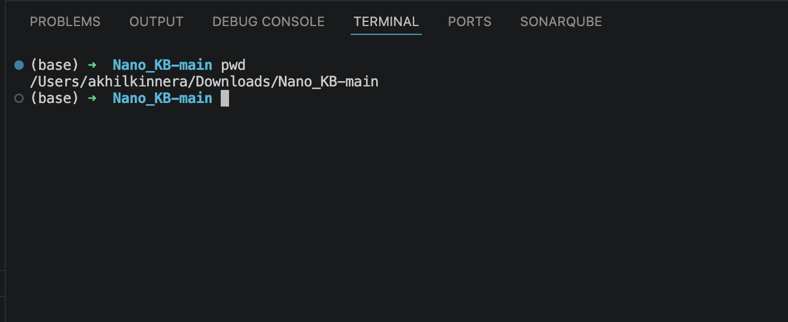
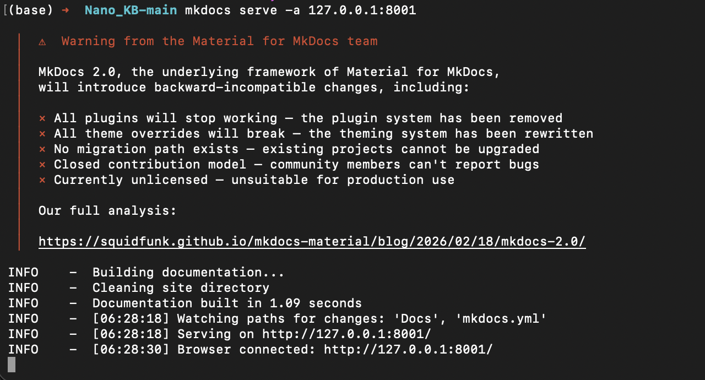
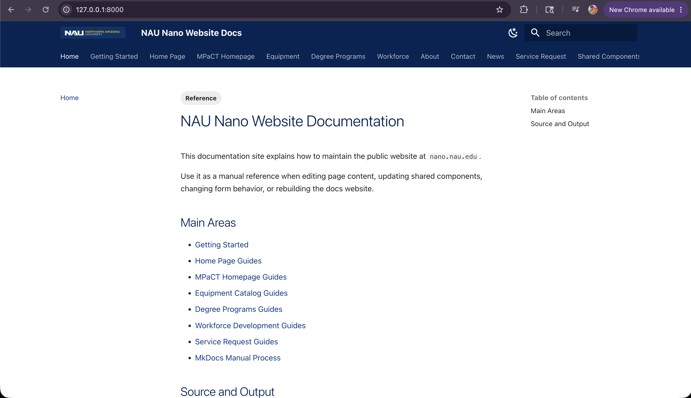

---
tags:
  - Reference
  - Navigation
  - CSS
  - MkDocs
  - Docs Site
---

# MkDocs Manual Process for Website Docs

This guide explains how to manually create, edit, organize, preview, and rebuild Website Docs.

The goal is to make the process repeatable for anyone creating or maintaining a documentation website by hand in VS Code or Terminal.

## What We Are Building

Website Docs is a documentation website built from Markdown files.

In this project, Website Docs explains how to maintain the public website at `nano.nau.edu`.

The docs site is created from:

- Markdown files in `Docs/`
- The site configuration in `mkdocs.yml`
- Custom styles in `Docs/assets/stylesheets/extra.css`
- Reference pages such as `Docs/reference/index.md` and `Docs/reference/tags.md`
- Tags in Markdown front matter
- The navigation list in `mkdocs.yml`

## Folder Structure

Use this structure:

```text title="Recommended folder structure"
project-root/
  mkdocs.yml
  Docs/
    index.md
    _shared-hero-stats-panel.md
    getting-started/
      index.md
    homepage/
      homepage.md
      home-academic-programs.md
      home-featured-equipment.md
      home-map-location.md
      home-workforce-partners.md
    MPaCT Homepage/
      mpact.md
      mpact-capability-cards.md
      mpact-facility-buildout.md
      mpact-research-areas.md
      mpact-shared-use-facility.md
    Equipment Page/
      equipment.md
      equipment-cards.md
      equipment-filter-bar.md
      equipment-json-status.md
    Degree Programs/
      degree-programs.md
      degree-programs-program-rows.md
    Workforce Development_A/
      workforce-development.md
      wfd-career-outcomes.md
      wfd-ecosystem.md
      wfd-investment.md
      wfd-pathways-ptap.md
    Workforce/
      01-update-industry-stats.md
      02-update-ecosystem-partners.md
      03-update-salary-data.md
      04-update-ptap-and-intel-chips-pages.md
      Career Pathways/
        01-add-or-update-pathway.md
        02-update-pathway-content.md
    About/
      01-update-strategic-vision.md
      02-update-cross-campus-impact.md
    Contact/
      01-update-remove-form-categories.md
      02-update-contact-form-fields.md
    News/
      01-add-news-article.md
      02-update-news-filters.md
    Service-Request/
      service-request-how-it-works.md
      service-request-field-lifecycle.md
    General/
      clone-program-page.md
    reference/
      index.md
      tags.md
      mkdocs-manual-process.md
    assets/
      images/
        NAU.png
      stylesheets/
        extra.css
  site/
    generated static website output
  MkDocs/
    older generated output kept for reference
```

## Why These Folders Exist

`mkdocs.yml` controls the website build. It tells MkDocs the site name, theme, plugins, Markdown features, custom CSS, and navigation.

`Docs/` is the editable source folder. MkDocs reads this folder because `mkdocs.yml` uses `docs_dir: Docs`.

`Docs/index.md` is the home page of the docs website. Without it, the site has no clear landing page.

`Docs/reference/` stores shared documentation rules. This is where tags, conventions, and the MkDocs manual process belong.

`Docs/assets/stylesheets/extra.css` stores NAU-specific visual styling for MkDocs Material. This keeps visual customization separate from the Markdown content.

`Docs/assets/images/` stores images used by the docs theme, such as the NAU logo and favicon.

Page folders such as `homepage/`, `Equipment Page/`, and `Workforce Development_A/` group guides by the public website area they explain.

`Docs/md_file_images/` stores screenshots and visual references used inside the Markdown guides.

`site/` is generated by `mkdocs build`. Do not edit generated HTML by hand because it will be replaced the next time the site is built.

`MkDocs/` is older generated output in this checkout. Treat it as reference material unless the team decides to remove or archive it.

## How Screenshot Paths Work

MkDocs reads files from `Docs/`, then builds them into the `site/` folder as browser pages.

A source file such as this:

```text title="Source Markdown file"
Docs/About/01-update-strategic-vision.md
```

builds into a page like this:

```text title="Built page location"
site/About/01-update-strategic-vision/index.html
```

That matters because raw HTML image tags are resolved by the browser from the final page URL, not from the Markdown source file.

For a guide inside a folder, use a path that goes back to the site root before entering `md_file_images/`:

```html title="Correct HTML image path"

```

Do not use this path for those pages:

```html title="Broken HTML image path"

```

That path points to the wrong generated URL after MkDocs builds directory-style pages.

## Screenshot Filename Mistakes to Avoid

!!! tip "Use web-safe screenshot names"
    For new screenshots, use simple filenames with lowercase words and hyphens.

```text title="Web-safe screenshot filenames"
mkdocs-vscode-terminal-pwd.png
mkdocs-serve-local-preview-url.png
mkdocs-build-strict-success.png
```

!!! warning "Avoid raw # in image URLs"
    If an existing screenshot filename contains `#`, write it as `%23` in the image path. In a browser URL, a raw `#` starts a page fragment and can stop the image from loading.

## How to Open Bash in VS Code

1. Open the project root folder in VS Code.
2. Select **Terminal** from the top menu.
3. Select **New Terminal**.
4. Confirm the terminal opens at the project folder.
5. Run this command to confirm the current folder:

```bash title="VS Code terminal"
pwd
```

The output should show your project folder. The exact path depends on where the project lives on your computer:

```text title="Example folder path"
/path/to/project-root
```

Example VS Code terminal check:



## How to Open Bash in Terminal

Open Terminal, then move into the project root folder:

```bash title="Terminal"
cd "/path/to/project-root"
pwd
```

The second command confirms that you are in the correct folder before running MkDocs commands.

Example Terminal check:


## Commands Anyone Can Run

Install MkDocs Material if it is not already installed:

```bash title="Install MkDocs Material"
pip install mkdocs-material
```

Preview the docs website locally. Use any open local port. This example uses `8001`:

```bash title="Preview Website Docs"
mkdocs serve -a 127.0.0.1:8001
```

After this command runs, MkDocs prints a local preview URL. Open that URL in a browser to view Website Docs.

Example preview command:



Example browser preview:



Build the static website:

```bash title="Build static site"
mkdocs build
```

Build with strict checking:

```bash title="Strict build check"
mkdocs build --strict
```

Use `mkdocs build --strict` before sharing the docs because it catches broken navigation links, missing files, and configuration mistakes.

Example strict build:


## How Navigation Works

The visible site navigation is controlled by the `nav:` section in `mkdocs.yml`.

Each nav item has a label and a Markdown file path:

```yaml title="mkdocs.yml navigation"
nav:
  - Home: index.md
  - Getting Started:
      - getting-started/index.md
  - Reference:
      - Reference Overview: reference/index.md
      - Tags: reference/tags.md
```

The file paths are relative to the `Docs/` folder.

If a file is moved, renamed, or added, update `nav:` so the site menu stays accurate.

## How Tags Work

Tags are added at the top of a Markdown file in front matter:

```markdown title="Markdown front matter"
---
tags:
  - Reference
  - CSS
---
```

Tags help people find related pages across different folders. They do not replace navigation.

The tag index is generated on this page:

```text title="Tag index file"
Docs/reference/tags.md
```

That page contains the Material tags marker. It is an HTML comment with `material/tags` inside it.

```text title="Tags page marker pattern"
HTML comment start + material/tags + HTML comment end
```

MkDocs Material replaces that marker with the generated tag list during the build.

## How Extra CSS Works

The custom CSS file is:

```text title="Custom CSS file"
Docs/assets/stylesheets/extra.css
```

It is loaded by this section in `mkdocs.yml`:

```yaml title="mkdocs.yml extra CSS"
extra_css:
  - assets/stylesheets/extra.css
```

Use this file for site-wide docs styling, such as NAU colors, header styling, link colors, and heading colors.

Do not put public website CSS here. This CSS changes only the docs website.

## Manual Update Workflow

1. Decide which public website page or feature needs documentation.
2. Create or edit the matching Markdown guide in `Docs/`.
3. Add front matter tags when useful.
4. Add screenshots to `Docs/md_file_images/` if the guide needs visual proof.
5. Update `mkdocs.yml` under `nav:` if a new guide should appear in the menu.
6. Run `mkdocs build --strict`.
7. Fix any broken links, missing files, or YAML mistakes.
8. Run `mkdocs serve -a 127.0.0.1:8001` and preview the site in a browser.
9. Capture final screenshots for handoff.

## Source Editing Rule for Developers

Keep `Docs/` as the source folder and keep generated output separate.

Website Docs source edits should happen only inside `Docs/` going forward. That is the cleanest manual process because it matches `docs_dir: Docs` and keeps source files separate from generated HTML.
