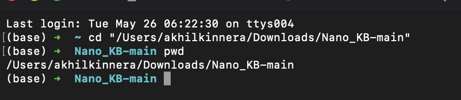
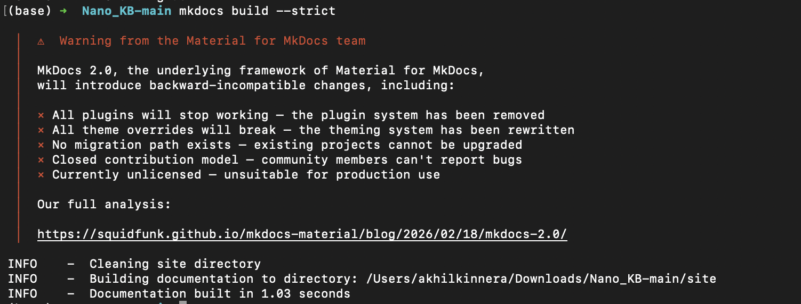

---
tags:
  - Reference
  - Navigation
  - CSS
  - MkDocs
  - Docs Site
---

# MkDocs Manual Process for Website Docs

This guide explains how to manually create, edit, organize, preview, and rebuild Website Docs.

The goal is to make the process repeatable for anyone creating or maintaining a documentation website by hand in VS Code or Terminal.

## Before You Start

You need two things installed before running any MkDocs commands:

- **VS Code** — for editing Markdown files and running the terminal
- **pip** — the Python package installer, used to install MkDocs Material

To check if MkDocs Material is already installed, run:

```bash title="Check if MkDocs Material is installed"
pip show mkdocs-material
```

If it returns package details, you are ready. If it says "not found", install it:

```bash title="Install MkDocs Material"
pip install mkdocs-material
```

## Getting the Repo

This project lives on a specific branch in GitHub. Clone it and switch to the correct branch before doing anything else.

```bash title="Clone the repo and switch to the right branch"
git clone <repo-url>
cd <repo-folder>
git checkout site_generation
```

Replace `<repo-url>` with the actual GitHub URL and `<repo-folder>` with the folder name git creates locally.

Once you have cloned and switched branches, open the project root folder in VS Code.

## What We Are Building

Website Docs is a documentation website built from Markdown files.

In this project, Website Docs explains how to maintain the public website at `nano.nau.edu`.

The docs site is created from:

- Markdown files in `Docs/`
- The site configuration in `mkdocs.yml`
- Custom styles in `Docs/assets/stylesheets/extra.css`
- Reference pages such as `Docs/reference/index.md` and `Docs/reference/tags.md`
- Tags in Markdown front matter
- The navigation list in `mkdocs.yml`

## Folder Structure

Use this structure:

```text title="Recommended folder structure"
project-root/
  mkdocs.yml
  Docs/
    index.md
    _shared-hero-stats-panel.md
    getting-started/
      index.md
    homepage/
      homepage.md
      home-academic-programs.md
      home-featured-equipment.md
      home-map-location.md
      home-workforce-partners.md
    MPaCT Homepage/
      mpact.md
      mpact-capability-cards.md
      mpact-facility-buildout.md
      mpact-research-areas.md
      mpact-shared-use-facility.md
    Equipment Page/
      equipment.md
      equipment-cards.md
      equipment-filter-bar.md
      equipment-json-status.md
    Degree Programs/
      degree-programs.md
      degree-programs-program-rows.md
    Workforce Development_A/
      workforce-development.md
      wfd-career-outcomes.md
      wfd-ecosystem.md
      wfd-investment.md
      wfd-pathways-ptap.md
    Workforce/
      01-update-industry-stats.md
      02-update-ecosystem-partners.md
      03-update-salary-data.md
      04-update-ptap-and-intel-chips-pages.md
      Career Pathways/
        01-add-or-update-pathway.md
        02-update-pathway-content.md
    About/
      01-update-strategic-vision.md
      02-update-cross-campus-impact.md
    Contact/
      01-update-remove-form-categories.md
      02-update-contact-form-fields.md
    News/
      01-add-news-article.md
      02-update-news-filters.md
    Service-Request/
      service-request-how-it-works.md
      service-request-field-lifecycle.md
    General/
      clone-program-page.md
    reference/
      index.md
      tags.md
      mkdocs-manual-process.md
    assets/
      images/
        NAU.png
      stylesheets/
        extra.css
    md_file_images/
      (screenshots used inside guides go here)
```

Do not create folders outside of `Docs/`. Everything MkDocs reads comes from inside `Docs/` and `mkdocs.yml`.

## Why These Folders Exist

`mkdocs.yml` is in the project root and controls the entire website build. It tells MkDocs the site name, theme, plugins, Markdown features, custom CSS, and navigation. It also sets `docs_dir: Docs`, which means MkDocs reads source files from the `Docs/` folder specifically.

`Docs/` is the only folder you edit. All Markdown guides live here.

`Docs/index.md` is the home page of the docs website. Without it, the site has no clear landing page.

`Docs/reference/` stores shared documentation rules. This is where tags, conventions, and this MkDocs manual process guide belong.

`Docs/assets/stylesheets/extra.css` stores NAU-specific visual styling for MkDocs Material. This keeps visual customization separate from the Markdown content.

`Docs/assets/images/` stores images used by the docs theme, such as the NAU logo and favicon.

`Docs/md_file_images/` stores screenshots and visual references used inside the Markdown guides. When you take a screenshot for a guide, copy it into this folder before referencing it.

Page folders such as `homepage/`, `Equipment Page/`, and `Workforce Development_A/` group guides by the public website area they explain.

## How to Open the Terminal

You need the terminal open at the **project root folder** to run any MkDocs commands. The project root is the folder that contains `mkdocs.yml`.

**In VS Code:**

1. Open the project root folder in VS Code.
2. Select **Terminal** from the top menu.
3. Select **New Terminal**.
4. Confirm the terminal opens at the project folder by running:

```bash title="VS Code terminal"
pwd
```

The output should show your project folder path.


**In macOS Terminal:**

Open Terminal, then move into the project root folder:

```bash title="Terminal"
cd "/path/to/project-root"
pwd
```

Replace `/path/to/project-root` with the actual path on your machine. The `pwd` command confirms you are in the right place before running MkDocs commands.



## Running MkDocs Commands

All commands below must be run from the **project root folder** — the same folder that contains `mkdocs.yml`.

**Preview the site locally:**

```bash title="Preview Website Docs"
mkdocs serve -a 127.0.0.1:8001
```

After running this, MkDocs prints a local URL. Open that URL in a browser to view the docs site live. The preview updates automatically as you save files — you do not need to restart the command.


Press `Ctrl + C` in the terminal to stop the preview.

**Build the static site:**

```bash title="Build static site"
mkdocs build
```

**Build with strict checking (recommended before sharing):**

```bash title="Strict build check"
mkdocs build --strict
```

Use `--strict` before sharing the docs. It catches broken navigation links, missing files, and configuration mistakes that a normal build would silently ignore.



**Reading build errors:**

If `mkdocs build --strict` fails, the terminal prints an error message that includes the file name and the problem. Look for lines that start with `ERROR` or `WARNING`. Common problems and fixes:

| Error message contains | What it means | Fix |
|---|---|---|
| `Doc file not found` | A file listed in `nav:` does not exist | Create the file or correct the path in `mkdocs.yml` |
| `Config value error` | The `mkdocs.yml` file has a YAML formatting mistake | Check indentation — use spaces, not tabs |
| `File not found for 'img src'` | A screenshot path in a Markdown file is wrong | Check the image path depth (see How Screenshot Paths Work) |

Fix the issue, then run `mkdocs build --strict` again until it passes with no errors.

## How Navigation Works

The visible site navigation is controlled by the `nav:` section in `mkdocs.yml`. This file is in the **project root**, not inside `Docs/`.

Open `mkdocs.yml` in VS Code. The `nav:` section looks like this:

```yaml title="mkdocs.yml navigation"
nav:
  - Home: index.md
  - Getting Started:
      - getting-started/index.md
  - Reference:
      - Reference Overview: reference/index.md
      - Tags: reference/tags.md
```

File paths inside `nav:` are relative to the `Docs/` folder.

**To add a new page to the navigation:**

1. Open `mkdocs.yml` in VS Code (it is in the project root, not inside `Docs/`).
2. Scroll to the `nav:` section.
3. Find the group the new file belongs to.
4. Add a new line in this format: `- Label: folder/filename.md`
5. Save with `Cmd + S` (Mac) or `Ctrl + S` (Windows).

The label is what shows in the site menu. The path is relative to `Docs/`.

```yaml title="Before — nav without the new guide"
nav:
  - Reference:
      - Reference Overview: reference/index.md
      - Tags: reference/tags.md
```

```yaml title="After — new line added at the end of the Reference group"
nav:
  - Reference:
      - Reference Overview: reference/index.md
      - Tags: reference/tags.md
      - MkDocs Process: reference/mkdocs-manual-process.md
```

**Important YAML rules:**

- Use **spaces for indentation**, never tabs. A tab anywhere in `mkdocs.yml` causes a build error.
- Match the indentation of the lines directly above — do not add extra or fewer spaces.
- Create the `.md` file before adding it to `nav:`. Adding a path that does not exist yet will fail the build.

## How Tags Work

Tags are added at the top of a Markdown file in the front matter block:

```markdown title="Markdown front matter"
---
tags:
  - Reference
  - CSS
---
```

The front matter block must be at the very top of the file, before any other content.

Tags help people find related pages across different folders. They do not replace navigation.

The tag index is generated automatically by MkDocs Material. You do not need to manually update `tags.md` — just add tags to the front matter of each guide and the tag index updates on the next build.

The tag index page lives at:

```text title="Tag index file"
Docs/reference/tags.md
```

That file contains this marker:

```html title="Tags page marker"
<!-- material/tags -->
```

MkDocs Material replaces that marker with the generated tag list during the build. Do not delete or edit that line.

## How Screenshot Paths Work

When you take a screenshot for a guide, copy the image file into `Docs/md_file_images/`. Then reference it in the Markdown file using an HTML image tag.

The correct path depends on how deep the Markdown file is inside `Docs/`.

MkDocs builds each Markdown file into a folder. For example:

```text title="Source file"
Docs/About/01-update-strategic-vision.md
```

builds into:

```text title="Built page location"
site/About/01-update-strategic-vision/index.html
```

That means the browser resolves image paths from inside `site/About/01-update-strategic-vision/`, not from where the Markdown file sits. To reach `site/md_file_images/` from there, you need to go up two levels:

```html title="Correct path for a file one folder deep (e.g. Docs/About/)"

```

```html title="Correct path for a file two folders deep (e.g. Docs/Workforce/Career Pathways/)"

```

The rule: **one `../` for each folder level between the file and `Docs/`**. A file in `Docs/About/` is one level deep, so use `../../`. A file in `Docs/Workforce/Career Pathways/` is two levels deep, so use `../../../`.

## Screenshot Filename Mistakes to Avoid

!!! tip "Use web-safe screenshot names"
    For new screenshots, use lowercase words and hyphens. No spaces, no special characters.

```text title="Web-safe screenshot filenames"
strategic-vision-step-1.png
workforce-salary-table.png
mkdocs-build-strict-success.png
```

!!! warning "Avoid raw # in image URLs"
    If an existing screenshot filename contains `#`, write it as `%23` in the image path. In a browser URL, a raw `#` starts a page fragment and stops the image from loading.

```html title="Correct — encoding # as %23"

```

## How Extra CSS Works

The custom CSS file is:

```text title="Custom CSS file"
Docs/assets/stylesheets/extra.css
```

It is loaded by this section in `mkdocs.yml`:

```yaml title="mkdocs.yml extra CSS"
extra_css:
  - assets/stylesheets/extra.css
```

Use this file for site-wide docs styling only — NAU colors, header styling, link colors, heading colors. Do not put public website CSS here. This CSS changes only the docs website appearance.

## Adding a New Document — Full Example

This section walks through adding a single new guide from scratch.

**Scenario:** You need to add a guide called "Update the Homepage Banner" under the `homepage/` section.

---

**Step 1 — Decide where the file goes**

Every guide lives in the `Docs/` subfolder that matches the public website section it documents. Use this table to find the right folder:

| What you are documenting | Folder to use |
|---|---|
| The main homepage | `Docs/homepage/` |
| The MPaCT homepage | `Docs/MPaCT Homepage/` |
| Equipment page | `Docs/Equipment Page/` |
| Degree programs page | `Docs/Degree Programs/` |
| Workforce development pages | `Docs/Workforce/` |
| About page | `Docs/About/` |
| Contact page | `Docs/Contact/` |
| News section | `Docs/News/` |
| Service request section | `Docs/Service-Request/` |
| General / cross-section tasks | `Docs/General/` |
| Reference and process docs | `Docs/reference/` |

For this example, the guide is about the homepage, so it goes in `Docs/homepage/`.

In VS Code, right-click the `Docs/homepage/` folder in the file explorer on the left side panel and select **New File**. Name it:

```text
home-banner.md
```

Use lowercase words separated by hyphens. No spaces, no capital letters.

---

**Step 2 — Add front matter at the top**

Open the file and paste this at the very top before any other content:

```markdown title="Front matter block"
---
tags:
  - Homepage
---
```

Pick tags that match the topic. Check other guides in the same folder to see which tags they use for consistency.

---

**Step 3 — Write the guide content**

Below the front matter block, add a heading and write the guide:

```markdown title="Guide content"
# Update the Homepage Banner

This guide explains how to change the homepage banner image and text.

## Steps

1. Open the file `homepage/homepage.md` in VS Code.
2. ...
```

---

**Step 4 — Add screenshots**

If the guide needs screenshots, copy the image files into `Docs/md_file_images/`. Then reference them in the guide:

```html title="Image tag for a file inside Docs/homepage/"

```

---

**Step 5 — Register the file in mkdocs.yml**

MkDocs will not show your new file in the site menu until you add it to `mkdocs.yml`.

1. In VS Code, click `mkdocs.yml` in the file explorer. It is in the project root, not inside `Docs/`.
2. Scroll down until you find the `nav:` section. It lists every page currently in the menu.
3. Find the group your new guide belongs to. For this example, look for the `Homepage` group.
4. Add a new line at the end of that group. The format is always `Label: folder/filename.md`:

```yaml title="mkdocs.yml — before"
nav:
  - Homepage:
      - homepage/homepage.md
      - homepage/home-academic-programs.md
```

```yaml title="mkdocs.yml — after adding the new guide"
nav:
  - Homepage:
      - homepage/homepage.md
      - homepage/home-academic-programs.md
      - Homepage Banner: homepage/home-banner.md
```

The label (`Homepage Banner`) is what appears in the site menu. The path (`homepage/home-banner.md`) points to the file inside `Docs/`.

5. Save the file with `Cmd + S` (Mac) or `Ctrl + S` (Windows).

**Important:** Use spaces for indentation, never tabs. Match the indentation of the lines above exactly — if the existing lines use 6 spaces before the `-`, your new line must also use 6 spaces.

---

**Step 6 — Build and preview**

Run the strict build from the project root terminal:

```bash
mkdocs build --strict
```

If it passes with no errors, start the preview:

```bash
mkdocs serve -a 127.0.0.1:8001
```

Open the URL in a browser and navigate to the new page in the menu to confirm it looks correct.

---

## Manual Update Workflow

Use this checklist every time you add or update a guide.

1. Decide which public website page or feature needs documentation.
2. Create a new `.md` file in the matching `Docs/` subfolder. Name it with lowercase words and hyphens (e.g. `home-banner.md`).
3. Add a front matter block at the top of the file with relevant tags.
4. Write the guide content below the front matter block.
5. Copy any screenshots into `Docs/md_file_images/` and reference them with the correct `../../` depth path.
6. Open `mkdocs.yml` from the project root and add the new file under the correct `nav:` section using spaces for indentation.
7. Run `mkdocs build --strict` from the project root. Read any error messages, fix the issues, and run again until it passes.
8. Run `mkdocs serve -a 127.0.0.1:8001` and preview the site in a browser. Check that the new page appears in the menu and the content and images load correctly.

## Source Editing Rule

Keep `Docs/` as the only source folder. All edits happen inside `Docs/` and `mkdocs.yml`.

Do not edit files in `site/`. That folder is generated by `mkdocs build` and is replaced every time the build runs.
